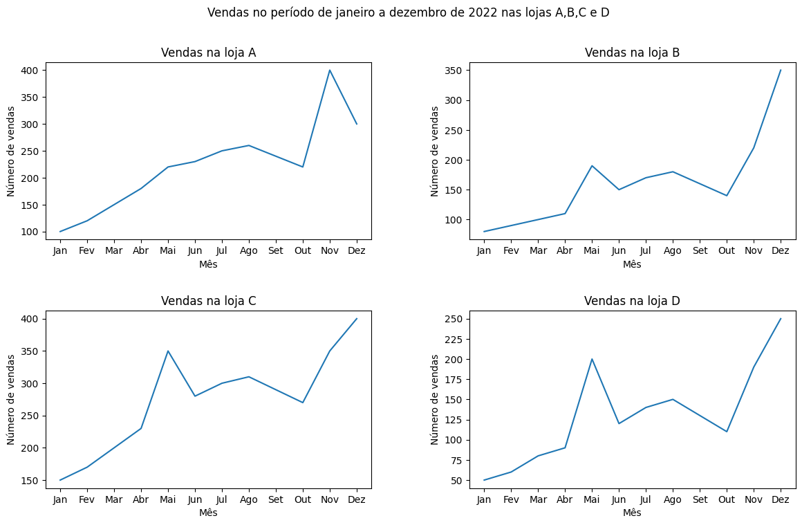
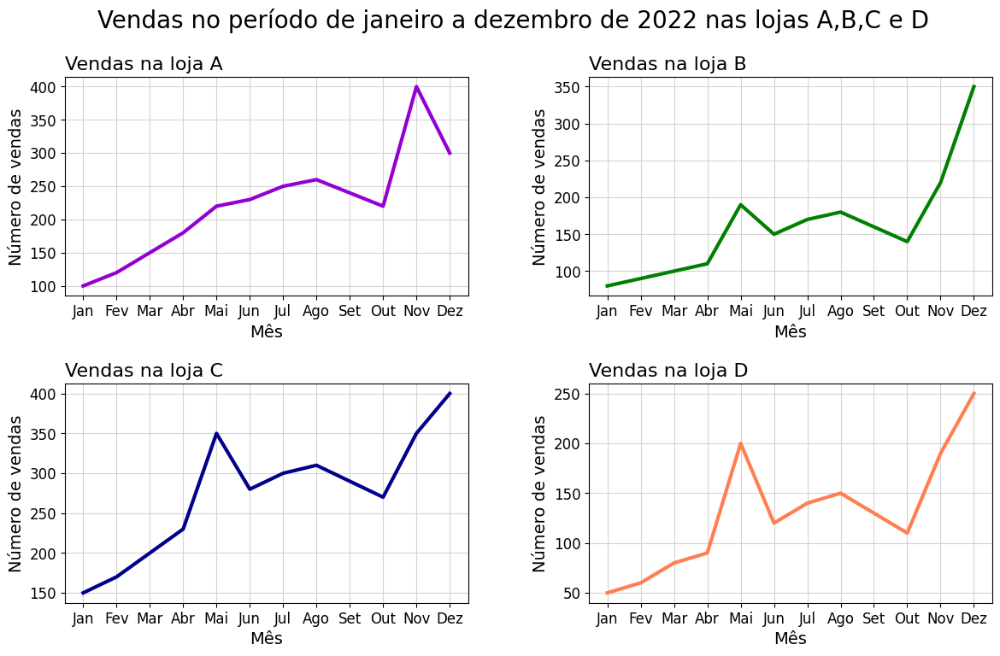
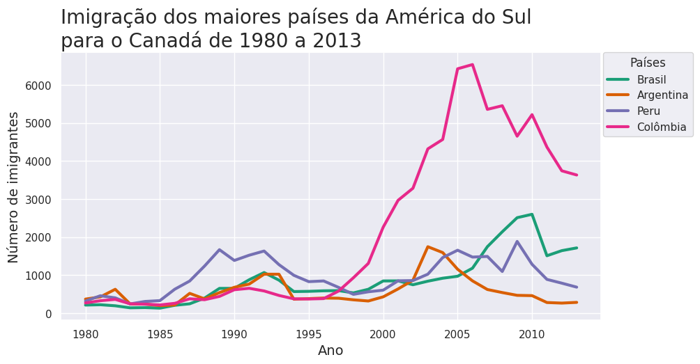

**Faça Como Eu Fiz** = **Mão na Massa**

## Aula 1: Preparando o ambiente  
Antes de começar…
O Google Colaboratory, ou Colab para abreviar, é uma ferramenta gratuita baseada em nuvem que permite executar e escrever códigos em Python sem precisar de configurações de software e hardware local. É uma excelente ferramenta para executar códigos de análise de dados e outros tipos de projetos de programação.

Para começar a usar a plataforma é necessário que você tenha uma conta no Gmail. Se ainda não tem uma, será necessário criá-la. Depois de fazer login, vá até a página do [Google Colab](https://colab.research.google.com/notebooks/welcome.ipynb) e clique no menu superior em “Arquivo” e escolha a opção “Novo notebook”. Ele é o ambiente de trabalho do Colab, onde é possível escrever e executar códigos em Python.

O Colab é executado em servidores do Google, então ele fornece uma máquina virtual na nuvem com recursos como CPU, memória e espaço em disco. Para executar um código, basta escrevê-lo em uma célula de código e clicar no botão “Executar” ou pressionar Shift + Enter.

Os dados utilizados no projeto que vamos desenvolver neste curso foram obtidos do [Kaggle](https://www.kaggle.com/datasets/ammaraahmad/immigration-to-canada) e para acompanhar o desenvolvimento do projeto ao longo do curso e reproduzir tudo o que foi feito, você pode fazer o download do [dataset no GitHub](https://github.com/alura-cursos/bibliotecas_visualizacao/blob/main/Dados/imigrantes_canada.csv). Fique tranquila(o) com esse processo! Para realizá-lo de forma simplificada basta seguir as próximas ações, etapa por etapa.

Etapa 01: Clique no botão chamado "Raw" na parte superior da página do arquivo.

Etapa 02: O conteúdo do arquivo será exibido em uma nova guia do navegador. Para baixá-lo, clique com o botão direito do mouse na página e selecione "Salvar como" no menu.

Etapa 03: Escolha um local no seu computador para salvar o arquivo e clique em "Salvar". O arquivo será salvo no local escolhido em seu computador em seu formato original.

Simples, não é mesmo?! Agora com esse arquivo baixado temos a facilidade e a flexibilidade necessária para trabalhar com os dados de forma mais produtiva e eficiente. Vamos começar?

## Desafio: comparando tendências de imigração

Chegou a hora de você testar os conhecimentos desenvolvidos durante a aula. Nós criamos um gráfico com a função plt.plot() para analisar as intrigantes tendências de imigração do Brasil para o Canadá, no período de 1980 a 2013. Neste momento temos uma nova demanda: criar um gráfico de linhas comparando os números de imigrantes do Brasil e Argentina para o Canadá, que são os maiores países da América do Sul.

Prepare-se para um mergulho fascinante nas linhas que conectam esses países da América do Sul ao território canadense. Nessa missão, a elaboração desse gráfico pode ser útil para a compreensão das tendências migratórias desses países para o Canadá ao longo do tempo e como elas se comparam entre si. Ao analisar esses fatores, podemos obter uma visão mais abrangente do cenário migratório na América do Sul.

Fique tranquila(o)!

Essa nova tarefa é mais desafiadora, pois exige uma análise comparativa entre dois países. No entanto, ela também permitirá com que você obtenha uma aprendizagem enriquecedora. Por isso, explore as diversas possibilidades e lembre-se dos elementos essenciais de um gráfico: título, rótulos nos eixos x e y e os ticks do eixo x, que devem ser definidos de 5 em 5 anos.

Além disso, você precisará descobrir como adicionar uma legenda para que seja possível identificar a linha de cada país. Ao seguir essas orientações, você terá construído um gráfico robusto que te permitirá uma análise significativa e aprofundada.

Após criar o gráfico analise o resultado obtido e reflita nas seguintes questões:

Há alguma tendência ou padrão comum nos dados dos dois países?
Quais são os períodos com maior número de imigrantes nos dois países?
Vamos lá?  

### Opinião do instrutor
Na aula nós extraímos apenas os dados do Brasil, porém agora podemos realizar o seguinte comando para também extrair os dados da Argentina:

df_comparacao = df.loc[['Brasil', 'Argentina'], anos]Copiar código
Dessa forma teremos uma linha para cada país e as colunas contendo os números de imigrantes para cada ano.

O DataFrame df_comparacao pode ser transposto para trocar as linhas pelas colunas e as colunas pelas linhas do DataFrame. Então, podemos usar a propriedade .T (abreviação para transpose):

df_comparacao = df_comparacao.T

Como resultado temos uma coluna com os anos e duas colunas para cada país contendo o número de imigrantes.

df_comparacao.head()Copiar código
index	Brasil	Argentina
1980	211	368
1981	220	426
1982	192	626
1983	139	241
1984	145	237
Para plotar o gráfico podemos usar a função plt.plot(), que possibilita a criação de duas linhas do gráfico: uma para o Brasil e outra para a Argentina. O parâmetro label é utilizado para adicionar rótulos aos gráficos, permitindo identificar qual linha corresponde a cada conjunto de dados.

A função plt.title() define o título do gráfico, que neste caso é "Imigração do Brasil e Argentina para o Canadá". A função plt.xlabel() define o rótulo do eixo X do gráfico, que é "Ano", enquanto a função plt.ylabel() define o rótulo do eixo Y, que é "Número de imigrantes".

A função plt.xticks() define os marcadores de posição (ticks) no eixo X do gráfico, que neste caso são os anos em que os dados foram coletados. O argumento é uma lista de strings com os valores desejados. A função plt.legend() adiciona uma legenda ao gráfico, reconhecendo o parâmetro label definido na função plt.plot(). Por fim, a função plt.show() exibe o gráfico na tela.

plt.plot(df_comparacao['Brasil'],label = 'Brasil')
plt.plot(df_comparacao['Argentina'],label ='Argentina')
plt.title('Imigração do Brasil e Argentina para o Canadá')
plt.xlabel('Ano')
plt.ylabel('Número de imigrantes')
plt.xticks(['1980', '1985', '1990', '1995', '2000', '2005', '2010'])
plt.legend()
plt.show()Copiar código
Como resultado temos o seguinte gráfico:

Alt text: Gráfico obtido com o código anterior, mostrando as tendências de imigração do Brasil e Argentina para o Canadá, no período de 1980 a 2013.

Com este gráfico, podemos notar que as tendências de imigração no Brasil e na Argentina eram bastante semelhantes no início do período. No entanto, a partir dos anos 2000, os números de imigrantes na Argentina começaram a aumentar e atingiram os valores mais elevados entre 2000 e 2005, antes de cair e atingir valores muito baixos nos anos mais recentes. Por outro lado, no caso do Brasil, os aumentos na imigração começaram após 2005 e parecem ter atingido o valor mais alto em 2010.

## Aula 02
### Desafio: visualizando dados de vendas de diferentes lojas
Você trabalha como Analista de Dados em uma empresa de varejo e recebeu a tarefa de criar uma figura com subplots que apresente a variação no número de vendas em quatro diferentes lojas ao longo de um ano. A gerência da empresa precisa visualizar de forma clara as tendências de vendas em cada loja, para que possam tomar decisões estratégicas sobre os estoques e ações de marketing. Para isso, você deve criar quatro subplots dispostos em duas linhas e duas colunas, onde cada subplot representa uma loja diferente. Nesse desafio, cada subplot deve apresentar um gráfico de linhas que mostre a variação do número de vendas ao longo dos meses do ano.

Agora, chegou a hora de mostrar suas habilidades em análise de dados e visualização! Para criar o DataFrame com o número de vendas das lojas e criar a figura, utilize as informações abaixo:

lojas = ['A', 'B', 'C', 'D']

vendas_2022 = {'Jan': [100, 80, 150, 50],
    'Fev': [120, 90, 170, 60],
    'Mar': [150, 100, 200, 80],
    'Abr': [180, 110, 230, 90],
    'Mai': [220, 190, 350, 200],
    'Jun': [230, 150, 280, 120],
    'Jul': [250, 170, 300, 140],
    'Ago': [260, 180, 310, 150],
    'Set': [240, 160, 290, 130],
    'Out': [220, 140, 270, 110],
    'Nov': [400, 220, 350, 190],
    'Dez': [300, 350, 400, 250]
}Copiar código
Dica: Para facilitar a criação dos subplots, você pode definir a coluna "Lojas" como índice do DataFrame e utilizar a propriedade loc da biblioteca Pandas para plotar cada uma das lojas.

Não se esqueça de adicionar um título geral à figura, títulos aos subplots e rótulos aos eixos. Além disso, se atente ao tamanho da figura e ao espaçamento entre os subplots!  
### Opinião do instrutor  
Para criar um DataFrame com esses dados, utilizando a coluna "Lojas" como índice, podemos executar o seguinte código:

df = pd.DataFrame(vendas_2022, index=lojas)Copiar código
O resultado será o seguinte DataFrame:

index	Jan	Fev	Mar	Abr	Mai	Jun	Jul	Ago	Set	Out	Nov	Dez
A	100	120	150	180	220	230	250	260	240	220	400	300
B	80	90	100	110	190	150	170	180	160	140	220	350
C	150	170	200	230	350	280	300	310	290	270	350	400
D	50	60	80	90	200	120	140	150	130	110	190	250
Para criar uma figura com um título geral contendo os quatro subplots, cada um com seu respectivo título e rótulos aos eixos, podemos executar o seguinte código:

# Criar a figura e os subplots
fig, axs = plt.subplots(2, 2, figsize=(14, 8))

# Ajustar os espaçamentos entre os subplots
plt.subplots_adjust(wspace=0.3, hspace=0.4)

# Adicionando um título geral para os subplots
fig.suptitle('Vendas no período de janeiro a dezembro de 2022 nas lojas A,B,C e D')

# Adicionar os gráficos em cada um dos subplots
axs[0, 0].plot(df.loc['A'])
axs[0, 0].set_title('Vendas na loja A')
axs[0, 1].plot(df.loc['B'])
axs[0, 1].set_title('Vendas na loja B')
axs[1, 0].plot(df.loc['C'])
axs[1, 0].set_title('Vendas na loja C')
axs[1, 1].plot(df.loc['D'])
axs[1, 1].set_title('Vendas na loja D')

# Adicionando rótulos para os eixos X e Y
for ax in axs.flat:
    ax.set_xlabel('Mês')
    ax.set_ylabel('Número de vendas')

# Exibir a figura
plt.show()Copiar código
O resultado deste código será a seguinte figura:

## Aula 03
### Desafio: customizando os subplots com dados de vendas de diferentes lojas  
Mais uma etapa de desafio se inicia! Aproveite a oportunidade proposta e mergulhe nas possibilidades. Na aula anterior, você teve o desafio de criar uma figura com subplots que apresentam a variação no número de vendas em quatro diferentes lojas ao longo de um ano. Agora é o momento de elevar essa figura a um novo patamar! É a hora de personalizá-la! Nesta segunda parte do desafio, você deve explorar as opções de customização dos subplots para deixar a figura mais clara e atraente para a gerência da empresa.

Algumas ideias de customização que você pode explorar são:

Alterar a posição dos títulos dos subplots para esquerda.
Aumentar o tamanho da fonte do título geral da figura para destacá-lo.
Aumentar o tamanho dos títulos e rótulos dos eixos dos subplots.
Deixar as linhas com a espessura maior.
Alterar a cor das linhas de cada loja para diferenciá-las ainda mais.
Fique à vontade para testar mais customizações!

E mais uma dica: você pode reduzir o tamanho do código utilizando o comando for i, ax in enumerate(axs.flat): que permite um loop iterando sobre todos os subplots da figura. Dentro desse loop você pode passar as funções plot, set_title, set_xlabel, set_ylabel e etc…

Lembrando que os dados são os seguintes:

lojas = ['A', 'B', 'C', 'D']

vendas_2022 = {'Jan': [100, 80, 150, 50],
    'Fev': [120, 90, 170, 60],
    'Mar': [150, 100, 200, 80],
    'Abr': [180, 110, 230, 90],
    'Mai': [220, 190, 350, 200],
    'Jun': [230, 150, 280, 120],
    'Jul': [250, 170, 300, 140],
    'Ago': [260, 180, 310, 150],
    'Set': [240, 160, 290, 130],
    'Out': [220, 140, 270, 110],
    'Nov': [400, 220, 350, 190],
    'Dez': [300, 350, 400, 250]
}

# Criando DataFrame
df = pd.DataFrame(vendas_2022, index=lojas)
Copiar código
Agora é hora de colocar a mão na massa! Experimente diferentes customizações e deixe a figura ainda mais impressionante. Bora?!  

### Opinião do instrutor
Abaixo temos um exemplo de como esse desafio pode ser resolvido. Existem diversas maneiras de abordar esse problema, e você pode utilizar a criatividade para encontrar soluções diferentes e inovadoras.

Este código cria uma figura com 4 subplots (2 linhas e 2 colunas), onde cada subplot representa as vendas de uma loja em cada mês do ano. O tamanho da figura é definido com o parâmetro figsize da função subplots(). Em seguida, o espaço entre os subplots é ajustado com a função subplots_adjust().

O título geral da figura é adicionado com a função suptitle(), onde é definido o texto e o tamanho da fonte com o parâmetro fontsize.

Uma lista de cores é criada com as cores que serão usadas para plotar as linhas em cada subplot. O comando enumerate(axs.flat) permite que o loop a seguir itere sobre todos os subplots da figura. Dentro do loop, o comando plot() é usado para plotar as vendas da loja correspondente ao subplot atual. A cor da linha é definida pelo índice do subplot na lista de cores. O título do subplot é definido com o nome da loja e o parâmetro loc='left' alinha o título à esquerda. Os rótulos dos eixos X e Y são definidos com as funções set_xlabel() e set_ylabel(), e as fontes são definidas pelo parâmetro fontsize. As ticks dos eixos são definidas com a função tick_params(). Por fim, um grid é adicionado aos subplots com a função grid().

# Criar a figura e os subplots
fig, axs = plt.subplots(2, 2, figsize=(14, 8))

# Ajustar os espaçamentos entre os subplots
plt.subplots_adjust(wspace=0.3, hspace=0.4)

# Adicionando um título geral para os subplots
fig.suptitle('Vendas no período de janeiro a dezembro de 2022 nas lojas A,B,C e D', fontsize=20)

# Lista de cores
cores = ['darkviolet', 'green', 'darkblue', 'coral']

#Loop para plotar e customizar os subplots
for i, ax in enumerate(axs.flat):
    ax.plot(df.loc[df.index[i]], color=cores[i], lw=3)
    ax.set_title(f'Vendas na loja {df.index[i]}', loc='left', fontsize=16)
    ax.set_xlabel('Mês', fontsize=14)
    ax.set_ylabel('Número de vendas', fontsize=14)
    ax.tick_params(labelsize=12)
    ax.grid(color='lightgrey')
Copiar código
A figura obtida com esse código é a seguinte:

## Aula 04
## Desafio: criando um gráfico de linhas com a biblioteca Seaborn  
Parabéns por chegar até aqui, em mais um desafio! Voltando aos dados utilizados no projeto que nós estamos desenvolvendo neste curso, agora chegou o momento de utilizar todos os conhecimentos adquiridos sobre as bibliotecas Matplotlib e Seaborn.

Nesta etapa, seu desafio é criar uma figura contendo as tendências de imigração dos 4 maiores países da América latina: Brasil, Argentina, Peru e Colômbia. Através dessa criação você pode explorar diversas possibilidades e reconhecer de forma atrativa o seu processo de desenvolvimento.E não nos esqueçamos das orientações! Essa figura precisa ter uma linha para cada país, título, rótulos nos eixos, cores apropriadas, um tema da biblioteca Seaborn e legenda. Por isso, pense nas questões de acessibilidade, como tamanho das fontes e espessura das linhas. É importante escolher cores adequadas que não causem cansaço visual ou dificultem a leitura das informações. Além disso, o tamanho das fontes deve ser legível o suficiente para que as pessoas possam interpretar os dados com facilidade.

Dica: para escolher a paleta de cores, você também pode consultar a documentação da biblioteca Matploltib. A Seaborn utiliza as colormaps do Matplotlib por padrão, além de oferecer suas próprias paletas de cores. Para aplicar uma paleta de cores a todas as linhas da figura você pode usar a função sns.set_palette() e passar a ela o nome da paleta escolhida.

Estamos empolgados para ver o resultado do seu trabalho e as histórias que você irá contar através deste gráfico. Mãos à obra e divirta-se!  
### Opinião do instrutor
Na primeira linha, a função set_theme() é usada para definir um tema para o gráfico, o que afeta o estilo do fundo, grade, etc.

Na segunda linha, a função set_palette() é usada para definir uma paleta de cores para o gráfico. Nesse caso, está sendo usado o colormap 'Dark2', que possui uma variedade de cores escuras.

Na terceira linha, a função subplots() é usada para criar uma figura com uma área de plotagem (eixo) com tamanho especificado. Em seguida, a função lineplot() do Seaborn é usada para plotar as linhas para o Brasil, Argentina, Peru e Colômbia. Cada linha é rotulada com o parâmetro label com o nome do país e possui uma largura de 3 pixels, com, lw=3.

As próximas linhas definem o título, rótulos dos eixos e a frequência dos ticks do eixo X.

Finalmente, a função legend() é usada para adicionar uma legenda ao gráfico, localizada no canto superior direito e ligeiramente fora do plot. No código apresentado, bbox_to_anchor=(1.18, 1.02) indica que a legenda deve ser ancorada em uma posição um pouco à direita e acima do canto superior direito do gráfico. O valor 1.18 para X indica que a legenda deve ser colocada 18% para a direita da extremidade direita do gráfico, enquanto o valor 1.02 para Y indica que a legenda deve ser colocada 2% acima do topo do gráfico. Isso ajuda a evitar que a legenda sobreponha outras partes do gráfico.

O título da legenda é definido como 'Países'. Por fim, a função plt.show() é chamada para exibir o gráfico.

sns.set_theme()
sns.set_palette('Dark2')

fig, ax = plt.subplots(figsize=(10, 5))
ax = sns.lineplot(df.loc['Brasil', anos], label='Brasil', lw=3)
ax = sns.lineplot(df.loc['Argentina', anos], label='Argentina', lw=3)
ax = sns.lineplot(df.loc['Peru', anos], label='Peru', lw=3)
ax = sns.lineplot(df.loc['Colômbia', anos], label='Colômbia', lw=3)

ax.set_title('Imigração dos maiores países da América do Sul\npara o Canadá de 1980 a 2013', loc='left', fontsize=20)
ax.set_xlabel('Ano', fontsize=14)
ax.set_ylabel('Número de imigrantes', fontsize=14)

ax.xaxis.set_major_locator(plt.MultipleLocator(5))

ax.legend(title='Países', loc='upper right', bbox_to_anchor=(1.18, 1.02))

plt.show()Copiar código

## Aula 05
### Desafio: criando uma animação para comparar diferentes dados  
Na atividade anterior foi possível compreender como criar uma animação com a biblioteca Plotly. Agora vem mais um desafio!

Lembra que nós criamos uma figura estática contendo os dados de imigração do Brasil e Argentina? Sua tarefa é criar um gráfico animado com o Plotly que mostre esses dados. O gráfico deve ter as seguintes características:

Duas linhas: uma para o Brasil e outra para a Argentina.
Um botão "Play" para iniciar a animação, mostrando o aumento ou diminuição do número de imigrantes ao longo dos anos.
As configurações de animação devem fazer com que as duas linhas sejam exibidas e animadas ao mesmo tempo.
Dicas:

Crie um DataFrame com os dados da Argentina e não se esqueça de deixar a coluna de anos no tipo int(inteiro).
Use o código fornecido para o Brasil como base e adapte-o para incluir os dados da Argentina.
Para configurar as animações você pode fazer um Loop for para percorrer o DataFrame dados_brasil e para cada iteração, criar uma nova lista contendo dois objetos do tipo go.Scatter, um para cada país. Em seguida, cada lista pode ser usada para criar um objeto go.Frame, que é adicionado à lista de frames. Por fim, a lista de frames pode ser atribuída ao objeto fig, que é a figura do gráfico a ser animado. Com isso, quando a animação for iniciada, o gráfico exibirá as duas linhas em movimento, uma para o Brasil e outra para a Argentina.    
### Opinião do instrutor

Para conseguir criar a animação do desafio, após criar os DataFrames e alterar o tipo da coluna Ano para *int *, podemos executar o código a seguir:

import plotly.graph_objs as go

# # Criando uma figura
fig = go.Figure()

# Adicionando a linha com os dados do Brasil 
fig.add_trace(
    go.Scatter(x=[dados_brasil['ano'].iloc[0]], y=[dados_brasil['imigrantes'].iloc[0]], mode='lines', name='Imigrantes do Brasil', line=dict(width=4))
)

# Adicionando a linha com os dados da Argentina
fig.add_trace(
    go.Scatter(x=[dados_argentina['ano'].iloc[0]], y=[dados_argentina['imigrantes'].iloc[0]], mode='lines', name='Imigrantes da Argentina', line=dict(width=4))
)

# Definindo as configurações de layout
fig.update_layout(
    title=dict(
        text='<b>Imigração do Brasil e da Argentina para o Canadá no período de 1980 a 2013',
        x=0.1,

        font=dict(size=18)
    ),
    xaxis=dict(range=[1980, 2013], autorange=False, title='<b>Ano</b>'),
    yaxis=dict(range=[0, 3000], autorange=False, title='<b>Número de imigrantes</b>'),
    updatemenus=[dict(
        type='buttons',
        showactive=False,
        buttons=[dict(
            label='Play',
            method='animate',
            args=[None, {'frame': {'duration': 100, 'redraw': True}, 'fromcurrent': True}]
        )]
    )],
    width=1200, # largura da figura em pixels
    height=600 # altura da figura em pixels
)

# Definindo as configurações de animação
frames = []
for i in range(len(dados_brasil)):
    frame_data = [
        go.Scatter(x=dados_brasil['ano'].iloc[:i+1], y=dados_brasil['imigrantes'].iloc[:i+1]),
        go.Scatter(x=dados_argentina['ano'].iloc[:i+1], y=dados_argentina['imigrantes'].iloc[:i+1])
    ]
    frame = go.Frame(data=frame_data)
    frames.append(frame)
fig.frames = frames

# Mostrando a figura
fig.show()Copiar código
A animação exibida será a seguinte:

Captura da tela do Google Colab mostrando a figura gerada com a biblioteca Plotly com animação.

Neste caso nós adicionamos duas linhas, uma para cada país com o fig.add_trace(). Para conseguir animar as duas linhas juntas, temos a criação de uma lista de frames que serão usados para a animação do gráfico. O loop for percorre o comprimento dos dados de imigração do Brasil (que deve ser o mesmo dos dados de imigração da Argentina). Para cada índice i no loop, cria-se um frame_data que contém dois objetos Scatter do Plotly: um para o Brasil e outro para a Argentina. Cada Scatter é definido pelos dados correspondentes de imigração para o país em questão até o índice i. Em seguida, é criado um objeto frame que contém o frame_data correspondente ao índice i. Finalmente, esse objeto frame é adicionado à lista de frames. O resultado é uma lista de frames que representam a evolução da imigração do Brasil e da Argentina para o Canadá ao longo do tempo, que serão usados para criar a animação do gráfico.