**Faça Como Eu Fiz** = **Mão na Massa**

## Aula 1
### Faça como eu fiz: gráfico de árvore  
E aí? Conseguiu descobrir uma forma de representar a participação de todos os Estados no PIB nacional numa mesma visualização que tentamos na aula Problemas em um gráfico de pizza? Qual visualização você acha que seria a ideal?

Para responder essas perguntas, vamos reler o 1º questionamento e respondê-lo com um gráfico de árvore, mais conhecido como Treemap:

Como está disposto o PIB nos Estados brasileiros no ano de 2020? É possível notar os Estados com maior e menor participação no PIB nacional?

Antes de gerar a visualização, vamos entender o que é um treemap e quais são as suas utilidades.

O que é um treemap
O gráfico de árvore ou treemap é um tipo de visual muito utilizado para mostrar a composição e a hierarquia dos dados usando formas geométricas retangulares coloridas. A imagem abaixo ilustra um exemplo:

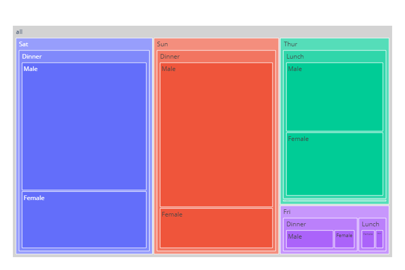
alt-text: Gráfico de árvore criado com a biblioteca Plotly. O gráfico possui um retângulo cinza contendo 4 retângulos nas cores azul, vermelha, verde e roxa. Esses retângulos possuem outros retângulos de menor tamanho preenchendo-os e com as mesmas cores. Cada retângulo presente na visualização possui um rótulo do que representa, partindo de dia da semana, para tipo de refeição e gênero de quem pediu a refeição. Todos os dados escritos estão em inglês. Os tamanhos de cada retângulo correspondem à quantidade de repetições daquele dado.

Fonte: [Documentação do Plotly](https://plotly.com/python/treemaps/)

Cada retângulo nesse visual tem o seu tamanho baseado no valor dos dados representados, ou seja, quanto maior o retângulo, mais vezes aquele valor aparece no conjunto de dados. Para o caso da composição do PIB, quanto maior a participação, maior também será o tamanho dos retângulos.

As cores também são utilizadas para informar algo ao nosso público. Ela pode ser utilizada para representar uma variável categórica ou variável numérica, como regiões do país ou população das regiões, respectivamente.

Este visual pode ser utilizado quando:

Queremos exibir grandes quantidades de dados hierárquicos.
Gráficos de setores ou barras não conseguem lidar com um grande volume de valores.
Desejamos mostrar as proporções entre cada parte e o todo.
Queremos detalhar os dados com o auxílio do tamanho e cores disponíveis.
Agora que aprendemos o que é e para que ser um treemap, vamos construir o nosso para representar a composição do PIB de acordo com os Estados.

Atenção: O processo que será explicado na sequência pode ser realizado dentro do notebook do Colab baixado ao longo do curso. Você encontrará essa parte, na aba Para saber mais: Gráfico de árvore (Treemap), logo após o gráfico de rosca gerado no vídeo anterior.

Gerando um treemap
Antes de criar o visual, vamos tratar os dados para o formato que queremos apresentar ao nosso público. Primeiro, assegure que os códigos com os dados do projeto e da paleta de cores já foram executados. Em seguida, vamos criar o DataFrame pib_2020 copiando o df_pib e selecionando as colunas regiao, sigla_uf e pib:
```
# Criando um df com os dados desejados
pib_2020 = df_pib.copy()
pib_2020 = pib_2020.query("ano == 2020")[["regiao", "sigla_uf", "pib"]]
Copiar código
Agora, vamos ajustar os valores do PIB para a ordem dos bilhões e ordenar as colunas em ordem decrescente em relação a coluna pib:

# Ajustando os valores do PIB para bilhões e ordenando pelo pib
pib_2020["pib"] = (pib_2020["pib"] / 1e9).round(0).astype("int64")
pib_2020 = pib_2020.sort_values("pib", ascending= False)
Copiar código
Para concluir o tratamento do conjunto de dados, vamos criar uma coluna que receberá a porcentagem da participação de cada Estado no PIB de 2020, arredondando o valor para uma casa decimal:

# Gerando uma coluna para a porcentagem da representação de cada Estado no PIB de 2020
pib_2020["pib_%"] = pib_2020["pib"].div(pib_2020["pib"].sum(), axis=0)
pib_2020["pib_%"] = (pib_2020["pib_%"] * 100).round(1)

pib_2020.head()
```  
A leitura dos 5 primeiros valores deve se assemelhar ao df abaixo:

regiao	sigla_uf	pib	pib_%
379	Sudeste	SP	2378	31.3
360	Sudeste	RJ	754	9.9
322	Sudeste	MG	683	9.0
398	Sul	PR	488	6.4
436	Sul	RS	471	6.2
Agora, geramos o gráfico para responder ao questionamento. Vamos importar o módulo plotly.express da biblioteca Plotly e utilizar o método treemap() junto aos seguintes parâmetros:

path: hierarquia de desenho do treemap
values: medida que determina o tamanho dos retângulos do treemap
color: medida que determina as cores dos retângulos
custom_data: colunas dos dados extras que podem ser utilizados na figura
title: título da figura
color_discrete_map: dicionário definindo as cores das observações do color
O código resultante é o seguinte:
```
# Importando a biblioteca
import plotly.express as px

# Gerando o gráfico de árvore (TREEMAP) para o ano de 2020
fig = px.treemap(pib_2020, path=[px.Constant("Distribuição do PIB"), 'sigla_uf'], values='pib_%',
color='regiao', custom_data=['regiao','pib'], 
title='Distribuição do PIB nos estados brasileiros no ano de 2020 (em bilhões de reais)',
color_discrete_map={'(?)': BRANCO,'Sudeste':AZUL3, 'Sul':LARANJA1, 'Nordeste':AZUL5,
'Centro-Oeste':VERDE1, 'Norte':CINZA5})
```
Por fim, vamos ajustar o layout do gráfico e o texto informativo que podemos ler ao passar o mouse em nosso visual adicionando as linhas abaixo em nosso visual:
```
# Ajustando o layout do gráfico
fig.update_layout(width=1400, height=600, margin = dict(t=50, l=0, r=0, b=25), font_family = 'DejaVu Sans',
                  font_size=14, font_color= CINZA2, title_font_color= CINZA1, title_font_size=24)

# Ajustando o hovertext
fig.update_traces(marker=dict(cornerradius=3), texttemplate='<b>%{label}</b>',
hovertemplate='<b>Estado:</b> %{label} <br><b>Região</b> = %{customdata[0]} <br>'                                                                                             '<b>PIB</b> = R$ %{customdata[1]} bi (%{value}%)')
fig.show()
```
Ao executar o código, conseguimos visualizar o seguinte gráfico de árvore:
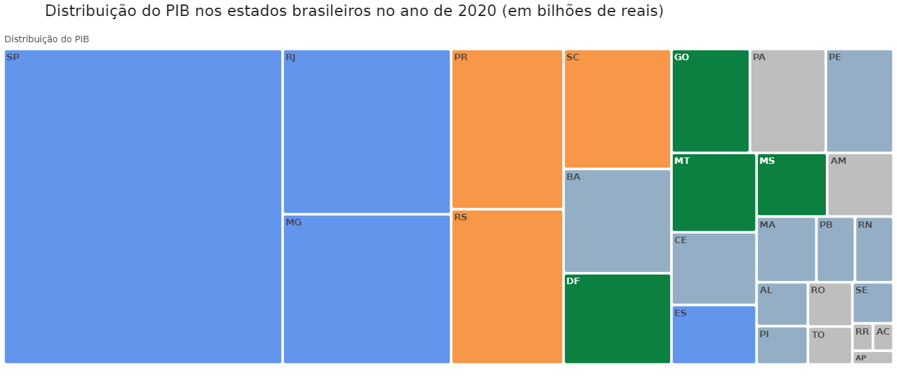
alt-text: Gráfico de árvore criado com a biblioteca Plotly com o título “Distribuição do PIB nos Estados brasileiros no ano de 2020 (e bilhões de reais)”. O gráfico possui 27 retângulos nas cores azul, laranja, azul-petróleo, verde e cinza e com as siglas correspondentes a cada Estado e o Distrito Federal. O tamanho de cada retângulo é diferente e corresponde à porcentagem da participação do Estado no pib nacional e as cores categorizam as regiões de cada Estado.

Note que possuímos retângulos de diversos tamanhos apontando a representação de cada Estado no PIB nacional. Este visual responde com sucesso às proporções dos dados, identificando, pelas cores, quais Estados compõem a mesma região.

É importante enfatizar que, como essa visualização carrega diversas formas de destaque de dados (cores, áreas e sub-áreas), precisamos fazer uso dela com bastante cuidado, pois podemos adicionar um excesso de elementos que podem dificultar a análise dos dados de forma rápida e objetiva.
### Opinião do instrutor  
Se você seguiu o passo a passo, conseguirá visualizar o gráfico em seu notebook. Tente gerar um treemap diferente com os dados de outra coluna, por exemplo um dos valores agregados que possuímos no conjunto de dados do PIB.

Experimente pesquisar na documentação do Plotly sobre as funções e métodos utilizados para entender mais a fundo sobre eles e se desafie ao procurar por mais funcionalidades para gerar seu próprio gráfico de árvore.


### Desafio: gráficos de composição - Proporção  
Vamos praticar a criação de gráficos de composição para a proporção de dados que aprendemos até aqui. Para a prática, vamos seguir utilizando o conjunto de dados do PIB em relação aos Estados do Brasil durante o período de 2002-2020 que está disponível no [GitHub do projeto](https://github.com/alura-cursos/dataviz-graficos-composicao-relacionamento/blob/main/dados/pib_br_2002_2020_estados.csv).

Neste desafio, a missão é construir as visualizações que respondam aos seguintes questionamentos:

Desafio 1

Como estão dispostos os valores agregados de serviços por região do Brasil no ano de 2018?

Desafio 2

Qual a participação da Região Norte nos valores agregados da indústria de todo Brasil nos anos de 2010 e 2020? Podemos notar algum comportamento?

Dica: Crie duas visualizações lado a lado para conseguir fazer o paralelo entre elas.

Caso precise de ajuda, uma opção de solução da atividade estará disponível na seção “Opinião da pessoa instrutora”.

Observação: Para você criar e verificar seus códigos vamos deixar um notebook para resolução deste e dos próximos desafios. Você pode baixá-lo e fazer o upload do notebook no Google Colab ou criar o seu próprio.  
### Opinião do instrutor  
Podem existir diversas formas de solucionar uma questão. Apresentamos abaixo uma sugestão de solução para cada problema.

Desafio 1

Para o primeiro desafio, vamos criar um gráfico de pizza com os valores agregados do setor de serviços em cada região no ano de 2018, lembrando de agrupar os dados por soma. A exibição da composição estará em porcentagem, para melhor interpretação dos dados.

Definindo a paleta de cores
```
AZUL1, AZUL2, AZUL3, AZUL4, AZUL5, AZUL6 = '#174A7E', '#4A81BF', "#6495ED", '#2596BE', '#94AFC5', '#CDDBF3'
CINZA1, CINZA2, CINZA3, CINZA4, CINZA5, CINZA6, BRANCO = '#231F20', '#414040', '#555655', '#A6A6A5', '#BFBEBE', '#CED4DA , '#FFFFFF'
VERMELHO1, VERMELHO2, LARANJA1 = '#C3514E',	'#E6BAB7', '#F79747'
VERDE1, VERDE2, VERDE3 = '#0C8040', '#9ABB59', '#9ECCB3'
```
Importando e tratando os dados
```
# Importando as bibliotecas
import pandas as pd
import matplotlib.pyplot as plt

# Importando a base de dados do PIB de 2002 a 2020
df_pib = pd.read_csv("https://raw.githubusercontent.com/alura-cursos/dataviz-graficos-composicao-relacionamento/main/dados/pib_br_2002_2020_estados.csv")

# Criando um df com os dados desejados
df_servicos = df_pib.copy()
df_servicos = df_servicos.query("ano == 2018")[["regiao", "va_servicos"]]
df_servicos = df_servicos.groupby("regiao").sum()
df_servicos = df_servicos.sort_values("va_servicos", ascending= False)

df_servicos
```
Gerando o gráfico
``` 
# Área do gráfico e tema da visualização
fig, ax = plt.subplots(figsize=(14,6))

# Definindo as cores do gráfico
cores = [AZUL3, VERMELHO2, AZUL5 , VERDE1, CINZA5]

# Personalizando o gráfico
ax.set_title('Composição dos Valores Agregados do\nSetor de Serviços em 2018',
             fontsize=14, ha="left", color=CINZA1, x = 0.1)

# Gerando o gráfico de pizza
ptc, text, _ = ax.pie(data=df_servicos, x='va_servicos', labels = df_servicos.index,
                      autopct='%.1f%%', pctdistance=0.6, colors = cores,
                      textprops = {"size": 12,"fontweight": "bold", "color": CINZA1})

# Ajustando as cores das regiões relativas às fatias
for i, p in enumerate(ptc):
  text[i].set_color(p.get_facecolor())

plt.show()
```
Saída:
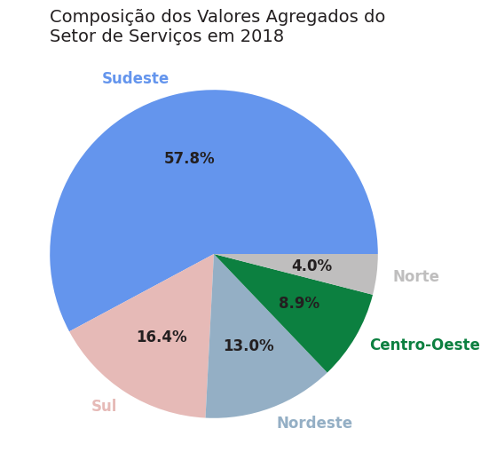
alt-text: Gráfico de pizza criado com a biblioteca Matplotlib com o título “Composição dos Valores Agregados do Setor de Serviços em 2018”. O gráfico possui 5 fatias com os rótulos do que cada fatia representa (Sudeste, Sul, Nordeste, Centro-Oeste e Norte no sentido anti-horário) seguida das porcentagens correspondentes a cada região dentro da pizza (57,8%, 16,4%, 13%, 8,9% e 4%). Cada fatia possui uma cor diversa e o tamanho correspondente à porcentagem da participação da região nos valores agregados do setor de serviços no período

Desafio 2

Para o segundo desafio vamos criar dois gráficos de rosca lado a lado e comparar a evolução da representatividade da região Norte nos valores agregados do setor da indústria dentro do PIB de 2010 em relação a 2020.

Importando e tratando os dados
```
# Importando as bibliotecas
import pandas as pd
import matplotlib.pyplot as plt

# Importando a base de dados do PIB de 2002 a 2020
df_pib = pd.read_csv("https://raw.githubusercontent.com/alura-cursos/dataviz-graficos-composicao-relacionamento/main/dados/pib_br_2002_2020_estados.csv")

# Criando um df com os dados desejados
df_n_2010 = df_pib.query("ano == 2010")[["regiao", "va_industria"]]
df_n_2020 = df_pib.query("ano == 2020")[["regiao", "va_industria"]]

# Renomeando todas as regiões exceto a Norte como 'Outros'
df_n_2010.loc[df_n_2010["regiao"] != "Norte", "regiao"] = "Outros"
df_n_2020.loc[df_n_2020["regiao"] != "Norte", "regiao"] = "Outros"

# Agrupando os dados
df_n_2010 = df_n_2010.groupby("regiao").sum()
df_n_2020 = df_n_2020.groupby("regiao").sum()

display(df_n_2010, df_n_2020)
``` 
Gerando o gráfico
```
# Área do gráfico e tema da visualização
fig, axs = plt.subplots(1, 2, figsize=(14,6))

# Definindo as cores do gráfico
cores = [VERDE2, CINZA6]

# Personalizando o gráfico
plt.suptitle('Participação da Região Norte nos Valores Agregrados da Indústria (2010 e 2020)', 
             fontsize=14, color=CINZA1, ha = 'left', x = 0.1)

# GRÁFICO 1 - Valores Agregados Norte x Outros em 2010
ptc, text, _ = axs[0].pie(data = df_n_2010, x = "va_industria", labels = df_n_2010.index, autopct="%.1f%%",
                          pctdistance=0.8, textprops={"size": 12, "fontweight":"bold", "color": CINZA1},
                          wedgeprops=dict(width=0.4), colors = cores)

# Título do Gráfico 1
axs[0].set_title('Em 2010', fontsize=14, color=CINZA3, y = 0.95)

# Ajustando as cores das regiões relativas às fatias
for i, p in enumerate(ptc):
  text[i].set_color(p.get_facecolor())

#######################################

# GRÁFICO 2 - Valores Agregados Norte x Outros em 2020
ptc, text, _ = axs[1].pie(data = df_n_2020, x = "va_industria", labels = df_n_2020.index, autopct="%.1f%%",
                          pctdistance=0.8, textprops={"size": 12, "fontweight":"bold", "color": CINZA1},
                          wedgeprops=dict(width=0.4), colors = cores)

# Título do Gráfico 2
axs[1].set_title('Em 2020', fontsize=14, color=CINZA3, y = 0.95)

# Ajustando as cores das regiões relativas as fatias
for i, p in enumerate(ptc):
  text[i].set_color(p.get_facecolor())

#######################################

# Anotações do gráfico
axs[0].annotate('\n\n\n', xy=(260, 210), xycoords='axes points', xytext=(400, 240), textcoords='axes points',            bbox=dict(boxstyle="round", fc=BRANCO, ec=CINZA3), size=10, arrowprops=dict(arrowstyle="->", fc=CINZA1, connectionstyle="arc,angleA=0,angleB=60,armA=30,armB=30,rad=5"))
                
axs[1].annotate('A Região Norte aumentou\na sua participação no PIB\npor meio da indústria em\naproximadamente 3%', xy=(260, 210), xycoords='axes points', xytext=(-30, 240), textcoords='axes points', bbox=dict(boxstyle="round", fc=BRANCO, ec=CINZA3), size=10, arrowprops=dict(arrowstyle="->", fc=CINZA1, connectionstyle="arc,angleA=0,angleB=-60,armA=30,armB=-30,rad=5"))

plt.show()
```
Saída:
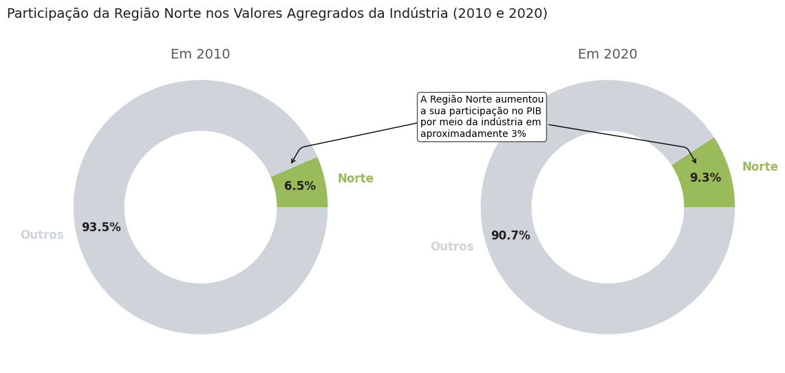
alt-text: Visualizações de dois gráficos de rosca, ambas criadas com a biblioteca Matplotlib e mostrando participação da Região Norte nos valores agregados da Indústria entre os anos de 2010 e 2020. À esquerda temos um gráfico de rosca com apenas 2 fatias com os rótulos Norte e Outros seguida das porcentagens correspondentes a cada fatia dentro da rosca (6,5% e 93,5% respectivamente) no ano de 2010. O gráfico à direita também apresenta 2 fatias com os rótulos Norte e Outros e as porcentagens dentro da rosca (9,3% e 90,7% respectivamente) no ano de 2020. A fatia correspondente ao Norte em ambos os gráficos está na cor verde e a parte de “Outros” em cinza. Há um texto apontando para as fatias da região Norte de ambas as visualizações dizendo “A Região Norte aumentou a sua participação no PIB por meio da indústria em aproximadamente 3%”

A prática é sempre muito importante para fixar o conteúdo, ainda mais de um assunto tão importante que é o de visualização de dados. A análise de dados por meio de recursos visuais facilita a interpretação das pessoas sobre os dados e apresenta de maneira simples e direta o que eles representam e quais insights podemos adquirir nessa forma de exploração dos dados.

Compartilhar os seus conhecimentos e as práticas que vem desenvolvendo nesse ponto é importante para o seu crescimento dentro da carreira de dados. Portanto, busque realizar os exercícios propostos e veja como isso pode te ajudar a progredir em suas habilidades em visualização de dados.

Se tiver alguma dúvida, você pode usar o fórum ou o Discord da Alura.

## Aula 2
### Desafio: gráficos de composição - Acréscimos e decréscimos  
Vamos praticar a criação de gráficos de composição para investigar a acumulação ou subtração de valores de um total. Para a prática, vamos seguir utilizando o conjunto de dados do PIB em relação aos Estados do Brasil durante o período de 2002-2020 que está disponível no GitHub do projeto.

Neste desafio, a missão é construir as visualizações que respondam aos seguintes questionamentos:

Desafio 1:

Como está composto o PIB do Estado de São Paulo em 2020 partindo do valor agregado bruto dos bens e serviços produzidos e os impostos líquidos?

Desafio 2:

Qual a evolução anual do valor agregado de serviços na Região Nordeste entre os anos de 2016 a 2020?

Caso precise de ajuda, uma opção de solução da atividade estará disponível na seção “Opinião da pessoa instrutora”.

Observação: Para você criar e verificar seus códigos vamos deixar um notebook para resolução deste e dos próximos desafios. Você pode baixá-lo e fazer o upload no Google Colab ou criar o seu próprio.

### Opinião do Instrutor  
Podem existir diversas formas de solucionar uma questão. Apresentamos abaixo uma sugestão de solução para cada problema.

Desafio 1:

Para o primeiro desafio, vamos criar um gráfico de cascata com o valor agregado final do Estado de São Paulo adicionando os impostos líquidos. Para isso, utilizamos o melt para reorganizar o df, assim como fizemos nesta aula, e construir a visualização. Os dados estão na ordem de trilhões de reais.

Definindo a paleta de cores
```
AZUL1, AZUL2, AZUL3, AZUL4, AZUL5, AZUL6 = '#174A7E', '#4A81BF', "#6495ED", '#2596BE', '#94AFC5', '#CDDBF3'
CINZA1, CINZA2, CINZA3, CINZA4, CINZA5, CINZA6, BRANCO = '#231F20', '#414040', '#555655', '#A6A6A5', '#BFBEBE', '#CED4DA , '#FFFFFF'
VERMELHO1, VERMELHO2, LARANJA1 = '#C3514E',	'#E6BAB7', '#F79747'
VERDE1, VERDE2, VERDE3 = '#0C8040', '#9ABB59', '#9ECCB3'
```
Importando e tratando os dados
```
# Importando as bibliotecas
import pandas as pd
import plotly.graph_objects as go

# Importando a base de dados do PIB de 2002 a 2020
df_sp = pd.read_csv("https://raw.githubusercontent.com/alura-cursos/dataviz-graficos-composicao-relacionamento/main/dados/pib_br_2002_2020_estados.csv")

# Criando um df com os dados desejados
df_sp = df_sp.query("sigla_uf == 'SP' and ano == 2020")[["va","impostos_liquidos", "pib"]]
df_sp.rename(columns = {"pib":"PIB", "impostos_liquidos": "Impostos Líquidos", "va":"Valor Agregado Bruto"}, inplace=True)

# Alterando o df para passar os indicadores para uma única coluna e seus valores em outra 
df_sp = df_sp.melt(var_name = "Indicadores", value_name = "Valores")

# Criando uma coluna com os valores em string e outra com as medidas
df_sp["Valores_str"] = (df_sp["Valores"]/1e12).map("R$ {:,.3f} tri".format)
df_sp["Medidas"] = ["absolute", "relative", "total"]

df_sp
```
Gerando o gráfico
```
# Gerando o gráfico de cascata
fig = go.Figure( go.Waterfall(name = "", measure = df_sp["Medidas"],
                             x = df_sp["Indicadores"],  y = df_sp["Valores"],
                             text = df_sp["Valores_str"], textposition = "outside",
                             connector_line = dict(color = CINZA4),
                             totals_marker = dict(color = AZUL3),
                             increasing_marker = dict(color = VERDE1)
                             )
              )

# Personalizando o gráfico
fig.update_layout(width=800, height=400, font_family = 'DejaVu Sans', font_size=14,
                  font_color= CINZA2, title_font_color= CINZA1, title_font_size=18,
                  title_text='Composição do Produto Interno Bruto (PIB) de São Paulo em 2020' +
                             f'<br><sup size=1 style="color:{CINZA3}">Em trilhões de reais</sup>',
                  plot_bgcolor= BRANCO, yaxis_range=[0,2.6e12], hovermode="closest")

# Retirando os ticks do eixo y
fig.update_yaxes(showticklabels=False)

# Dados ao passar o mouse
fig.update_traces(hovertemplate = "<b>%{x}</b> = %{text}")

fig.show()
```

Saída:
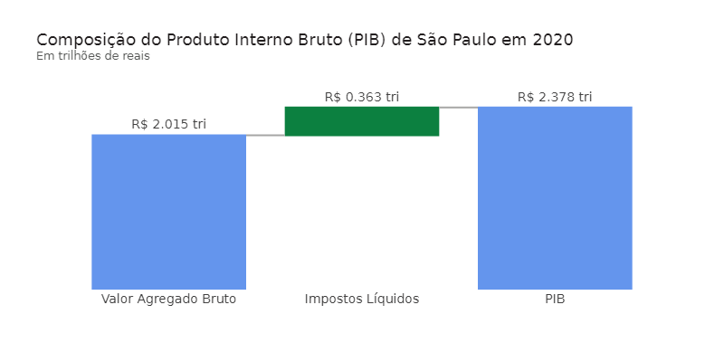
alt-text: Gráfico de cascata criado com a biblioteca Plotly com o título “Composição do Produto Interno Bruto (PIB) de São Paulo em 2020”. O gráfico possui 3 colunas com as métricas utilizadas na composição dos dados de esquerda para direita: Valor Agregado Bruto, Impostos Líquidos e PIB. As colunas dos extremos estão na cor azul representando, respectivamente, o valor inicial e final do investigado. Ao centro, temos uma coluna verde correspondente ao acréscimo em impostos líquidos. Acima de cada barra temos o valor em trilhões de reais dos dados.

Desafio 2:

Para o segundo desafio, vamos criar um gráfico de cascata com acréscimos e decréscimos, mostrando o comportamento de evolução e involução dos valores agregados do setor de serviços na região Nordeste entre os anos de 2016 e 2020.

Importando e tratando os dados
```
# Importando as bibliotecas
import pandas as pd
import plotly.graph_objects as go
import numpy as np

# Importando a base de dados do PIB de 2002 a 2020
df_ne = pd.read_csv("https://raw.githubusercontent.com/alura-cursos/dataviz-graficos-composicao-relacionamento/main/dados/pib_br_2002_2020_estados.csv")

# Criando um df com os dados desejados
anos = [x for x in range(2016, 2021)]
df_ne = df_ne.query("regiao == 'Nordeste' and ano == @anos")[["ano","va_servicos"]]
df_ne = df_ne.groupby("ano").sum().reset_index()

# Gerando a coluna com a variação do valor agregado da indústria 
# e passando o valor inicial para a 1ª linha da variação 
df_ne["variacao_servicos"] = df_ne["va_servicos"].diff().fillna(df_ne["va_servicos"]).astype("int64")

# Gerando uma coluna com as Medidas para o gráfico de cascata
df_ne["Medidas"] = ["absolute"] + ["relative"] * 4

# Gerando uma observação com a atualização da última linha com o PIB total de 2020
linha = pd.Series({'ano': 'Total',
                   'va_servicos': df_ne["va_servicos"].values[-1],
                   'variacao_servicos': df_ne["va_servicos"].values[-1],
                   'Medidas': "total"}).to_frame().T

# Concatenando o df com a atualização e retirando a coluna pib
df_ne = pd.concat([df_ne, linha], axis = 0, ignore_index=True)
df_ne = df_ne.drop(columns=["va_servicos"])

# Criando uma coluna com os valores em string
df_ne["variacao_servicos_texto"] = (df_ne["variacao_servicos"]/1e9).map('R$ {:,.2f} Bi'.format)

df_ne
```

Gerando o gráfico
```
# Gerando o gráfico de cascata
fig = go.Figure( go.Waterfall(name = "", measure = df_ne["Medidas"], y = df_ne["variacao_servicos"], 
                              text = df_ne["variacao_servicos_texto"], textposition = "outside",
                              connector_line = dict(color = CINZA3),
                              totals_marker = dict(color = AZUL3),
                              increasing_marker = dict(color = VERDE1),
                              decreasing_marker = dict(color = VERMELHO1)
                             )
                )

# Personalizando o gráfico
fig.update_layout(width=800, height=400, font_family = 'DejaVu Sans', font_size=12,
                  font_color= CINZA2, title_font_color= CINZA1, title_font_size=18,
                  title_text='Variação do Valor Agregado de Serviços no Nordeste' +
                             f'<br><sup size=1 style={CINZA3}>De 2016 a 2020 (em bilhões de reais)</sup>',
                  plot_bgcolor= BRANCO, yaxis_range=[0,500e9])

# Retirando os ticks do eixo y
fig.update_yaxes(showticklabels=False)

# Ajustando o eixo x para receber o Total
fig.update_xaxes(tickmode='array', tickvals=np.arange(0,6), ticktext=df_ne["ano"])

# Dados ao passar o mouse
fig.update_traces(hovertemplate = "<b>%{x}</b> = %{text}")

fig.add_annotation(text="No período destacado, <b>apenas</b><br>no ano de 2020 houve recuo do<br>valor agregado do <b>setor de<br>serviços</b> na região Nordeste",
                   align="left", axref = 'x', ayref='y', x=4, y=390e9, ax=3, ay=250e9,
                   arrowhead=1, arrowside = "start", showarrow=True, arrowwidth=2, arrowcolor=CINZA3,
                   bordercolor= CINZA3, borderwidth=1, borderpad=4)

fig.show()
```

Saída:
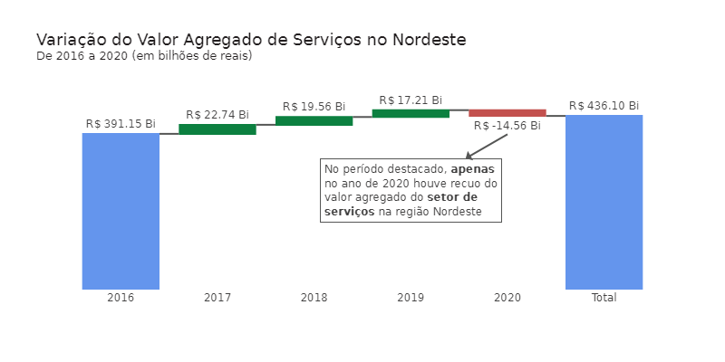
alt-text: Gráfico de cascata criado com a biblioteca Plotly com o título “Variação do Valor Agregado de Serviços no Nordeste de 2016 a 2020 (em bilhões de reais)”. O gráfico possui 6 colunas em que no eixo x temos os anos variando de 2016 a 2020 além do total como última coluna. As colunas dos extremos estão na cor azul representando, respectivamente, o valor inicial e final do investigado. Da direita para a esquerda do gráfico, temos três colunas verdes correspondente ao acréscimo em serviços e uma coluna vermelha correspondente ao decréscimo em serviços em cada ano. Os dados acima de cada coluna estão na ordem de bilhões de reais.

A prática é sempre muito importante para fixar o conteúdo, ainda mais de um assunto tão importante que é o de visualização de dados. A análise de dados por meio de recursos visuais facilita a interpretação das pessoas sobre os dados e apresenta de maneira simples e direta o que eles representam e quais insights podemos adquirir nessa forma de exploração dos dados.

Compartilhar os seus conhecimentos e as práticas que vem desenvolvendo nesse ponto é importante para o seu crescimento dentro da carreira de dados. Portanto, busque realizar os exercícios propostos e veja como isso pode te ajudar a progredir em suas habilidades em visualização de dados.

Se você tiver alguma dúvida, você pode usar o fórum ou o Discord da Alura.

## Aula 3  
### Desafio: gráficos de composição - Poucos períodos
Vamos praticar a criação de gráficos de composição para poucos períodos, comparando os intervalos. Para a prática, vamos seguir utilizando o conjunto de dados do PIB em relação aos Estados do Brasil durante o período de 2002-2020 que está disponível no GitHub do projeto.

Neste desafio, a missão é construir as visualizações que respondam aos seguintes questionamentos:

Desafio 1:

Como está composto, em valores absolutos, o PIB por região dos 4 últimos anos do conjunto de dados (2017 a 2020)?

Desafio 2:

Como está composto os valores agregados brutos dos bens e serviços (em valor absoluto) em relação aos Estados da região Centro-Oeste no ano de 2020?

Caso precise de ajuda, uma opção de solução da atividade estará disponível na seção “Opinião da pessoa instrutora”.

Observação: Para você criar e verificar seus códigos, vamos deixar um notebook para resolução deste e dos próximos desafios. Você pode baixá-lo e fazer o upload no Google Colab ou criar o seu próprio.
### Opinião do Instrutor  
Podem existir diversas formas de solucionar uma questão. Apresentamos abaixo uma sugestão de solução para cada problema.

Desafio 1:

Para o primeiro desafio vamos criar um gráfico de colunas empilhadas com os valores absolutos do PIB separados por região pelos anos de 2017 a 2020. Importante definir as cores e construir a legenda na sequência em que visualizamos os dados, para facilitar a leitura do gráfico. Os dados estão na ordem de trilhões de reais.

Definindo a paleta de cores
```
AZUL1, AZUL2, AZUL3, AZUL4, AZUL5, AZUL6 = '#174A7E', '#4A81BF', "#6495ED", '#2596BE', '#94AFC5', '#CDDBF3'
CINZA1, CINZA2, CINZA3, CINZA4, CINZA5, CINZA6, BRANCO = '#231F20', '#414040', '#555655', '#A6A6A5', '#BFBEBE', '#CED4DA , '#FFFFFF'
VERMELHO1, VERMELHO2, LARANJA1 = '#C3514E',	'#E6BAB7', '#F79747'
VERDE1, VERDE2, VERDE3 = '#0C8040', '#9ABB59', '#9ECCB3'
```  
Importando e tratando os dados
```
# Importando as bibliotecas
import pandas as pd
import matplotlib.pyplot as plt

# Importando a base de dados do PIB de 2002 a 2020
df_reg = pd.read_csv("https://raw.githubusercontent.com/alura-cursos/dataviz-graficos-composicao-relacionamento/main/dados/pib_br_2002_2020_estados.csv")

# Criando um df com os dados desejados
anos = [x for x in range(2017,2021)]
df_reg = df_reg.query("ano == @anos")[["ano","regiao","pib"]]
df_reg["pib"] = (df_reg["pib"] / 1e12).round(2)

# Criando uma tabela cruzada (crosstab) com os valores de cada ano por região
df_reg = pd.crosstab(index = df_reg.ano, columns = df_reg.regiao,
                            values = df_reg.pib, aggfunc = "sum")
df_reg = df_reg[["Sudeste", "Sul", "Nordeste", "Centro-Oeste", "Norte"]]
df_reg = df_reg.reset_index()

df_reg
```
Gerando o gráfico
```
# Área do gráfico e tema da visualização
fig, ax = plt.subplots(figsize=(7,7))

# Definindo as cores do gráfico
cores = [AZUL3, LARANJA1, AZUL5, VERDE3, CINZA4]

# Personalizando o título
ax.set_title("Composição do PIB por região", fontsize=18, color=CINZA1, ha = 'left', x=0, transform=ax.transAxes)
ax.text(0, 0.97, "De 2017 a 2020 (em trilhões de reais)", color= CINZA3, fontsize=12, ha='left', va='center', transform=ax.transAxes)

# Construindo o gráfico de colunas empilhadas
df_reg.plot(x = "ano", kind="bar", width=0.8, stacked = True, color = cores, ax = ax)
ax.set_xlabel('')
ax.set_ylabel('')
ax.set_yticklabels([])
ax.xaxis.set_tick_params(labelsize=12, color = CINZA2, labelrotation = 0)
ax.set_ylim(0, 9)
ax.set_frame_on(False)

# Adicionar a legenda do lado superior direito
ax.legend(bbox_to_anchor=(1.01, 1), reverse = True, title='Região', title_fontsize  = 12, fontsize = 10)

# remover todos os ticks do eixo x e y
ax.tick_params(axis='both', which='both', length=0)

# Adicionando os valores dentro da coluna
for container in ax.containers:
    labels = [f'{valor.get_height():.2f} Tri' for valor in container]
    ax.bar_label(container, label_type='center', labels = labels, size = 9, color = CINZA3, fontweight = "bold")
    
plt.show()
```
Saída:
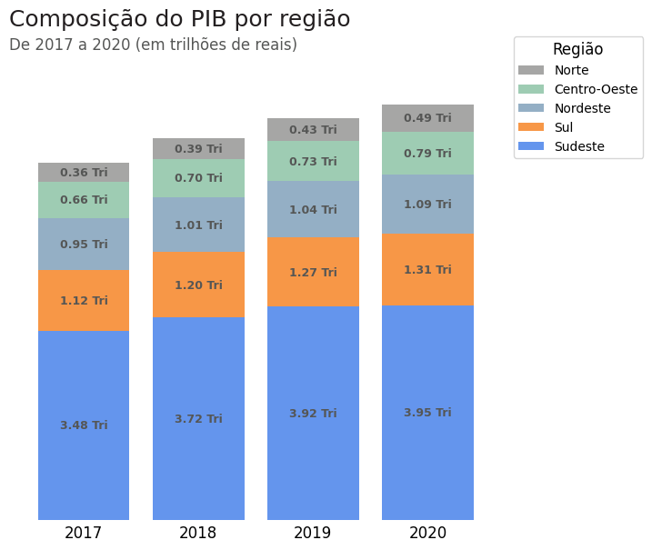
alt-text: Gráfico de colunas empilhadas criado com a biblioteca Pandas mostrando a composição do PIB por região de 2017 a 2020 em trilhões de reais separados por região. No eixo x temos os quatro anos do período. O eixo y foi retirado por código. Cada coluna possui 5 barras de cores diferentes: a azul simboliza o Sudeste, a laranja representa o Sul, a azul-petróleo representa o Nordeste, a verde representa o Centro-Oeste e, por fim, a cinza a região Norte. Cada barra tem o tamanho correspondente à participação em trilhões de cada região no PIB do ano em específico com os valores centralizados em cada uma delas. No lado direito do gráfico temos uma legenda com as cores correspondentes a cada região

Desafio 2:

Para o segundo desafio, vamos criar um gráfico de barras empilhadas com cada um dos Estados da região Centro-Oeste representados com uma barra com os diferentes valores agregados empilhados. Vamos utilizar a função para texto colorido para legenda e escrita do texto informativo. Os dados estão na ordem de bilhões de reais.

Importando e tratando os dados
```
# Importando as bibliotecas
import pandas as pd
import matplotlib.pyplot as plt

# Importando a base de dados do PIB de 2002 a 2020
df_n_estados = pd.read_csv("https://raw.githubusercontent.com/alura-cursos/dataviz-graficos-composicao-relacionamento/main/dados/pib_br_2002_2020_estados.csv")

# Criando um df com os dados desejados
df_n_estados = df_n_estados.query("regiao == 'Centro-Oeste' and ano == 2020")[["sigla_uf","va_servicos", "va_industria", "va_adespss", "va_agropecuaria"]]
df_n_estados = df_n_estados.set_index("sigla_uf")
df_n_estados = df_n_estados.sort_values(by="va_servicos", axis=0)

df_n_estados
```
Código para gerar o texto colorido
``` 
# Código para gerar o texto colorido
from matplotlib import transforms

def texto_colorido(x, y, texto, cores, esp=20, ax=None, **kw):
    cores = list(reversed(cores))
    t = ax.transData
    canvas = ax.figure.canvas

    for i, linha in enumerate(reversed(texto.split('\n'))):
        frases = linha.split('||')
        for s, cor in zip(frases, cores[i]):
            texto = ax.text(x, y, s, color=cor, transform=t, **kw)
            texto.draw(canvas.get_renderer())
            ex = texto.get_window_extent()
            t = transforms.offset_copy(texto._transform, x=ex.width, 
                                       units='dots')

        t = transforms.offset_copy(ax.transData, x=0, y=(i + 1) * esp, units='dots')
``` 
Gerando o gráfico
```
def grafico_va():
  # Área do gráfico e tema da visualização
  fig, ax = plt.subplots(figsize=(12,7))

  # Definindo as cores do gráfico
  cores = [AZUL3, LARANJA1, CINZA5, VERDE3]

  # Gerando o gráfico de barras empilhadas 100%
  df_n_estados.plot(kind="barh", stacked=True, color = cores, ax=ax)

  ## Personalizando o gráfico
  plt.suptitle('Valores adicionados de bens e serviços da região Centro-Oeste do Brasil em 2020', size=14, 
               color=CINZA1, ha = 'left', x = 0, y = 1.1, transform=ax.transAxes)
  plt.title('Em bilhões de reais', fontsize=12, color=CINZA3, ha = "left", x = 0, y = 1.03, transform=ax.transAxes)
  ax.legend(bbox_to_anchor=(1, 1), bbox_transform=ax.transAxes, fontsize = 10, loc='upper left')
  ax.set_ylabel('')
  ax.set_xticklabels([])
  ax.yaxis.set_tick_params(labelsize=10, color = CINZA2)
  ax.set_frame_on(False)

  # remover todos os ticks do eixo x e y
  ax.tick_params(axis='both', which='both', length=0)

  # Valores das barras
  for container in ax.containers:
      labels = [f'{valor.get_width()/1e9:.0f} Bi' for valor in container]
      ax.bar_label(container, label_type='center', labels = labels, size = 9, color = CINZA2, fontweight='bold')

  return ax, cores

ax, cores = grafico_va()
``` 
Personalizando o gráfico para os textos coloridos
```
# Gerando o gráfico de barras empilhadas e salvando as cores que vamos utilizar no texto
ax, cores = grafico_va()

## Trabalhando com o texto colorido para legenda e anotações

# legenda das barras
ax.legend().remove()    # remover legenda padrão da visualização
texto_colorido(0, 3.3, '$\\bf{Serviços}$ || | || $\\bf{Indústria}$ || | || $\\bf{ADESPSS}$ || | || $\\bf{Agropecuária}$',
               cores = [[cores[0], CINZA3, cores[1], CINZA3, cores[2], CINZA3, cores[3]]], ax=ax, fontsize=12)

# Anotando uma conclusão no gráfico
texto_colorido(
    250e9, 2,                                                             # coordenadas
    'Em 2020, o ||$\\bf{Distrito\ Federal}$|| liderou em dois setores no Centro-Oeste:\n'
    '$\\bf{serviços}$|| e ||$\\bf{ADESPSS\ (Administração,\ Defesa,\ Educação,}$\n'
    '$\\bf{Saúde\ Pública\ e\ Seguridade\ Social)}$.\n'
    '\n'
    '$\\bf{Goiás}$|| foi o estado com maior participação em ||$\\bf{indústria}$|| e ||$\\bf{Mato\ Grosso}$\n'
    'em ||$\\bf{agropecuária}$||.\n'
    '\n'
    'Já ||$\\bf{Mato\ Grosso\ do\ Sul}$||, em números gerais, ultrapassa apenas o\n'
    '$\\bf{Distrito\ Federal}$|| em dois setores: ||$\\bf{indústria}$|| e ||$\\bf{agropecuária}$ ||.',
    [[CINZA3, CINZA1, CINZA3],                     # linha 1                          # cores
     [AZUL3, CINZA3, CINZA5],                      # linha 2
     [CINZA5],                                     # linha 3
     [CINZA3],                                     # linha 4
     [CINZA1, CINZA3, LARANJA1, CINZA3, CINZA1],   # linha 5
     [CINZA3, VERDE3, CINZA3],                     # linha 6
     [CINZA3],                                     # linha 7
     [CINZA3, CINZA1, CINZA3],     # linha 8
     [CINZA1, CINZA3, LARANJA1, CINZA3, VERDE3, CINZA3],   # linha 9
    ],
    esp=22,         # espaçamento
    ax=ax,          # figura onde desenhar o texto
    fontsize=12)

fig.show()
```  
Saída:
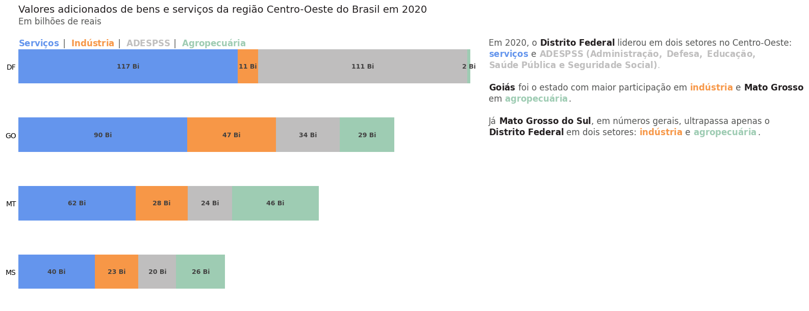
alt-text: Gráfico de barras empilhadas criado com a biblioteca Pandas mostrando os valores adicionados de todos os bens e serviços da região Centro-Oeste do Brasil em 2020. O eixo x foi retirado por código. O eixo Y possui a sigla dos 4 Estados da região Centro-Oeste: DF, GO, MT e MS. Cada barra possui 4 barras menores em que: a barra azul simboliza os valores adicionados de Serviços, a laranja da Indústria, a cinza da ADESPSS (Administração, Defesa, Educação, Saúde Pública e Seguridade Social) e a verde da Agropecuária. Cada barra menor tem o tamanho correspondente a sua contribuição em bilhões de reais dentro de cada Estado da região. Ao lado direito do gráfico temos um texto resumindo e explicando os dados representados.

A prática é sempre muito importante para fixar o conteúdo, ainda mais de um assunto tão importante que é o de visualização de dados. A análise de dados por meio de recursos visuais facilita a interpretação das pessoas sobre os dados e apresenta de maneira simples e direta o que eles representam e quais insights podemos adquirir nessa forma de exploração dos dados.

Compartilhar os seus conhecimentos e as práticas que vem desenvolvendo nesse ponto é importante para o seu crescimento dentro da carreira de dados. Portanto, busque realizar os exercícios propostos e veja como isso pode te ajudar a progredir em suas habilidades em visualização de dados.

Se você tiver alguma dúvida, você pode usar o fórum ou o discord da Alura.  

## Aula 4
### Desafio: gráficos de composição - Muitos períodos  
Vamos praticar a criação de gráficos de composição para investigar a variação dos dados para muitos períodos e/ou para pontos específicos ao longo do tempo. Para isso, vamos seguir utilizando o conjunto de dados do PIB em relação aos Estados do Brasil durante o período de 2002-2020 que está disponível no GitHub do projeto.

Neste desafio, a missão é construir as visualizações que respondam aos seguintes questionamentos:

Desafio 1:

No setor de Administração, Defesa, Educação, Saúde Pública e Seguridade Social (ADESPSS), como estão distribuídos os valores adicionados por região, em valores relativos, dentro do período da base dos dados (2002 - 2020)?

Desafio 2:

Qual foi a variação do PIB relativo à indústria nas regiões do Brasil nos anos de 2010, 2015 e 2020?

Dica: Faça um gráfico de inclinação com esses 3 períodos em um mesmo gráfico.

Caso precise de ajuda, uma opção de solução da atividade estará disponível na seção “Opinião da pessoa instrutora”.

Observação: Para você criar e verificar seus códigos vamos deixar um notebook para resolução deste e dos próximos desafios. Você pode baixá-lo e fazer o upload no Google Colab ou criar o seu próprio.  

### Opinião do instrutor

Podem existir diversas formas de solucionar uma questão. Apresentamos abaixo uma sugestão de solução para cada problema.

Desafio 1:

Para o primeiro desafio vamos criar um gráfico de áreas empilhadas 100% com cada a participação de cada Região no valor agregado de ADESPSS entre os anos de 2002 e 2020.

Definindo a paleta de cores
```
AZUL1, AZUL2, AZUL3, AZUL4, AZUL5, AZUL6 = '#174A7E', '#4A81BF', "#6495ED", '#2596BE', '#94AFC5', '#CDDBF3'
CINZA1, CINZA2, CINZA3, CINZA4, CINZA5, CINZA6, BRANCO = '#231F20', '#414040', '#555655', '#A6A6A5', '#BFBEBE', '#CED4DA , '#FFFFFF'
VERMELHO1, VERMELHO2, LARANJA1 = '#C3514E',	'#E6BAB7', '#F79747'
VERDE1, VERDE2, VERDE3 = '#0C8040', '#9ABB59', '#9ECCB3'
```
Importando e tratando os dados
```
# Importando as bibliotecas
import pandas as pd
import matplotlib.pyplot as plt

# Importando a base de dados do PIB de 2002 a 2020
df_ind = pd.read_csv("https://raw.githubusercontent.com/alura-cursos/dataviz-graficos-composicao-relacionamento/main/dados/pib_br_2002_2020_estados.csv")

# Selecionando os dados desejados
df_ind = df_ind[["regiao", "ano", "va_adespss"]]

# Agrupando os dados por região e ano
df_ind = pd.crosstab(index = df_ind.ano, columns = df_ind.regiao, values = df_ind.va_adespss, 
                     aggfunc="sum", normalize="index")
df_ind = (df_ind*100).round(2)
df_ind = df_ind[["Sudeste", "Sul", "Nordeste", "Centro-Oeste", "Norte"]]
df_ind
```

Gerando o gráfico
```
# Área do gráfico e tema da visualização
fig, ax = plt.subplots(figsize=(14,7))

# Definindo as cores do gráfico
cores = [AZUL3, VERMELHO2, AZUL5, VERDE3, CINZA4]

# Gerando o gráfico de áreas empilhadas
df_ind.plot(kind="area", stacked=True, color = cores, ax = ax, xticks = range(2002, 2021, 2))

## Personalizando o gráfico
ax.set_title('PIB relativo à Administração, Defesa, Educação, \nSaúde Pública e Seguridade Social nas regiões do Brasil', fontsize = 18, color = CINZA1, loc='left', x = 0, transform=ax.transAxes)
ax.text(0, 0.98, "De 2002 a 2020 (em %)", transform=ax.transAxes, color= CINZA3, fontsize=12, ha='left', va='center')
ax.set_ylabel('')
ax.set_xlabel('')
ax.xaxis.set_tick_params(labelsize=12, color = CINZA2)
ax.yaxis.set_tick_params(labelsize=12, color = CINZA2)
plt.ylim(0, 110)              # ajustando os limites do eixo y
ax.set_xbound(2001.75,2020)   # ajustando os limites do eixo x
ax.legend().remove()
ax.set_frame_on(False)

## Anotando os nomes das regiões
reg = df_ind.columns
y_pos = [21, 48, 67, 83, 95]
for i in range(len(reg)):
  ax.text(2011, y_pos[i], f'{reg[i]}', color = CINZA1, weight = "bold", fontsize = 14, ha="center", transform=ax.transData)

# remover todos os ticks do eixo x e y
ax.tick_params(axis='both', which='both', length=0)

plt.show()
```
Saída:
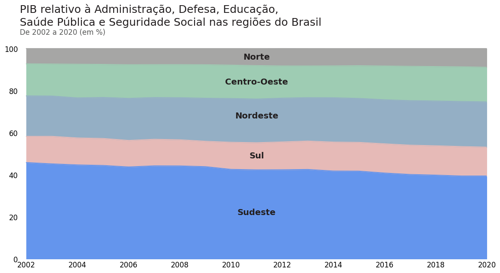
alt-text: Gráfico de áreas empilhadas 100%, criada com a biblioteca Pandas mostrando o PIB relativo à Administração, Defesa, Educação, Saúde Pública e Seguridade Social no Brasil separado por região. O eixo Y representa a contribuição em escala percentual (0 a 100%) das regiões. No eixo x temos a representação de dois em dois anos de 2002 a 2020. As áreas são empilhadas uma em cima da outra em que, partindo de baixo para cima, temos: na cor azul o Sudeste, na cor laranja o Sul, na cor azul-petróleo o Nordeste, na cor verde o Centro-Oeste e, na cor cinza, o Norte. Cada área varia de acordo com o PIB do ano. Dentro de cada área temos o nome da região correspondente ao dado

Desafio 2:

Para o segundo desafio, vamos construir um gráfico de inclinação com três períodos de interesse (2010, 2015 e 2020) para a participação do PIB relativo à indústria nas regiões do Brasil. Vamos utilizar axis duplos no eixo y para conseguir editar os pontos e apresentar os dados de maneira direta, apresentando as oscilações nesses únicos pontos.

Importando e tratando os dados
```
# Importando as bibliotecas
import pandas as pd
import matplotlib.pyplot as plt

# Importando a base de dados do PIB de 2002 a 2020
df_pib = pd.read_csv("https://raw.githubusercontent.com/alura-cursos/dataviz-graficos-composicao-relacionamento/main/dados/pib_br_2002_2020_estados.csv")

# Selecionando os dados desejados
anos = [2010, 2015, 2020]
df_pib = df_pib.query("ano == @anos")[["regiao",  "ano", "va_industria"]]

# Agrupando os dados por região
df_pib = pd.crosstab(index = df_pib.ano, columns = df_pib.regiao,
                      values = df_pib.va_industria, aggfunc="sum", normalize="index")

df_pib = (df_pib * 100).round(1)
df_pib = df_pib[["Sudeste", "Sul", "Nordeste", "Centro-Oeste", "Norte"]]

df_pib.head()
```
Gerando o gráfico
```
def grafico_slope_pib():
  # Importando as bibliotecas
  import matplotlib.pyplot as plt

  # Área do gráfico e tema da visualização
  fig, ax1 = plt.subplots(figsize=(7,7))

  # Definindo as cores do gráfico
  cores = [AZUL3, LARANJA1, AZUL5, VERDE3, CINZA4]

  # Gerando um axis duplo partilhando o eixo x e os mesmos limites em y
  ax2 = ax1.twinx()
  ax1.set_ylim([0,65])
  ax2.set_ylim([0,65])

  # Gerando o gráfico de inclinação (pontos + curva + texto)
  for i in range(5):
    # Adicionando o ponto inicial e final
    ax1.scatter(x = df_pib.index, y = df_pib.iloc[:,i], color = cores[i], s = 50)

    # Adicionando a inclinação
    ax1.plot(df_pib.index, df_pib.iloc[:,i], color = cores[i], lw = 3)

    # Adicionando as regiões no label
    ax1.text(x = 2022.5, y = df_pib.iloc[-1,i], s = df_pib.columns[i],
            fontsize=15, fontweight = 'bold', color=cores[i], va='center')

  ## Personalizando o gráfico
  ax1.set_title('Participação do PIB relativo à indústria das regiões do Brasil', fontsize = 18, color = CINZA1, loc='left', pad = 40)
  ax1.text(0, 1.05, "Entre os anos de 2010, 2015 e 2020 (em %)", transform=ax1.transAxes, color= CINZA3, fontsize=12, ha='left', va='center')

  return ax1, ax2, cores

ax1, ax2, cores = grafico_slope_pib()
```
Personalizando o gráfico
```
# Gerando o gráfico de inclinação
ax1, ax2, cores = grafico_slope_pib()

# Retirando os ticks do eixo y de ambos os lados e as bordas exeto a da base
ax1.tick_params(left = False)
ax1.spines[["top", "left", "right"]].set_visible(False)
ax2.tick_params(right = False)
ax2.set_frame_on(False)

# Ajustando as propriedades do eixo y da esquerda
plt.setp(ax1, xticks=[2010, 2015, 2020], xticklabels = ["2010", "2015", "2020"],
         yticks = df_pib.iloc[0,:],
         yticklabels = [f'{str(valor)}%' if i!= 4 else f'{str(valor)}%\n\n' for i, valor in enumerate(df_pib.iloc[0,:])]
         )

# Ajustando as propriedades do dos pontos centrais
valores = df_pib.iloc[1,:].values
y_pos = [53, 17, 11, 4,-1]
for i in range(len(valores)):
  ax1.text(2015, y_pos[i], f'{valores[i]}%', weight = "bold", fontsize = 14, color = cores[i], ha="center", transform=ax.transData)

# Ajustando as propriedades do eixo y da direita
plt.setp(ax2, yticks = df_pib.iloc[2,:],
         yticklabels = [f'{str(valor)}%' for i, valor in enumerate(df_pib.iloc[2,:])])

# Ajustando propriedades dos dois eixos y
for ax in (ax1, ax2):
  for i, item in enumerate(ax.get_yticklabels()):
    item.set_fontsize(14)
    item.set_fontweight('bold')
    item.set_color(cores[i])

# Ajustando propriedades do eixo x
ax1.xaxis.set_tick_params(labelsize=14, labelcolor=CINZA3)
ax1.spines['bottom'].set_color(CINZA3)

plt.show()
```
Saída:
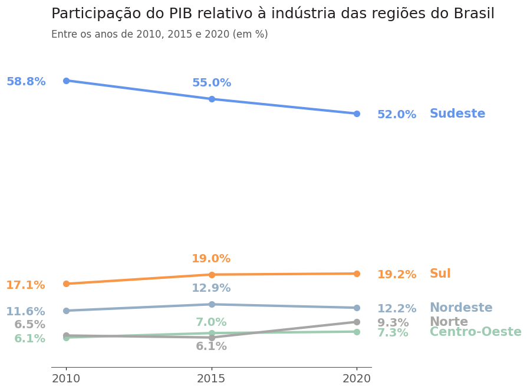
alt-text: Gráfico de inclinação criado com a biblioteca Matplotlib com o título “Participação do PIB relativo à indústria das regiões do Brasil entre os anos de 2010, 2015 e 2020 em %. O gráfico possui 5 linhas com os rótulos das regiões apresentadas em cada linha (Sudeste, Sul, Nordeste, Norte e Centro-Oeste) seguida das porcentagens correspondentes aos três períodos apresentados no título. Cada linha possui uma cor diversa e as inclinações entre o primeiro e segundo trecho do gráfico correspondente à variação da contribuição de cada região em porcentagem no setor

A prática é sempre muito importante para fixar o conteúdo, ainda mais de um assunto tão importante que é o de visualização de dados. A análise de dados por meio de recursos visuais facilita a interpretação das pessoas sobre os dados e apresenta de maneira simples e direta o que eles representam e quais insights podemos adquirir nessa forma de exploração dos dados.

Compartilhar os seus conhecimentos e as práticas que vem desenvolvendo nesse ponto é importante para o seu crescimento dentro da carreira de dados. Portanto, busque realizar os exercícios propostos e veja como isso pode te ajudar a progredir em suas habilidades em visualização de dados.

Se tiver alguma dúvida, você pode usar o fórum ou o Discord da Alura.

## Aula 5
### Desafio: gráficos de relacionamento  
Vamos praticar a criação de gráficos de relacionamento de dados. Para resolver os desafios, vamos seguir utilizando a base de dados com os dados do IDEB (Índice de Desenvolvimento da Educação Básica) entre 2005 a 2021, que está disponível no [GitHub do projeto](https://github.com/alura-cursos/dataviz-graficos-composicao-relacionamento/blob/main/dados/ideb_reg_2005_2021.csv).

Neste desafio, a missão é construir as visualizações que respondam aos seguintes questionamentos:

Desafio 1:

Qual a relação entre as notas das disciplinas de língua portuguesa e matemática do SAEB no Ensino Fundamental Anos Finais no período das 5 últimas avaliações?

Dica: Utilize a coluna de ano para definir as cores do gráfico. Além disso, para ter uma noção da pontuação mínima para proficiência, você pode verificar esse link do [QEdu](https://academia.qedu.org.br/prova-brasil/aprendizado-adequado/?repeat=w3tc) sobre aprendizado adequado.

Desafio 2:

Qual seria a relação entre as notas do SAEB no Ensino Médio? Conseguimos notar como as duas se comportam em relação a taxa de aprovação e as regiões?

Caso precise de ajuda, uma opção de solução da atividade estará disponível na seção “Opinião da pessoa instrutora”.

Observação: Caso ainda não tenha baixado o notebook dos desafios aproveite para fazer isso agora. Ele possui as células e textos para você construir suas soluções e pode te ajudar a verificar seus códigos. Você pode baixar ele para resolver as atividades e desafios testando os seus conhecimentos até o momento.
### Opinião do instrutor

Podem existir diversas formas de solucionar uma questão. Apresentamos abaixo uma sugestão de solução para cada problema.

Desafio 1:

Para o primeiro desafio vamos criar um gráfico de dispersão. As cores definem os anos de aplicação da prova e as retas do gráfico os intervalos que definem as notas dentro ou não do mínimo para proficiência dentro da etapa do Ensino Médio.

Definindo a paleta de cores
```
# Definindo a paleta de cores
AZUL1, AZUL2, AZUL3, AZUL4, AZUL5, AZUL6 = '#174A7E', '#4A81BF', "#6495ED", '#2596BE', '#94AFC5', '#CDDBF3'
CINZA1, CINZA2, CINZA3, CINZA4, CINZA5, CINZA6, BRANCO = '#231F20', '#414040', '#555655', '#A6A6A5', '#BFBEBE', '#CED4DA ,'#FFFFFF'
VERMELHO1, VERMELHO2, LARANJA1 = '#C3514E',	'#E6BAB7',	'#F79747'
VERDE1, VERDE2, VERDE3 = '#0C8040',	'#9ABB59', '#9ECCB3'
```
Importando os dados
```
# Importando as bibliotecas
import pandas as pd
import seaborn as sns
import matplotlib.pyplot as plt

# Importando o conjunto de dados com os dados do IDEB nacional de provas realizadas de 2005 a 2021
ideb = pd.read_csv("https://raw.githubusercontent.com/afonsosr2/dataviz-graficos-composicao-relacionamento/master/dados/ideb_reg_2005_2021.csv")

# Selecionando os dados desejados
anos = [2013, 2015, 2017, 2019, 2021] 
ideb_efaf = ideb.query("ano == @anos and anos_escolares == 'EFAF'")[["ano", "nota_saeb_matematica", "nota_saeb_lingua_portuguesa"]]
ideb_efaf = ideb_efaf.sort_values("ano")
ideb_efaf.head()
Copiar código
Gerando o gráfico
# Definindo as cores do gráfico
cores = [AZUL6, AZUL5, AZUL3, AZUL2, AZUL1]

# Área do gráfico e tema da visualização
fig, ax = plt.subplots(figsize=(10,5))
sns.set_theme(style="white")

# Gerando o gráfico de dispersão com cores como categorias
ax = sns.scatterplot(data = ideb_efaf, x  = "nota_saeb_matematica", y="nota_saeb_lingua_portuguesa", hue = "ano", palette = cores)

## Personalizando o gráfico
plt.suptitle('Relação entre as notas de matemática e língua portuguesa do SAEB', size=18, color=CINZA1, ha = 'right', x = 0.97, y = 1.03)
plt.title('Do Ensino Fundamental Anos Finais (EFAF) entre os anos de 2013 a 2021', fontsize=14, color=CINZA3, pad = 15, loc = "left")
ax.legend(bbox_to_anchor=(225, 320), title='Ano', title_fontsize  = 10, fontsize = 10, loc='upper left', bbox_transform=ax.transData)
ax.set_xlabel('Notas de Matemática (0 - 500)',  fontsize = 14)
ax.set_ylabel('Notas de Português (0 - 500)', fontsize = 14)
ax.xaxis.set_tick_params(labelsize=12, color = CINZA2)
ax.set_xlim(220, 320)
ax.yaxis.set_tick_params(labelsize=12, color = CINZA2)
ax.set_ylim(220, 320)
sns.despine()

# Limites das notas em no eixo y (notas de português) - 275 pontos (proficiência)
ax.text(ax.get_xlim()[0] + 1, 277, 'Nível 4 e superior', fontsize=12, color = CINZA3, va = "bottom")
ax.text(ax.get_xlim()[0] + 1 , 273, 'Nível 4 e inferior', fontsize=12, color = CINZA3, va = "top")
plt.axhline(y = 275, color = CINZA5, linestyle='--')

# Limites das notas em no eixo x (notas de matemática) - 300 pontos (proficiência)
ax.text(298, ax.get_ylim()[1] - 10, 'Nível 5\ne inferior', fontsize=12, color = CINZA3, ha="right")
ax.text(302, ax.get_ylim()[1] - 10, 'Nível 5\ne superior', fontsize=12, color = CINZA3, ha="left")
plt.axvline(x = 300, color = CINZA5, linestyle='--')

# Adicionando um texto explicando a divisão de quadrantes e o que significa
ax.annotate("Cada quadrante representa o nível de proficiência\nde estudantes divididas pelo nível 5 (>=300 pontos)\ne 4 (>=275 pontos)\n\n"
            "Nota-se que o 2º quadrante (Nível 5 e superior em \nmatemática e Nível 4 e superior em português)\n"
            "possuímos as notas com melhores desempenhos \nà nivel nacional", xy=(320, 240), xycoords='data',
            bbox=dict(boxstyle="round", fc=BRANCO, ec=CINZA3),
            xytext=(0, 0), textcoords='offset points')

plt.show()
```
Saída:
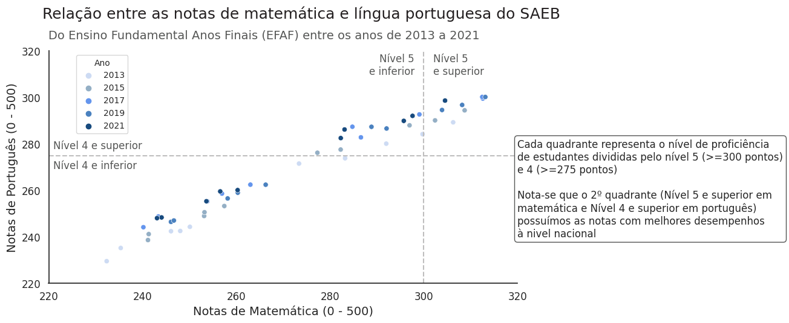
alt-text: Gráfico de dispersão criado com a biblioteca Seaborn e Matplotlib mostrando a relação entre as notas de matemática e língua portuguesa do SAEB do Ensino Fundamental Anos Finais (EFAF) entre os anos de 2013 e 2021. No eixo x temos os intervalos das notas de Matemática de 20 em 20, partindo de 220 até 320. Os valores do eixo y também variam de 20 em 20, partindo de 220 até 320 para as notas de Língua Portuguesa. Os pontos representam as coordenadas das notas e no gráfico variam de um tom de azul mais claro para escuro no qual a intensidade da cor indica a passagem dos anos de 2013 a 2021 das provas. No gráfico temos uma linha vertical tracejada cinza que corta o eixo x em 300. À esquerda da linha está escrito “Nível 5 e inferior”. À direita da linha está escrito “Nível 5 e superior”, apontando a nota mínima de proficiência em Matemática. Ainda temos uma nova linha horizontal tracejada cinza que corta o eixo y em 275. Acima da linha está escrito “Nível 4 e superior” e abaixo da linha está escrito “Nível 4 e inferior”, apontando a nota mínima de proficiência em Língua Portuguesa. Do lado direito do gráfico temos um texto explicando os dados

Desafio 2:

Para o segundo desafio vamos construir um gráfico de bolhas cujo tamanho das bolhas seja relacionado às taxas de aprovação dos pontos presentes na base de dados. Vamos adicionar a meta mínima de proficiência do Ensino Médio como uma nova bolha e linhas que apontem este intervalo.

Importando e tratando os dados
```
# Área do gráfico e tema da visualização
fig, ax = plt.subplots(figsize=(10,8))

# Gerando o gráfico de bolhas
ax = sns.scatterplot(data = ideb_em, x = "nota_saeb_matematica", y = "nota_saeb_lingua_portuguesa",
                     size = "taxa_aprovacao", sizes=(20, 150), color = AZUL3)

# Adicionando a nota meta de proficiência - https://academia.qedu.org.br/prova-brasil/aprendizado-adequado/?repeat=w3tc
ax.scatter([325], [300], color=VERMELHO1, s=75)
plt.axvline(x = 325, color = CINZA5, linestyle='--', linewidth=0.5)
plt.axhline(y = 300, color = CINZA5, linestyle='--', linewidth=0.5)
ax.text(326, 298, 'Meta mínima\nde proficiência', color=CINZA3, fontsize=10, fontweight='bold')

## Personalizando o gráfico
plt.suptitle('Relação entre as notas de matemática e língua portuguesa do SAEB', size=16, 
             color=CINZA1, ha = 'left', x = 0, y = 1.2, transform=ax.transAxes)
plt.title('Do Ensino Médio (EM) entre os anos de 2005 a 2021', fontsize=12, 
          color=CINZA3, ha = "left", x = 0, y = 1.12, transform=ax.transAxes)
ax.legend(loc = 'upper center', fontsize = 10, title="Taxa de Aprovação (%)", ncols = 5,
          bbox_transform=ax.transData)
sns.despine()

# Propriedades dos eixos x e y
ax.set_xlim(230, 350)
ax.set_ylim(230, 350)
plt.setp(ax, xticks=np.arange(230, 351, 15), yticks=np.arange(230, 351, 15))

# Ajustando a aparência dos ticks e tick labels
ax.tick_params(bottom=True, left=True)
ax.xaxis.set_tick_params(labelsize=11, color = CINZA3)
ax.yaxis.set_tick_params(labelsize=11, color = CINZA3)
ax.set_xlabel('Notas de Matemática (0 - 500)', fontsize = 14, labelpad = 15)
ax.set_ylabel('Notas de Português (0 - 500)', fontsize = 14, labelpad = 15)

plt.show()
```
Saída:
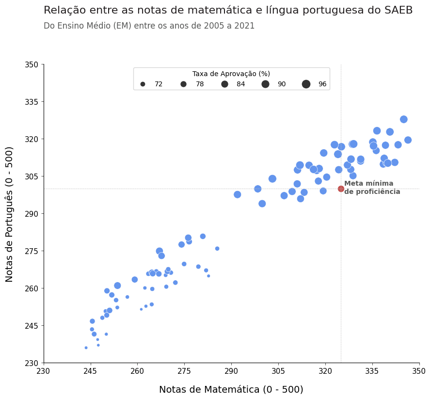
alt-text: Gráfico de bolhas criado com a biblioteca Seaborn e Matplotlib mostrando a relação entre as notas de matemática e língua portuguesa do SAEB do Ensino Médio (EM) entre os anos de 2005 e 2021. No eixo x temos os intervalos das notas de Matemática de 15 em 15, partindo de 230 até 350. Os valores do eixo y também variam de 15 em 15, partindo de 230 até 350 para as notas de Língua Portuguesa. Os pontos representam as coordenadas das notas e no gráfico e variam em tamanho de acordo com a taxa de aprovação dos estudantes no dado fornecido. No gráfico há um ponto vermelho que é intersectado por uma linha vertical tracejada cinza que corta o eixo x em 325 e uma linha horizontal tracejada cinza que corta o eixo y em 300 apontando a meta mínima de proficiência de Matemática e Língua Portuguesa, respectivamente. Na parte superior central do gráfico temos também uma legenda apresentando as porcentagens correspondentes aos tamanhos das bolhas

A prática é sempre muito importante para fixar o conteúdo, ainda mais de um assunto tão importante que é o de visualização de dados. A análise de dados por meio de recursos visuais facilita a interpretação das pessoas sobre os dados e apresenta de maneira simples e direta o que eles representam e quais insights podemos adquirir nessa forma de exploração dos dados.

Compartilhar os seus conhecimentos e as práticas que vem desenvolvendo nesse ponto é importante para o seu crescimento dentro da carreira de dados. Portanto, busque realizar os exercícios propostos e veja como isso pode te ajudar a progredir em suas habilidades em visualização de dados

Se tiver alguma dúvida, você pode usar o fórum ou o Discord da Alura.