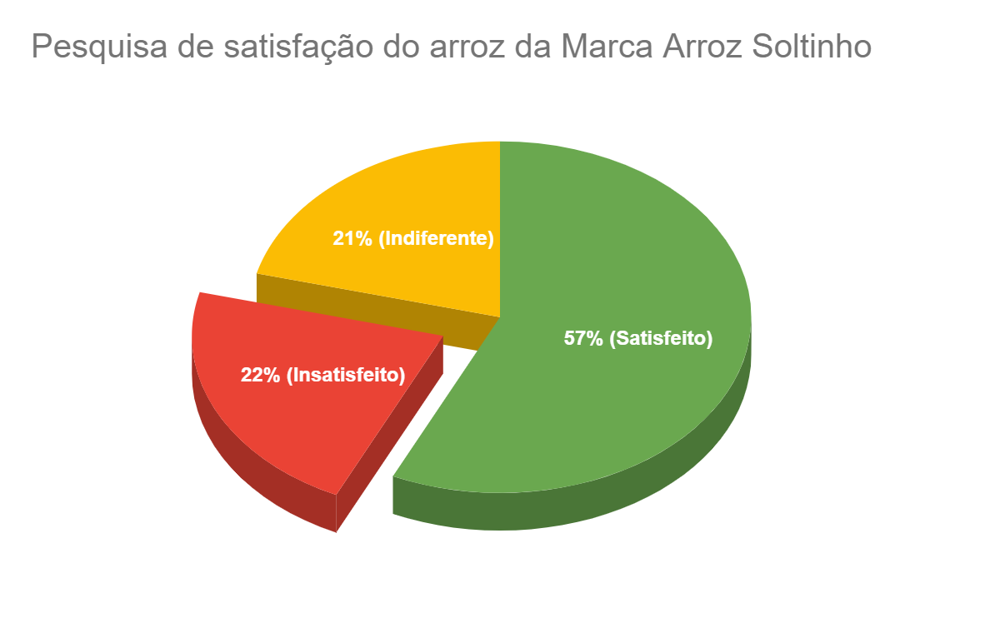
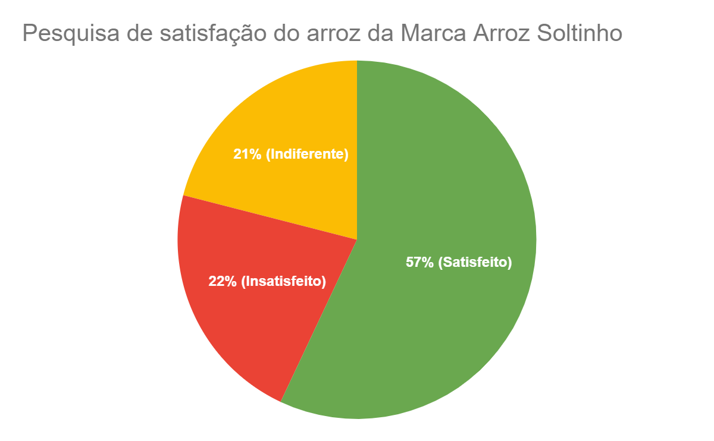
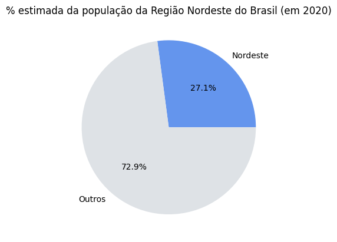
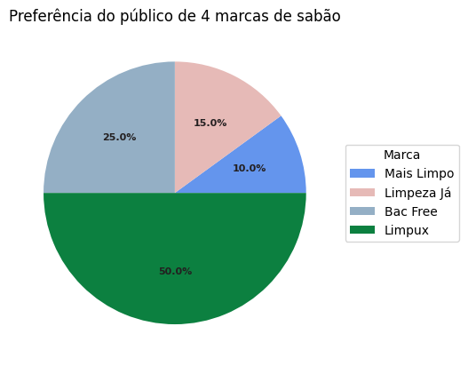
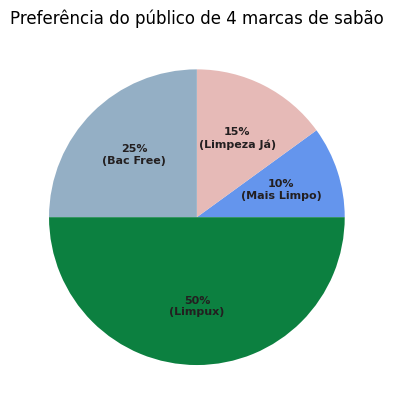
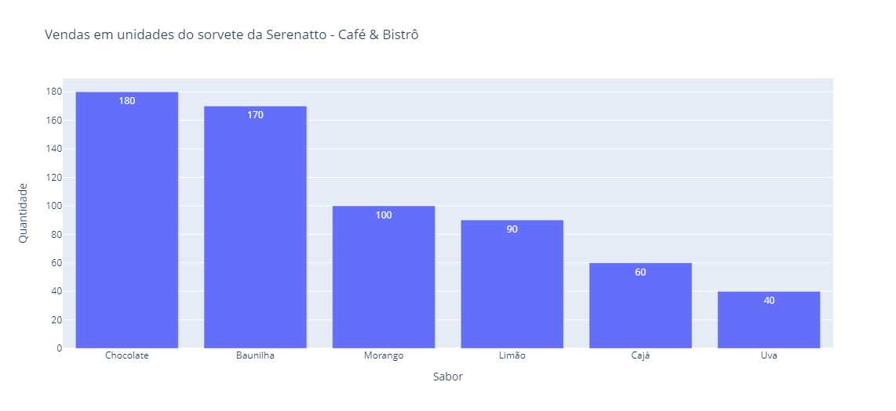
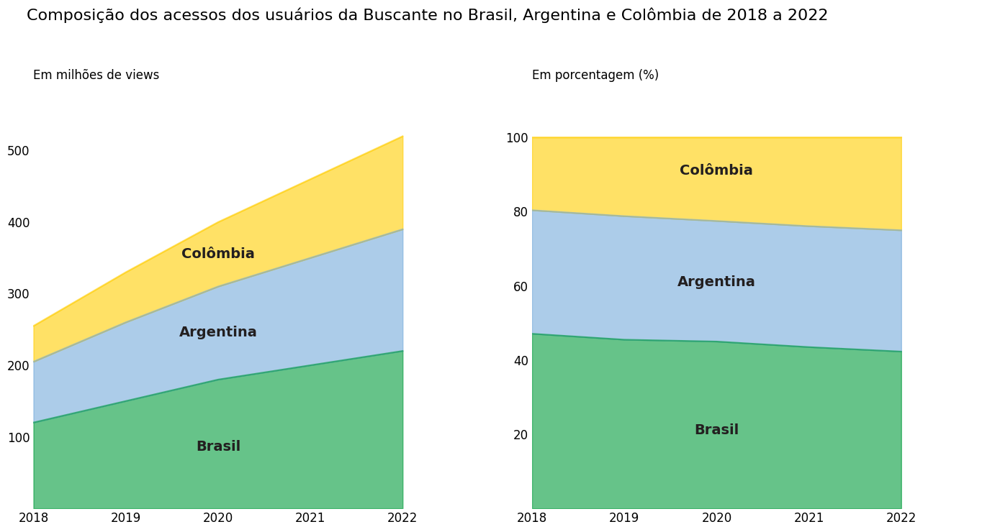
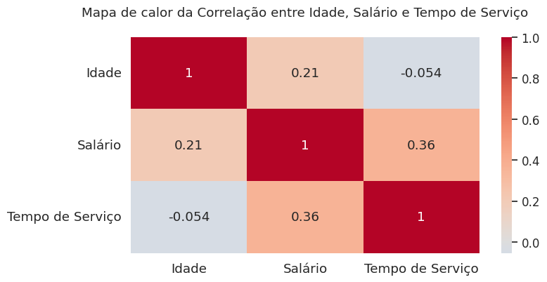

# Para Saber Mais

## Aula 1

### Para saber mais: sintetizando o conteúdo  
Neste curso, vamos aprender a construir diversos tipos de visualização e adicionar alguns recursos como anotações, destaques de dados, entre outros, para responder aos questionamentos levantados acerca da composição do PIB nos Estados brasileiros. Esse tipo de exploração dos dados será importante para compreender como cada Estado e/ou região compõe o PIB nacional e quais setores são mais relevantes para cada um ao longo do período compartilhado.

Para isso, você, como cientista de dados, vai ter acesso a um conjuntos de dados com os valores do PIB, dos impostos líquidos e dos valores agregados dos setores de agropecuária, indústria, serviços e ADESPSS (Administração, Defesa, Educação, Saúde Pública e Seguridade Social) de cada Estado entre os anos de 2002 e 2020.

Este projeto nos seguirá nas quatro primeiras aulas deste curso. Para que possamos trabalhar com os dados, precisamos compreender as informações que temos acesso. Sendo assim, vamos verificar os dados que possuímos em cada coluna do nosso dataset pib_br_2002_2020_estados.csv:

ano: ano de representação dos dados
sigla_uf: sigla do Estado representada na base de dados
regiao: região do Estado
pib: valor do PIB do Estado
impostos_liquidos: impostos líquidos do Estado
va: valor adicionado bruto a preços correntes das atividades econômicas
va_agropecuaria: valor adicionado bruto a preços correntes da agropecuária
va_industria: valor adicionado bruto a preços correntes da indústria
va_servicos: valor adicionado bruto a preços correntes dos serviços, exclusive administração, defesa, educação e saúde públicas e seguridade social
va_adespss: valor adicionado bruto a preços correntes da administração, defesa, educação e saúde públicas e seguridade social
Os questionamentos que vamos responder durante a exploração dos dados são os seguintes:

Como está disposto o PIB nos Estados brasileiros no ano de 2020? É possível notar os Estados com maior e menor participação no PIB nacional?
Houve uma significativa mudança na distribuição do PIB por região comparando os valores de 2002 e 2020?
Qual a participação do Estado de Minas Gerais no PIB de todo o Brasil no ano de 2020?
Como está distribuído o PIB do Estado da Bahia em 2020 separado por impostos líquidos e os valores adicionados brutos dos bens e serviços produzidos?
Qual a evolução anual do PIB do Estado do Rio de Janeiro entre os anos de 2010 a 2020?
Como está distribuído o PIB nos 3 últimos quinquênios (lustro) dos dados (2010, 2015, 2020) na Região Sul do Brasil divididos pelos Estados (Paraná, Santa Catarina e Rio Grande do Sul)?
Como estão distribuídos, em porcentagem, os valores adicionados de bens e serviços descritos na base de dados em relação a cada região no ano de 2020?
Na agropecuária, como estão distribuídos seus valores adicionados por região dentro do período da base dos dados (2002 - 2020)?
Cada questionamento será explorado utilizando um tipo de visualização juntamente a elementos visuais para focar a atenção do nosso público ao que queremos informar e destacar em nossos dados.

Então, vamos começar a criar o nosso primeiro gráfico? Te espero no próximo vídeo!😉

### Para saber mais: quando um gráfico de pizza é eficaz
Muitos(as) profissionais discutem acerca da utilidade prática dos gráficos de pizza como ferramenta de visualização de dados. Existem estudiosos(as) que são contrários(as) à sua aplicação, como [Edward Tufte](https://www.edwardtufte.com/notes-sketches/?msg_id=00018S), um teórico considerado o pai da visualização de dados e com diversos livros abordando esse tema; e a [Cole Nussbaumer Knaflic](https://www.storytellingwithdata.com/blog/2011/07/death-to-pie-charts), autora do Storytelling com dados, um dos livros mais conhecidos da área. Entretanto, esses gráficos são utilizados em nosso dia a dia pela sua apresentação direta dos dados e facilidade na criação em diversas ferramentas de análise de dados.

É importante dizer que muitas pessoas também apontam usos práticos de gráficos de pizza e rosca para casos específicos. O artigo, [When Pie Charts Are Okay (Seriously): Guidelines for Using Pie and Donut Charts](https://depictdatastudio.com/when-pie-charts-are-okay-seriously-guidelines-for-using-pie-and-donut-charts/), escrito por Ann K. Emery, aponta alguns casos em que um gráfico de pizza pode ser utilizado, tais como:

Dados de categorias de gêneros homem/mulher/etc.
Quantidade ou porcentagem de respostas de pesquisas de sim/não.
Pessoas que preferem gatos vs. pessoas que preferem cachorros.
Outros dados binários/dicotômicos.
É possível notar que depende muito do tipo de dado ou de como desejamos apresentar as nossas análises para nosso público para saber se um gráfico de pizza seria ou não adequado. Assim, vamos apresentar 3 pontos de atenção para que a nossa visualização de dados não gere uma confusão na leitura pelo nosso público-alvo.

Nunca utilize Pizza 3D e explosão de fatias
Quanto mais simples e direta é a nossa visualização, menor será o esforço cognitivo de nosso público de consumir e interpretar os dados que queremos apresentar.

Os gráficos de pizza já possuem certa complexidade por apresentar os dados relacionando a parte pelo todo através das áreas de setores circulares. Inserindo 3D levamos os dados para análise de volumes, que não são nada triviais para nossa análise. Além disso, a explosão de fatias desloca as fatias do centro, deixando ainda mais difícil a comparação delas, como mostrado nos gráficos a seguir.

alt text: Gráfico de pizza com o título “Pesquisa de satisfação do arroz da Marca Arroz Soltinho''. O gráfico está desenhado em 3D com a fatia correspondente a Insatisfeito explodida (extraída do gráfico). O rótulo dos dados são: 21% (Indiferente), 22% (Insatisfeito) e 57% (Satisfeito)

alt-text: Gráfico de pizza com o título “Pesquisa de satisfação do arroz da Marca Arroz Soltinho''. O gráfico está desenhado de maneira simples (sem 3D e explosões). O rótulo dos dados são: 21% (Indiferente), 22% (Insatisfeito) e 57% (Satisfeito)

Quanto menos fatia melhor
Não existe um número ótimo para quantidade de fatias que uma pizza pode ter. Entretanto, para a representação ser a mais direta possível, é suficiente utilizar entre duas ou três fatias para informar certos pontos ao nosso público.

Quando há tendência a aumentar as fatias, aumentamos também a dificuldade em visualizar os nossos dados e passamos a pensar se o gráfico de pizza/rosca é adequado. Muitas das vezes a resposta é não e teremos que pensar se vamos usar o de barras, colunas, linhas ou outras formas de visualizar os dados. Os gráficos abaixo, por exemplo, contém os mesmos dados, mas dispostos de formas diferentes.

alt text: Gráfico de pizza de título “% estimada da população brasileira por regiões (em 2020)” possuindo 5 fatias, cada uma com uma legenda de dados, em ordem de porcentagem da seguinte forma: Centro-Oeste (7,8%), Norte (8,8%), Sul (14,3%), Nordeste (27,1%) e Sudeste (42,0%). As cores apresentadas são, respectivamente: roxo, vermelho, verde, laranja e azul.

alt-text:Gráfico de pizza de título “% estimada da população da Região Nordeste do Brasil (em 2020)”, contendo apenas duas fatias: uma fatia cinza escrita Outros (72,9%) e uma azul-claro indicando os dados Nordeste (27,1%).

Fonte: IBGE. Diretoria de Pesquisas - DPE - Coordenação de População e Indicadores Sociais - COPIS (apenas os dados).

Rótulos juntos aos valores
É ideal trazer os rótulos para perto dos dados evitando distrações que atrapalhem a leitura e interpretação dos dados. Um exemplo seria o posicionamento da legenda, pois ela pode influenciar diretamente na interpretação da visualização. Quanto mais distantes as legendas ficam do gráfico, maior é a demora para a compreensão do visual, pois teríamos que dividir a atenção entre a legenda e o gráfico, como podemos observar nos gráficos a seguir.

alt text: Gráfico de pizza que tem como título “Preferência do público de 4 marcas de sabão”. O gráficos possui 4 fatias com as porcentagens das marcas dentro de cada uma delas(10%, 15%, 25% e 50%) e uma legenda no lado direito com as marcas que cada fatia representa, respectivamente, Mais limpo, Limpeza Já, BacFree e Limpux. As cores apresentadas respectivamente são: azul, laranja, azul claro e verde.

alt-text: Gráfico de pizza que tem como título “Preferência do público de 4 marcas de sabão” com o nome das marcas juntas as suas respectivas porcentagens dentro de cada fatia, sendo elas: Mais Limpo (10%), Limpeza Já (15%), BacFree (25%) e Limpux (50%). As cores apresentadas respectivamente são: azul, laranja, azul claro e verde.

Para finalizar, os gráficos de setores tendem a ser mais fáceis de interpretar quando utilizamos frações comuns como um quarto e três quartos (25% vs. 75%) ou um terço e dois terços (33% vs 67%).

## Aula 2
### Para saber mais: método melt  
O método melt() é uma ferramenta bastante utilizada para a transformação de dados no Python. Ele faz parte da biblioteca Pandas e é responsável por transformar um DataFrame em um formato mais longo, reorganizando as colunas em linhas, tornando-os mais adequados para análise e visualização de dados. Esse comportamento é o que chamamos de transformação de um DataFrame de "wide to long" (ampla para longa).

Em um conjunto de dados do tipo "wide", temos muitas colunas com diferentes tipos de informações. Já em um do tipo "long" temos menos colunas e mais linhas, com cada linha contendo várias parcelas de informação. Ao usar melt(), estamos transformando colunas do nosso DataFrame em linhas para formar um conjunto de dados mais longo.

Para entender esse comportamento, vamos testar em um exemplo. Recebemos o DataFrame abaixo para construir um gráfico de colunas que representa, ano a ano, as vendas de 3 produtos de um mercado. Os dados estão expressos em toneladas.

import pandas as pd

# Criando um dataframe
vendas_ton = pd.DataFrame({'Produto': ['Arroz', 'Feijão', 'Açúcar'],
                           '2020': [90, 85, 88],
                           '2021': [92, 94, 89],
                           '2022': [84, 88, 92],
                           '2023': [100, 98, 87]})
vendas_ton
Copiar código
Saída:

Produto	2020	2021	2022	2023
0	Arroz	90	92	84	100
1	Feijão	85	94	88	98
2	Açúcar	88	89	92	87
Podemos perceber que temos um DataFrame com cada ano como uma coluna, configurando-o como do tipo “wide”. É possível trabalhar com ele dessa forma, mas podemos, por exemplo, trazer os dados dos anos para uma única coluna e seus valores correspondentes em outra coluna se quisermos transformar o nosso conjunto de dados para um formato longo.

Então, podemos utilizar o método melt() no nosso DataFrame da seguinte forma:

vendas_ton_melt = vendas_ton.melt(id_vars='Produto', var_name='Ano', value_name='Toneladas')
vendas_ton_melt
Copiar código
Saída:

Produto	Ano	Toneladas
0	Arroz	2020	90
1	Feijão	2020	85
2	Açúcar	2020	88
3	Arroz	2021	92
4	Feijão	2021	94
5	Açúcar	2021	89
6	Arroz	2022	84
7	Feijão	2022	88
8	Açúcar	2022	92
9	Arroz	2023	100
10	Feijão	2023	98
11	Açúcar	2023	87
Agora, temos o nosso DataFrame devidamente convertido para um tipo “long” e podemos prosseguir para a criação do gráfico requisitado. Mas, que tal você construir este gráfico com os dados já transformados agora? Fica o desafio!

### Para saber mais: Plotly express x Graph objects  
Aqui, vamos explorar duas das principais bibliotecas do Plotly: a Plotly Express e a Graph Objects.

Sabemos que a Plotly possui uma incrível capacidade de criar gráficos impactantes e interativos, que vão desde simples dispersões até visualizações complexas de dados multidimensionais. Dito isto, temos duas abordagens distintas para a criação de gráficos com o Plotly que são a partir da utilização da biblioteca Plotly Express ou da Plotly Graph Objects.

Plotly Express
Com uma abordagem de alto nível, a **Plotly Express ** (usualmente importada como px) oferece simplicidade e rapidez na criação de gráficos interativos, sendo ideal para análise exploratória de dados. Entre seus pontos positivos, podemos destacar:

Interface de alto nível para criação rápida e fácil de gráficos interativos.
Funções simples e diretas para criar uma variedade de gráficos, como gráficos de dispersão, barras, linhas, bolhas, entre outros.
Requer menos código e é mais amigável para iniciantes.
Criação rápida de visualizações interativas sem a necessidade de ajustes detalhados.
Todos esses pontos apontam a Plotly Express como a ideal para prototipagem rápida e análise exploratória de dados. Mas, temos muitas vantagens também em utilizar a Graph Objects como podemos conferir a seguir.

Graph Objects
A Plotly Graph Objects (usualmente importada como go) oferece um nível mais avançado de controle, possibilitando a personalização detalhada e a criação de gráficos complexos sob medida para os requisitos específicos do projeto. Entre seus pontos positivos, podemos destacar:

Interface de baixo nível que oferece controle detalhado sobre cada elemento do gráfico.
Requer mais código e conhecimento mais avançado para criar gráficos personalizados.
Construção de gráficos complexos com total controle sobre layouts, anotações e estilos.
Adequada para personalização avançada e criação de gráficos que não são facilmente alcançados com o Plotly Express.
Todos esses pontos apontam a Plotly Graph Objects como ideal para visualizações personalizadas, relatórios específicos e quando é necessário ter controle total sobre o design dos gráficos.

Como escolher entre as duas bibliotecas
Ao entender as diferenças entre essas duas bibliotecas, as pessoas cientistas de dados e desenvolvedoras podem tomar decisões sobre qual abordagem utilizar para criar visualizações de dados impactantes e eficazes. Assim, podemos elencar três situações que podem te dar um auxílio sobre qual utilizar:

Se você precisa criar rapidamente gráficos interativos com uma sintaxe simples, escolha Plotly Express.
Se você busca criar gráficos altamente personalizados com controle detalhado ou precisa construir visualizações complexas, use Plotly Graph Objects.
Em alguns casos, é possível combinar ambas as bibliotecas para aproveitar o melhor de cada uma, começando com Plotly Express para uma prototipagem rápida e, em seguida, migrando para Plotly Graph Objects para ajustes finos e personalizações.
Observe um exemplo da criação de um gráfico de colunas utilizando essas bibliotecas separadamente.

Exemplo de um gráfico de colunas para ambas bibliotecas
Vamos representar, em um gráfico de colunas, as vendas por unidade dos sorvetes da Serenatto - Café & Bistrô, a franquia de restaurantes mencionada no exercício anterior, utilizando as duas bibliotecas que estamos estudando.

Utilizando a Plotly Express:

import plotly.express as px

# Dados de exemplo
data = {'sabor': ['Chocolate', 'Baunilha', 'Morango', 'Limão', 'Cajá', 'Uva'], 
        'qtd': [180, 170, 100, 90, 60, 40]}

# Criando um gráfico de colunas usando Plotly Express
fig = px.bar(data, x='sabor', y='qtd', title='Vendas em unidades do sorvete da Serenatto - Café & Bistrô',
             labels={'sabor': 'Sabor', 'qtd': 'Quantidade'}, text_auto=True,
             hover_data=['sabor','qtd'])

# Mostrando o gráfico
fig.show()
Copiar código
Utilizando a Plotly Graph Objects:

import plotly.graph_objects as go

# Dados de exemplo
data = {'sabor': ['Chocolate', 'Baunilha', 'Morango', 'Limão', 'Cajá', 'Uva'], 
        'qtd': [180, 170, 100, 90, 60, 40]}

# Criando um gráfico de colunas usando Plotly Graph Objects
fig = go.Figure()

fig.add_trace(go.Bar(x=data['sabor'], y=data['qtd'], text=data['qtd'], textposition='auto'))

fig.update_layout(title='Vendas em unidades do sorvete da Serenatto - Café & Bistrô',
                  xaxis_title='Sabor', yaxis_title='Quantidade')

# Mostrando o gráfico
fig.show()
Copiar código
Note que ambos os gráficos gerados serão semelhantes a este:

alt-text: Gráfico de colunas criado tanto com os módulos Plotly Express quanto Graph Objects da Plotly, mostrando os 6 tipos de sorvetes mais vendidos da Serenatto - Café e Bistrô. No eixo x temos o nome de cada um dos sabores de sorvete, sendo eles: chocolate, baunilha, morango, limão, cajá e uva. Os valores do eixo y representam a quantidade vendida em unidades 0 a 180. Todas as colunas estão com a cor azul e o tamanho correspondente a quantidade vendida de cada sabor

Resumindo, ambas as bibliotecas são boas ferramentas do Plotly para visualizações interativas. O Express é indicado para gráficos rápidos e fáceis, enquanto o Graph Objects oferece controle avançado para visualizações personalizadas. A escolha depende da agilidade versus personalização desejada. Combiná-las é uma estratégia eficaz para criar visualizações sofisticadas e ágeis.

## Aula 3
### Para saber mais: normalização de dados
Vamos pontuar uma das razões de explorarmos a normalização mais voltada para criação de visualizações de dados. A normalização de dados tenta resolver o problema da criação de visuais cujos dados possam representar diferenças muito grandes em uma mesma variável tornando difícil a interpretação em nosso gráfico. Além disso, ela é bastante útil quando queremos averiguar a composição dos dados em termos percentuais.

A normalização dos dados é essencial para garantir que as variáveis estejam em uma escala comparável, facilitando a interpretação dos resultados. Em nosso último vídeo, utilizamos uma expressão similar a df = df.div(df.sum(axis=1), axis=0) para dividir cada valor pelo somatório da linha correspondente, realizando a normalização das linhas do DataFrame. Isso permite que a pessoa cientista de dados transforme seus dados em uma escala de 0 a 1, que pode ser facilmente transformada em uma escala percentual (0 a 100).

Por que transformar em escala percentual?
A transformação dos dados para a escala percentual pode ser extremamente útil para entender seus dados. Por exemplo, se você estivesse analisando as vendas de vários produtos, ter a informação em termos percentuais poderia te dizer rapidamente que produto estava gerando a maior parte das vendas.

Transformar seus dados em escala percentual também pode ser importante para a normalização. Você pode ter dados onde a maioria das observações esteja em um pequeno intervalo de valores, mas alguns poucos dados muito grandes ou muito pequenos distorcem a escala de tal forma que a maioria deles é espremida em uma pequena parte da escala. Ao normalizar, você garante que todos os dados são representados de forma equitativa.

Explicando a fórmula de normalização
Vamos utilizar a mesma fórmula que aprendemos na aula para entender como conseguimos normalizar dados na mesma linha. Vamos resgatar a expressão logo abaixo para explicá-la:

df = df.div(df.sum(axis=1), axis=0)
Copiar código
O método sum() é aplicado ao longo das linhas (axis=1) para calcular a soma de cada linha do DataFrame, atuando como o nosso denominador da divisão. Enquanto que o método div() é utilizado para dividir cada valor do DataFrame pelo valor correspondente na soma da sua respectiva linha utilizando o eixo das colunas (axis=0).

É importante ter atenção na divisão que é feita por eixo das colunas porque os valores estão sendo “varridos” na mesma linha pulando coluna a coluna. Por isso que na função div(), passamos o parâmetro axis=0.

Vamos representar em um conjunto de dados normalizados a composição das vendas dos sorvetes da Serenatto - Café & Bistrô de acordo com as 4 principais filiais. Primeiro vamos criar o DataFrame e depois aplicar a normalização com a fórmula explicada mais acima:

import pandas as pd

df = pd.DataFrame({'Cidade': ["A", "B", "C", "D"],
                   'Chocolate':[60, 30, 20, 40],
                   'Baunilha': [50, 40, 40, 30],
                   'Morango': [15, 30, 25, 50],
                   'Limão': [10, 20, 10, 40]})

df = df.set_index("Cidade")
df_normalizado = df.div(df.sum(axis=1), axis=0)
Copiar código
Vamos ler agora o df e o df_normalizado para compará-los, sendo o primeiro o conjunto de dados antes da normalização e o segundo já normalizado:

Antes da normalização:

Chocolate	Baunilha	Morango	Limão
Cidade				
A	60	50	15	10
B	30	40	30	20
C	20	40	25	10
D	40	30	50	40
Após a normalização:

Chocolate	Baunilha	Morango	Limão
Cidade				
A	0.444444	0.370370	0.111111	0.074074
B	0.250000	0.333333	0.250000	0.166667
C	0.210526	0.421053	0.263158	0.105263
D	0.250000	0.187500	0.312500	0.250000
Note que os dados foram trazidos entre os valores de 0 a 1 e o somatório de cada linha resulta no valor 1, ou seja, trazemos todos os dados para uma mesma escala. Podemos então, facilmente transformar essa escala em porcentagem multiplicando todos os valores por 100.

Observação: Vamos voltar a explorar este exemplo na próxima atividade construindo o gráfico com esses dados.

Estudamos a importância da normalização de dados com o objetivo de comparar a distribuição relativa dos valores dos nossos dados. Ao normalizar os dados por linha, os valores em cada linha foram transformados para demonstrar suas respectivas proporções em relação ao total daquela linha.

## Aula 4
### Para saber mais: gráfico de áreas empilhadas 100%  
O gráfico de áreas empilhadas 100% é um tipo de gráfico de áreas em que os dados são apresentados como porcentagens do total, permitindo comparar a distribuição relativa de várias categorias ao longo de um eixo. Neste tipo de gráfico, a área total da representação é sempre igual a 100%, o que facilita a visualização das proporções entre as categorias.

Este tipo de gráfico é útil quando desejamos comparar a contribuição de diferentes categorias para o total em várias séries de dados. Ele é bastante útil quando temos várias séries com tamanhos variados e queremos entender a distribuição percentual de cada categoria em relação ao total. Além disso, os gráficos de áreas empilhadas 100% são adequados para mostrar como a composição das categorias muda ao longo do tempo.

Vamos entender as diferenças entre o gráfico de áreas empilhadas com valores absolutos e o de áreas empilhadas 100% por meio de um exemplo explorando um case do e-commerce Buscante, um buscador online de livros.

Neste caso, você precisa representar a composição dos acessos dos usuários nos últimos 5 anos (2018 a 2022) na plataforma, tomando como base o acesso realizado nos três países em que a empresa possui clientes. A base de dados que você recebeu possui as quantidades de acesso dos três países (Brasil, Argentina e Colômbia) em cada ano de pesquisa.

Para resolver este problema, vamos criar 2 diferentes gráficos: o gráfico de áreas empilhadas para mostrar a magnitude e variação dos acessos ano a ano e um gráfico de áreas empilhadas 100% para mostrar a distribuição relativa dos acessos entre os países.

Primeiro, vamos importar as bibliotecas que vamos utilizar e criar o DataFrame com os dados fornecidos para a construção do 1º gráfico:

import pandas as pd
import numpy as np
import matplotlib.pyplot as plt

# Acessos em milhões de cada país em cada ano
acessos = pd.DataFrame({'Ano': [2018, 2019, 2020, 2021, 2022], 'Brasil': [120, 150, 180, 200, 220],
                        'Argentina': [85, 110, 130, 150, 170],  'Colômbia': [50, 70, 90, 110, 130]})

acessos = acessos.set_index("Ano")
acessos
Copiar código
DataFrame acessos:

Brasil	Argentina	Colômbia
Ano			
2018	120	85	50
2019	150	110	70
2020	180	130	90
2021	200	150	110
2022	220	170	130
Em seguida, vamos aplicar a normalização em acessos, trazendo os números para a escala percentual (0-100) a fim de construir o 2º gráfico:

# Normalizando os números de acessos e deixando-os numa escala de 0 a 100
acessos_normalizados = (acessos.div(acessos.sum(axis=1), axis=0) * 100).round(1)
acessos_normalizados
Copiar código
DataFrame acessos_normalizados:

Brasil	Argentina	Colômbia
Ano			
2018	47.1	33.3	19.6
2019	45.5	33.3	21.2
2020	45.0	32.5	22.5
2021	43.5	32.6	23.9
2022	42.3	32.7	25.0
Por fim, para construir ambos os gráficos lado a lado para realizarmos a comparação, vamos executar o seguinte código:

fig, axs = plt.subplots(1, 2, figsize=(14,7))

fig.suptitle('Composição dos acessos dos usuários da Buscante no Brasil, Argentina e Colômbia de 2018 a 2022', 
             fontsize = 16, ha = 'left', x = 0.03, y = 1.05)

# GRÁFICO 1 - gráfico de áreas empilhadas

acessos.plot.area(color = ["#009C3B", "#75AADB", "#FFCD00"], xticks=np.arange(2018, 2023,1), ax = axs[0], alpha= 0.6)
axs[0].set_title('Em milhões de views\n', loc = "left")
axs[0].set_ylabel('')
axs[0].set_xlabel('')
axs[0].xaxis.set_tick_params(labelsize=12)
axs[0].yaxis.set_tick_params(labelsize=12)
axs[0].set_ylim(0.01, 570)     # ajustando os limites do eixo y
axs[0].set_xbound(2018,2023)   # ajustando os limites do eixo x
axs[0].legend().remove()
axs[0].tick_params(axis='both', which='both', length=0)
axs[0].set_frame_on(False)

## Anotando os nomes das regiões
pais = acessos.columns
y_pos = [80, 240, 350]
for i in range(len(pais)):
  axs[0].text(2020, y_pos[i], f'{pais[i]}', color = '#231F20', weight = "bold", fontsize = 14, ha="center", transform=axs[0].transData)

#######################################

# GRÁFICO 2 - gráfico de áreas empilhadas 100%

acessos_normalizados.plot.area(color = ["#009C3B", "#75AADB", "#FFCD00"], xticks=np.arange(2018, 2023,1), ax = axs[1], alpha= 0.6)
axs[1].set_title('Em porcentagem (%)\n', loc = "left")
axs[1].set_ylabel('')
axs[1].set_xlabel('')
axs[1].xaxis.set_tick_params(labelsize=12)
axs[1].yaxis.set_tick_params(labelsize=12)
axs[1].set_ylim(0.01, 110)     # ajustando os limites do eixo y
axs[1].set_xbound(2018,2023)   # ajustando os limites do eixo x
axs[1].legend().remove()
axs[1].tick_params(axis='both', which='both', length=0)
axs[1].set_frame_on(False)

## Anotando os nomes das regiões
pais = acessos_normalizados.columns
y_pos = [20, 60, 90]
for i in range(len(pais)):
  axs[1].text(2020, y_pos[i], f'{pais[i]}', color = '#231F20', weight = "bold", fontsize = 14, ha="center", transform=axs[1].transData)

plt.tight_layout()
plt.show()
Copiar código
O gráfico gerado é o seguinte:

alt-text: Duas visualizações, sendo uma do gráfico de áreas empilhadas e outra do gráfico de áreas empilhadas 100%, ambas criadas com a biblioteca Pandas e Matplotlib mostrando a composição dos acessos dos usuários da Buscante no Brasil, Argentina e Colômbia de 2018 a 2022. À esquerda temos um gráfico de áreas empilhadas em que o eixo Y representa a quantidade de acessos em milhões variando de 0 a 500. As áreas são empilhadas uma em cima da outra em que: a área de baixo, na cor verde, representa os acessos no Brasil, a área central, na cor azul, os acessos na Argentina e a área do topo, na cor amarela, os acessos na Colômbia. Cada área varia de acordo com os acessos ano a ano. Já no gráfico à direita são representados os mesmos dados em escala percentual (0 a 100%) representando a contribuição de cada país ano a ano. Em ambos os gráficos no eixo x temos a representação ano a ano de 2018 a 2022. Dentro de cada área temos o nome do país correspondente ao dado

Note, neste exemplo da Buscante, que possuímos diferentes interpretações para os dois gráficos. Em essência os dados são os mesmos, mas as escalas escolhidas possuem intencionalidades diferentes para apresentação do dado.

O gráfico de barras empilhadas foca na magnitude dos dados apontando, por exemplo, o crescimento global dos acessos e também as diferenças absolutas entre cada país. Já o gráfico de áreas empilhadas 100% representa a contribuição de cada país para o total de acessos. Ou seja, não conseguimos averiguar a evolução ou não dos acessos totais ano a ano, mas é mais evidente a composição de cada país para os acessos em cada um dos anos.

## Aula 5
### Para saber mais: sintetizando o conteúdo
Para o nosso segundo projeto dentro do curso vamos focar na criação de diferentes visualizações que apresentam o relacionamento entre os dados. Vamos utilizar os recursos que aprendemos até aqui para responder aos questionamentos relativos ao [IDEB](https://www.gov.br/inep/pt-br/areas-de-atuacao/pesquisas-estatisticas-e-indicadores/ideb) (Índice de Desenvolvimento da Educação Básica).

Teremos acesso a um conjunto de dados que compila os indicadores do IDEB, divididos por região, que é fruto das notas das provas do [SAEB](https://www.gov.br/inep/pt-br/areas-de-atuacao/avaliacao-e-exames-educacionais/saeb) (Sistema de Avaliação da Educação Básica) realizadas entre 2005 a 2021 e as taxas de aprovação divulgadas pelo [Censo Escolar](https://www.gov.br/inep/pt-br) do mesmo período.

Para compreender o storytelling do projeto, esses dados descrevem o desempenho dos(as) estudantes em testes de proficiência de Língua Portuguesa e Matemática, além da taxa de aprovação escolar. O IDEB é medido em uma escala de 0 a 10 e é uma importante ferramenta para acompanhar o desenvolvimento da educação básica no país, permitindo a avaliação da efetividade das políticas públicas na área e a identificação das regiões que necessitam de maior atenção.

Este projeto nos seguirá nesta aula e, para que possamos trabalhar com os dados, precisamos compreender as informações que temos acesso. Sendo assim, vamos verificar os dados que possuímos em cada coluna do dataset ideb_reg_2005_2021.csv:

ano: ano de representação dos dados
regiao: região onde a prova foi realizada
rede: rede onde os dados foram compilados (estadual ou privada)
ensino: etapa de ensino dos aplicantes (fundamental ou medio)
anos_escolares: fase do ensino dos aplicantes (EFAI´ - Ensino Fundamental Anos Iniciais , EFAF- Ensino Fundamental Anos Finais, EM` - Ensino Médio)
taxa_aprovacao: taxa de aprovação dos aplicantes da região na fase
indicador_rendimento: indicador de rendimento baseado na taxa de aprovação dos aplicantes
nota_saeb_matematica: nota de proficiência em matemática não padronizada (0-500) no exame do SAEB ou Prova Brasil
nota_saeb_lingua_portuguesa: nota de proficiência em língua portuguesa não padronizada (0-500) no exame do SAEB ou Prova Brasil
nota_saeb_media_padronizada: média da proficiência em língua portuguesa e matemática, padronizada para um indicador entre 0 e 10
ideb: índice de desenvolvimento da educação básica resultante do produto entre a nota média padronizada (N) e o indicador de rendimento (P)
Os questionamentos que vamos responder durante a exploração dos dados são os seguintes:

Qual a relação entre o IDEB e o indicador de rendimento das escolas no ensino médio? É positiva, negativa ou não estão correlacionadas?

Qual a relação entre as notas das disciplinas de língua portuguesa e matemática no SAEB por região no Ensino Fundamental Anos Iniciais? Conseguimos traçar algum paralelo entre elas?

Qual seria a relação entre a taxa de aprovação e a média da nota do SAEB no Ensino Fundamental Anos Finais? Conseguimos notar como as duas se distribuem em relação ao IDEB e as regiões?

Essas questões serão nossas principais formas de conduzir nosso curso daqui em diante. Iremos responder aos poucos a cada uma delas. Conto contigo nessa caminhada! Bons estudos e até o próximo vídeo. 

### Para saber mais: mapa de calor e matriz de correlação  
Na fase inicial de um projeto de análise de dados é bem comum que façamos uma série de tentativas para que possamos compreender melhor os padrões nos dados e verificar se certos valores contribuem ou não para o problema que enfrentamos.

Dito isto, existe uma série de visualizações que podemos utilizar para relacionar dados, sendo duas delas bastante comuns para uma pessoa cientista de dados: os mapas de calor (heatmap) e as matrizes de correlação. Elas ajudam a identificar relações entre variáveis, bem como investigar a força entre as relações que podemos chamar de correlação dos dados. Mas o que é cada um deles?

Mapa de calor
O mapa de calor é uma representação gráfica que mostra a distribuição, relação ou variação dos dados em uma matriz ou espaço bidimensional, utilizando as cores para destacar valores ou como representação de intensidade na distribuição dos dados. Existem vários tipos de mapas de calor, partindo dos mapas de calor de correlação, que vamos dar maior destaque aqui, aos mapas de calor de densidade, os geográficos, entre outros.

O mapa de calor pode ser utilizado para uma variedade de situações, incluindo:

Visualizar a relação entre duas ou mais variáveis (mapa de calor de correlação).
Visualizar a distribuição de dados (mapa de calor de intensidade).
Apresentar a densidade de ocorrência de um evento em uma área específica (mapa da calor de densidade).
Distribuição geográfica dos dados (mapa de calor geográfico).
Para representar o relacionamento entre variáveis, o mapa de calor utiliza cores para destacar padrões e variações nos dados no formato de tabela, mostrando a correlação entre diferentes combinações de valores. Os eixos x e y representam as dimensões e a intensidade das cores ou tons representam os valores das células.

Matriz de correlação
A matriz de correlação é uma tabela que mostra a relação estatística entre múltiplas variáveis. Ela exibe os coeficientes de correlação entre os pares de variáveis, indicando a força e direção da relação linear entre elas. Os valores variam entre -1 e 1, nos quais:

-1 indica uma correlação negativa perfeita;
1 indica uma correlação positiva perfeita; e
0 indica ausência de correlação.
A matriz de correlação pode ser utilizada para uma variedade de situações, incluindo:

Identificar variáveis que estão relacionadas.
Eliminar variáveis que não estão relacionadas.
Auxiliar na escolha de variáveis para modelos de aprendizado de máquina.
Exemplificando os visuais
Podemos notar que os mapas de calor e as matrizes de correlação podem ser utilizados juntos para uma análise mais completa dos dados. Os mapas são apontados para visualizar a relação dos dados, enquanto as matrizes de correlação podem ser utilizadas para medir a associação entre as variáveis.

Vamos criar um simples exemplo para observar essas visualizações. Temos abaixo uma pequena tabela representando uma lista de 10 funcionários e suas respectivas idades, salários e tempo de serviço em uma dada empresa:

Idade	Salário	Tempo de Serviço
0	50	3130	1
1	36	4685	12
2	29	3769	10
3	42	5391	6
4	40	8611	13
5	44	9949	12
6	32	5433	9
7	32	8311	1
8	45	8051	11
9	45	9420	11
Para construir a matriz de correlação, vamos passar os dados do DataFrame que gerou a tabela e chamar o método corr() da biblioteca Pandas que cria essa visualização:

import pandas as pd

df = pd.DataFrame({"Idade": [50, 36, 29, 42, 40, 44, 32, 32, 45, 45],
                   "Salário": [3130, 4685, 3769, 5391, 8611, 9949, 5433, 8311, 8051, 9420],
                   "Tempo de Serviço": [1, 12, 10, 6, 13, 12, 9, 1, 11, 11]})

matriz_correlacao = data.corr()
matriz_correlacao
Copiar código
Saída:

Idade	Salário	Tempo de Serviço
Idade	1.000000	0.210951	-0.054001
Salário	0.210951	1.000000	0.364877
Tempo de Serviço	-0.054001	0.364877	1.000000
A matriz correlação demonstra a relação entre as variáveis. Podemos notar, por exemplo, uma pequena correlação positiva entre o salário e o tempo de serviço. Por fim, vamos representar os dados em um mapa de calor, escrevendo o seguinte código:

import seaborn as sns
import matplotlib.pyplot as plt

# Criando o heatmap
fig, ax = plt.subplots(figsize=(8, 4))
sns.set(font_scale=1.1)
sns.heatmap(matriz_correlacao, annot=True, cmap='coolwarm', center=0)
plt.title('Mapa de calor da Correlação entre Idade, Salário e Tempo de Serviço\n')
plt.show()
Copiar código
Saída:

alt-text: Mapa de calor com a correlação entre a idade, salário e tempo de serviço dos funcionários de uma dada empresa. No eixo x e y temos as colunas de idade, salário e tempo de serviço e os valores apresentando a correlação entre cada duas a duas. As cores variam de cinza a vermelho escuro, no qual o tom vermelho fica mais forte quanto mais próximo de 1 e o cinza para os valores positivos e negativos em torno de zero. Ao lado direito do gráfico temos  a escala com essas cores mencionadas variando de 0.0 a 1.0.

Note que utilizamos o método heatmap() do Seaborn para construir o mapa de calor. As células são coloridas de acordo com o valor da correlação, facilitando a identificação de padrões e relações entre as variáveis.

Para aprender mais sobre a construção das matrizes de correlação e mapas de calor em Python, indicamos a leitura do método corr() do Pandas e do método heatmap() do Seaborn em cada documentação.