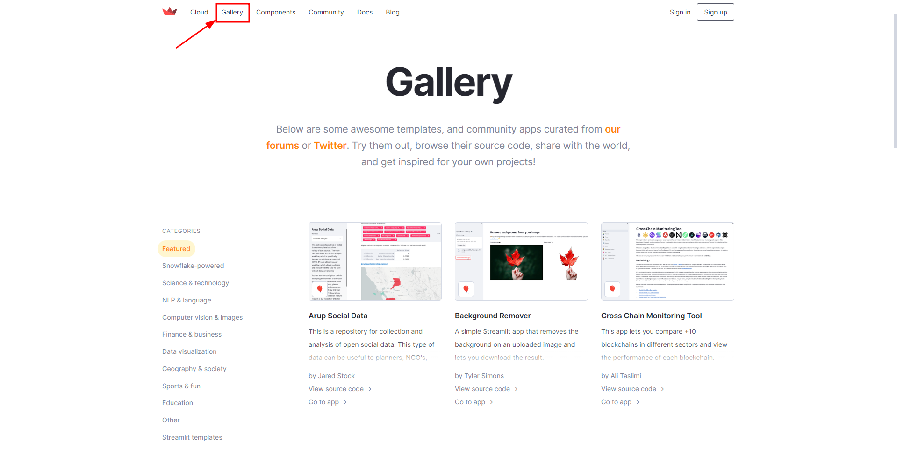

# Para Saber Mais

## Aula 1

### Para saber mais: visão geral do Streamlit  
O [Streamlit](https://streamlit.io/) é uma biblioteca em Python que permite a criação e compartilhamento de aplicativos web, com a vantagem de ser fácil de utilizar, sem a necessidade de conhecer ferramentas de front-end ou de deploy de aplicações.

Neste curso, vamos utilizar o Streamlit para construir um dashboard de vendas, mas esse não é o único tipo de projeto que podemos criar com essa ferramenta. Na seção ["Galeria" do site oficial do Streamlit](https://streamlit.io/gallery), é possível visualizar diversos exemplos de aplicações que podem ser construídas com o Streamlit.

alt text: Site oficial do Streamlit aberto na seção Gallery, que está destacada na barra superior por uma seta e um retângulo vermelho. A tela contém exemplos de projetos construídos com o Streamlit. É possível filtrar as categorias de projetos no menu lateral esquerdo da página, e no centro são mostrados os projetos contendo uma breve descrição e imagens exemplificativas.

É possível criar aplicativos para remover fundos em imagens ou fazer um classificador de imagens interativo, dentro da área de visão computacional. É possível gerar textos ou converter áudio em texto, dentro da área de NLP. Todo tipo de projeto de ciência de dados que podemos fazer com a linguagem Python pode ser facilmente transportado para um aplicativo do Streamlit, deixando o projeto interativo e dinâmico.

### Para saber mais: opções adicionais de métricas  
As métricas ou indicadores servem para resumir os dados e para monitorar os resultados que estão sendo obtidos. Apesar de ser um tipo de visualização de dados muito simples, são muito úteis.

O Streamlit consegue exibir métricas a partir do comando st.metric. E mesmo sendo uma visualização simples, existem algumas opções de parâmetros que podemos usar nessa função. Vamos explorar essas opções agora:

label: o rótulo ou título da métrica;
value: o valor da métrica, podendo ser um número ou uma string;
delta: indicador de como a métrica se alterou. Caso o valor seja positivo, será mostrado o valor e uma seta verde para cima, indicando que a métrica cresceu. Se for negativo, será mostrado o valor e uma seta vermelha para baixo, indicando que a métrica diminuiu;
delta_color: permite alterar a cor da variação da métrica. Se colocado como 'normal', que é o valor padrão do parâmetro, será colocado verde para valores positivos e vermelho para negativos. Se colocado como 'inverse', as cores verde e vermelha serão invertidas. Se colocado como 'off', a cor será cinza;
help: texto informativo que pode ser colocado para explicar sobre a métrica. Ele aparece como uma tooltip, ou seja, um texto que só é mostrado caso o mouse esteja sobreposto ao ícone de ajuda;
label_visibility: define a visibilidade do rótulo. Pode ser colocado como 'visible' para manter a visibilidade, 'hidden' para deixar oculto mantendo o espaço que contém o texto, ou 'collapsed' para deixar oculto o rótulo e também remover o espaço destinado ao texto.
Com todas essas opções, é possível criar a visualização de métrica que mais se encaixa em cada projeto. Essa personalização é essencial para dar o devido destaque para esse tipo de informação que resume os dados.

## Aula 2
### Para saber mais: imagens e vídeos  
Além da possibilidade de inserir gráficos no aplicativo Streamlit, podemos incluir outros elementos visuais, como imagens ou vídeos, de forma muito simples e eficaz. Os dois métodos que permitem isso são o st.image() e o st.video().

O método st.image() suporta diversos formatos de imagem, como JPEG, PNG e GIF, permite redimensionar e cortar imagens, e também permite exibir legendas. Já o método st.video() suporta diversos formatos de vídeo, como MP4 e WebM, assim como a reprodução de vídeos de URL externas.

É importante citar que, ao usar esses métodos, é necessário ter cuidado com o tamanho dos arquivos exibidos, já que arquivos muito grandes podem deixar o aplicativo lento e dificultar a visualização do conteúdo pelos usuários. Além disso, é importante verificar se os arquivos de imagem e vídeo possuem direitos autorais e se é permitido exibi-los em um aplicativo público.

### Para saber mais: configuração da página  
O Streamlit permite a configuração da página do aplicativo a partir da função st.set_page_config. É uma função útil para ajustar a página para atender às necessidades do usuário, personalizar o design do aplicativo e o comportamento da página. Ela pode ser utilizada logo no topo do código e, abaixo, apresentamos uma lista com parâmetros que podem ser utilizados.

page_title: define o título da página que será mostrado na aba do navegador.
page_icon: define um ícone para a página que será mostrado na aba do navegador. Pode ser uma imagem, uma url contendo uma imagem ou um emoji.
layout: modifica o formato de visualização do aplicativo. O padrão é 'centered', que posiciona os elementos centralizados em uma coluna de tamanho fixo, mas pode ser trocado para 'wide', que utiliza todo o espaço da tela.
initial_sidebar_state: estado inicial da barra lateral. O valor padrão é 'auto', que oculta a barra lateral em dispositivos móveis. Pode ser alterado para 'expanded' para sempre iniciar com a barra lateral à mostra ou 'collapsed' para sempre iniciar com a barra lateral oculta.
menu_items: configura, a partir de um dicionário de chave-valor, o menu que aparece no topo superior direito do aplicativo. Podem ser alteradas 3 opções do menu:
'Get help': altera a página de ajuda do aplicativo, bastando passar uma URL;
'Report a bug': altera a página de reportar um bug no aplicativo, bastando passar uma URL;
'About': altera um texto de informação sobre a página, bastando passar uma string em markdown.
Todas essas opções de configuração fazem com que o aplicativo possa ser construído de forma totalmente personalizada e, mais do que isso, de maneira bem simples.

## Aula 3
### Para saber mais: barra lateral  
A disposição dos elementos na página é muito importante para deixar o aplicativo intuitivo e fácil de utilizar. O Streamlit permite a criação de elementos na barra lateral do aplicativo, deixando o acesso rápido, principalmente para ferramentas interativas que modificam a visualização do aplicativo dependendo da implementação que foi feita no código.

É possível criar a barra lateral de duas maneiras diferentes, ambas de execução simples e poucos passos, assim como praticamente todas as funcionalidades do Streamlit. A primeira maneira é simplesmente adicionar st.sidebar antes do elemento que será adicionado na página. Para adicionar um título na barra lateral, por exemplo, basta utilizar o comando st.sidebar.title().

A segunda maneira de inserir elementos na barra lateral é utilizando o comando with st.sidebar:. Com ele, não precisamos especificar a barra lateral em cada elemento que será adicionado, basta colocar o elemento indentado no bloco de código. Tem como vantagem a criação de vários elementos de uma só vez na barra lateral.

De todo modo, é sempre importante manter a barra lateral organizada. Ela pode rapidamente se tornar desorganizada se forem adicionados muitos elementos. A dica é agrupar elementos relacionados em seções ou criar títulos para subdividir a barra lateral.

## Aula 4
### Para saber mais: Streamlit - Informações extras
Roadmap
Como uma ferramenta em constante evolução, o Streamlit está sempre sendo atualizado e novidades, novas funcionalidades e melhorias frequentemente surgem. No site oficial do Streamlit, é possível acessar a [página de roadmap](https://roadmap.streamlit.app/) para ficar por dentro das últimas novidades e melhorias da biblioteca. Essa página é regularmente atualizada pela equipe do Streamlit.

Ela possui três categorias principais de recursos em desenvolvimento: "Em breve", "Em andamento" e "Planejado". A categoria "Em breve" apresenta recursos que estão programados para serem lançados em breve. A categoria "Em andamento" apresenta recursos que estão sendo trabalhados atualmente pela equipe do Streamlit. A categoria "Planejado" apresenta recursos que estão em fase de planejamento e ainda não têm uma data de lançamento definida.

Alguns dos recursos em desenvolvimento que podem ser encontrados na página de roadmap do Streamlit incluem melhorias de desempenho, novos componentes e widgets, melhorias de design, integrações com outras bibliotecas e serviços, suporte a mais tipos de dados e aprimoramentos de segurança.

Limitações do aplicativo
Embora o Streamlit seja uma biblioteca gratuita e de código aberto, há uma limitação de aplicativos por conta. Atualmente, cada usuário registrado no Streamlit pode criar até 3 aplicativos ativos por conta. Se você precisar criar mais de 3 aplicativos, será necessário se inscrever em uma conta Pro.

Além disso, para que o servidor do Streamlit não fique sobrecarregado, aplicativos que ficam muitos dias sem acesso são colocados para "dormir". O aplicativo não é deletado nesse meio tempo e somente precisa de um carregamento inicial para voltar a funcionar. Para ativá-lo novamente, basta acessar o aplicativo a partir do link, e ele será recarregado.