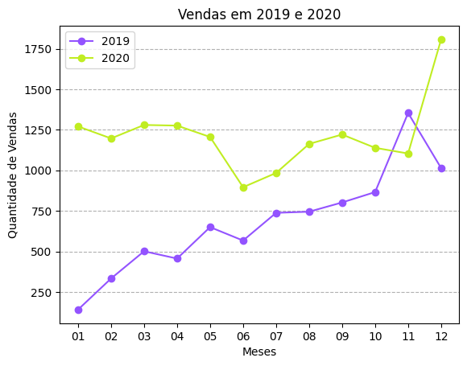

# Para Saber Mais

## Aula 1

### Para saber mais: o que é SQL  
SQL (Structured Query Language) é uma linguagem de programação projetada para gerenciar e manipular bancos de dados relacionais. Ela fornece um conjunto de comandos e instruções que permitem a criação, consulta, atualização e exclusão de dados em bancos de dados.

O uso dessa linguagem é essencial para trabalhar com dados armazenados em bancos de dados relacionais e é uma habilidade fundamental para pessoas desenvolvedoras, analistas de dados, administradoras de bancos de dados e outras categorias de profissões envolvidas na manipulação e análise de dados.

Caso queira se aprofundar sobre essa importante linguagem, você pode acessar o artigo [Saiba tudo sobre SQL - A linguagem padrão para trabalhar com banco de dados relacionais!](https://www.alura.com.br/artigos/o-que-e-sql)
A linguagem SQL também é bastante utilizada em Sistemas de Gerenciamento de Bancos de Dados relacionais (SGBDs), como MySQL, PostgreSQL, SQLite, Oracle, SQL Server, entre outros. Ela oferece uma sintaxe padrão e consistente, tornando-se uma linguagem altamente portátil e interoperável entre diferentes sistemas de banco de dados.

Para saber mais sobre os bancos relacionais, recomendo a leitura do artigo [SGBD’s Relacionais](https://www.alura.com.br/artigos/sgbds-relacionais).
O SQL possui comandos básicos que são fundamentais para a manipulação de dados em um banco de dados relacional, dois deles são o SELECT e o FROM.

O SELECT é usado para exibir dados de uma ou mais tabelas em um banco de dados. Ele permite especificar as colunas que você deseja selecionar.
O FROM é usado em conjunto com o SELECT para especificar a tabela ou tabelas das quais você deseja recuperar os dados. Ele indica a origem dos dados que serão selecionados.
Para conhecer ou relembrar esses e outros comandos básicos em SQL, você pode fazer a leitura complementar dos seguintes artigos:

[SQL: comandos básicos](https://www.alura.com.br/artigos/sql-comandos-basicos);
[SQL: consultas com SELECT](https://www.alura.com.br/artigos/sql-consultas-com-select);
[SQL: cláusulas UPDATE e DELETE](https://www.alura.com.br/artigos/sql-clausulas-update-e-delete).  

### Para saber mais: qual a diferença do SQLite para outros SGBDs?  
O SQLite é um SGDB relacional embutido e de código aberto. Ele é amplamente utilizado em aplicativos móveis, desktops e embutidos devido à sua simplicidade, leveza e facilidade de integração.

Por funcionar diretamente em um arquivo, sem a necessidade de um servidor separado, ele permite que seu uso seja fácil, pois não requer uma configuração complexa. Além disso, não há necessidade de administração e de um servidor de banco de dados separado.

Em relação a outros SGBDs como MySQL, PostgreSQL e Oracle, o SQLite se torna uma opção mais adequada para projetos simples, onde a portabilidade e facilidade de uso são mais valorizadas. Isso se dá por algumas causas, como:

O SQLite é um banco de dados armazenado em um único arquivo e operado diretamente nesse arquivo. Já bancos de dados como MySQL e PostgreSQL são SGBDs cliente-servidor, onde o servidor gerencia o acesso aos dados e os clientes se conectam a ele para interagir com o banco de dados.
No SQLite o modelo de concorrência adotado permite que apenas uma transação possa acessar o banco de dados por vez. Em contraste, outros SGBDs usam um modelo de concorrência que permite que várias transações ocorram simultaneamente.
O SQLite fornece um conjunto básico de recursos SQL e não possui algumas funcionalidades avançadas encontradas em outros SGBDs, como procedimentos armazenados, funções definidas pela pessoa usuária, gatilhos complexos, entre outros.
A portabilidade do SQLite é bastante alta e funciona em várias plataformas, incluindo desktops, dispositivos móveis e sistemas embarcados, sendo amplamente utilizado em aplicativos móveis e outros cenários onde a portabilidade é importante. Outros SGBDs também são multiplataforma, mas geralmente são mais utilizados em servidores e ambientes de desenvolvimento.
Para mais informações sobre o SQLite acesse a sua [documentação](https://www.sqlite.org/docs.html).  

## Aula 2
### Projeto com Pandas #1: selecionando colunas, agrupando e contando  
No decorrer do curso, você vai notar atividades como essa, nomeadas “Projeto com Pandas”. Nelas, você encontrará possíveis soluções aos problemas apresentados até o momento, desenvolvidas integralmente em Python com Pandas, sem uso do SQL. A ideia é que você conheça uma outra alternativa de solução e possa comparar a ferramenta (ou combinação de ferramentas) e escolher a que melhor se ajusta aos problemas que você encontra, além de claro, permitir que você ganhe repertório em programação.

Durante os vídeos, construímos um código de consulta a um banco de dados com SQL, mas e se ao invés de quatro tabelas em um SGBD, nós estivéssemos lidando com DataFrames?

Digamos que os DataFrames tenham os mesmos nomes de cada uma das tabelas, vamos então ver como seria o código em Pandas que corresponderia ao resultado obtido pelas consultas que fizemos em aula no SQL.

Parte 1: selecionar coluna Condicao
Usamos a seguinte consulta:

SELECT CONDICAO FROM PRODUTOS
Copiar código
Precisamos obter o mesmo resultado da consulta, ou seja, um DataFrame. Para tal, podemos selecionar a coluna Condicao e executar a transformação da Series para DataFrame com pd.DataFrame.

pd.DataFrame(produtos['Condicao'])
Copiar código
Parte 2: contar as frequências
Usamos a seguinte consulta:

SELECT CONDICAO, COUNT(*) AS 'Quantidade'
FROM PRODUTOS
GROUP BY CONDICAO;
Copiar código
Para aplicar uma função de agregação por contagem de frequências, podemos aplicar groupby e a agregação de contagem com size. O nome da coluna de 'Quantidade' pode ser definido com reset_index.

A conversão para pandas seria:

produtos.groupby('Condicao').size().reset_index(name='Quantidade')
Copiar código   

### Para saber mais: limitando dados com SQL   
Conseguimos limitar a quantidade de registros retornados pelos resultados dentro de uma consulta no SQL: a cláusula que pode executar isso é a LIMIT. Ela permite especificar a quantidade máxima de registros que você deseja receber como saída.

Por exemplo, vamos selecionar os 10 primeiros registros da tabela que relaciona produto e quantidade vendida.

def sql_df (query):
  with engine.connect() as connection:
    result = connection.execute(text(query))
    rows = result.fetchall()
  return pd.DataFrame(rows, columns=result.keys())

query = '''SELECT PRODUTOS.produto, SUM (ITENS_PEDIDOS.quantidade) AS 'Quantidade'
FROM PRODUTOS, ITENS_PEDIDOS
WHERE PRODUTOS.PRODUTO_ID = ITENS_PEDIDOS.PRODUTO_ID
GROUP BY PRODUTOS.produto
LIMIT 10;
'''
sql_df(query)
Copiar código
Saída:

produto	Quantidade
0	Bata Pink Decote	459
1	Bermuda Acetinada Preta	363
2	Bermuda Jeans Lavagem	395
3	Bermuda Listras Bolsos	402
4	Blazer Alfaiataria Grafite	433
5	Blazer Cinza E Azul Marinho	457
6	Blazer Nude Botao	485
7	Blusa Babados Cats	413
8	Blusa Babados Off-white	337
9	Blusa Cinza	341
Podemos também usar a cláusula LIMIT em conjunto com a cláusula OFFSET para especificar um deslocamento (um ponto de partida) e retornar um conjunto específico de registros. Por exemplo, vamos selecionar do 6° ao 10° registro da tabela anterior:

query = '''SELECT PRODUTOS.produto, SUM (ITENS_PEDIDOS.quantidade) AS 'Quantidade'
FROM PRODUTOS, ITENS_PEDIDOS
WHERE PRODUTOS.PRODUTO_ID = ITENS_PEDIDOS.PRODUTO_ID
GROUP BY PRODUTOS.produto
LIMIT 5 OFFSET 5;
'''
sql_df(query)
Copiar código
Saída:

produto	Quantidade
0	Blazer Cinza E Azul Marinho	457
1	Blazer Nude Botao	485
2	Blusa Babados Cats	413
3	Blusa Babados Off-white	337
4	Blusa Cinza	341
Nesse caso, a consulta retorna 5 registros, começando do 6º.

Com isso, podemos usá-la quando desejamos exibir uma quantidade específica de registros ou paginar os resultados da consulta em partes menores, não necessitando fazer essa seleção com o DataFrame após a coleta da consulta.

### Projeto com Pandas #2: selecionando e relacionando dados  
Vamos novamente verificar como seriam nossas consultas caso elas fossem feitas no Pandas. Ainda vamos assumir que os DataFrames tenham os mesmos nomes de cada uma das tabelas.

Parte 1: selecionar os dados
Usamos as seguintes consulta:

sql_df ('SELECT * FROM PRODUTOS').head(3)

sql_df('SELECT * FROM ITENS_PEDIDOS').head(3)
Copiar código
Na consulta, lemos todos os dados das tabelas produtos e itens_pedidos. Para fazer isso em Python com Pandas, basta usar o objeto específico do DataFrame.

produtos.head(3)

itens_pedidos.head(3)
Copiar código
Parte 2: relacionar os produtos por quantidade
Usamos a seguinte consulta:

SELECT PRODUTOS.PRODUTO, SUM(ITENS_PEDIDOS.QUANTIDADE) AS Quantidade
FROM ITENS_PEDIDOS, PRODUTOS
WHERE ITENS_PEDIDOS.PRODUTO_ID = PRODUTOS.PRODUTO_ID
GROUP BY PRODUTOS.PRODUTO
ORDER BY Quantidade ASC
Copiar código
Para um código equivalente em Python com Pandas, começamos mesclando com merge os DataFrames itens_pedidos e produtos, com base na coluna produto_id. Em seguida, aplicamos a função groupby() para agrupar os dados pelo nome do produto e depois, usamos a função sum() para obter a soma da coluna quantidade para cada grupo. Por fim, para ordenar o resultado em ordem ascendente de acordo com a quantidade, usamos a função sort_values():

df_prod_quant = itens_pedidos.merge(produtos, on='produto_id')
df_prod_quant = df_prod_quant.groupby('produto')['quantidade'].sum().reset_index()
df_prod_quant = df_prod_quant.sort_values('quantidade', ascending=True).reset_index(drop=True)
df_prod_quant
Copiar código

## Aula 3
### Para saber mais: mais sobre usos do strftime
A função strftime no SQLite é usada para formatar valores de data e hora de acordo com um padrão específico. Ela permite extrair componentes individuais de uma data e hora, como o dia, mês, ano, hora, minuto, segundo, etc., e formatá-los de acordo com suas necessidades.

A sintaxe básica da função strftime é a seguinte:

strftime(formato, valor)
Copiar código
O parâmetro formato especifica o padrão de formatação desejado, e o parâmetro valor é o valor da data e hora que você deseja formatar.

Com essa função, podemos extrair diferentes componentes de data e hora, por exemplo:

Extrair o ano: '%Y';
Extrair o mês: '%m';
Extrair o dia: '%d'.
E para formatos de data que incluem horas como '2022-05-29 14:30:00', podemos usar os formatos de hora:

Extrair a hora: '%H';
Extrair o minuto: '%M';
Extrair o segundo: '%S'.
Como um exemplo, podemos usar dessas formatações para entender a distribuição de pedidos durante os meses do ano 2019 e 2020:

## Selecionar dados do ano de 2019
query = '''
SELECT strftime('%m', data_compra) AS mes, COUNT(*) AS quantidade_vendas
FROM pedidos
WHERE strftime('%Y', data_compra) = '2019'
GROUP BY mes;
'''
vendas_19 = sql_df(query)
vendas_19

## Selecionar dados do ano de 2020
query = '''
SELECT strftime('%m', data_compra) AS mes, COUNT(*) AS quantidade_vendas
FROM pedidos
WHERE strftime('%Y', data_compra) = '2020'
GROUP BY mes;
'''
vendas_20 = sql_df(query)
vendas_20
Copiar código
Depois de coletar os dados, podemos comparar os resultados com uma visualização.

import matplotlib.pyplot as plt

# Plotar o gráfico de 2019 e 2020
plt.plot(vendas_19.mes.to_numpy(), vendas_19.quantidade_vendas.to_numpy(), marker='o', linestyle='-', color='#9353FF', label = '2019')
plt.plot(vendas_20.mes.to_numpy(), vendas_20.quantidade_vendas.to_numpy(), marker='o', linestyle='-', color='#C0ED22', label = '2020')

# Definir título e eixos
plt.title('Vendas em 2019 e 2020')
plt.xlabel('Meses')
plt.ylabel('Quantidade de Vendas')

# Adicionar a legenda
plt.legend()

# Adicionar grid horizontal
plt.grid(axis='y', linestyle='--')

# Exibir a figura
plt.show()
Copiar código
O resultado obtido pode ser observado abaixo

Alt text: Gráfico de linhas intitulado “Vendas em 2019 e 2020”. No eixo x, temos os meses de 01 a 12 em intervalo de 1. No eixo y, temos a quantidade de vendas, que vai de 250 a 1750 em intervalos de 250. Existem 2 linhas no gráfico, uma na cor verde abacate que representa os dados do ano de 2020 e outra em cor lilás que representa os dados do ano 2019, ambos os gráficos têm 12 marcadores em forma de pontos, que aparecem,a cada intervalo de 1 mês. Há variação, mas o ano de 2020 começa e termina com mais vendas que o ano de 2019, sendo o mês 11 a única exceção, onde em 2019 se vendeu mais que em 2020.  

## Para saber mais: funções de agregação
A biblioteca SQLite oferece algumas funções de agregação que podem ser úteis para uma análise. As funções apresentadas na [documentação](https://www.sqlite.org/lang_aggfunc.html) são AVG(), COUNT(), GROUP_CONCAT(), MAX(), MIN(), SUM() e TOTAL() e vamos discutir sobre elas nessa atividade.

AVG()
É uma função que calcula a média aritmética de um conjunto de valores. Ela pode ser aplicada a colunas numéricas, como valores inteiros ou decimais. Ela ignora valores nulos durante o cálculo da média.

Um exemplo de sua utilização é o cálculo da média de produção em uma indústria. Digamos que, na coluna QUANTIDADE_PRODUZIDA da tabela PRODUCAO, existem 30 valores informando a produção diária do mês de junho na indústria. No código abaixo, a função AVG calcula a média desses 30 dias de produção.

query = '''
SELECT AVG(QUANTIDADE_PRODUZIDA) AS media_producao
FROM PRODUCAO;
'''
Copiar código
COUNT()
É uma função de agregação que conta o número de linhas ou valores não nulos em uma coluna ou conjunto de valores e retorna um valor inteiro. Por isso, é usada para determinar a quantidade de registros que satisfazem determinadas condições em uma consulta.

Um exemplo de sua utilização é a contagem de vendas feitas em uma loja. Suponhamos que, na tabela VENDAS_REALIZADAS, cada linha armazena uma venda realizada pelo time de vendas da loja. No código abaixo, a função COUNT calcula a quantidade de linhas e, por consequência, a quantidade de vendas realizadas.

query = '''
SELECT COUNT(*) AS total_vendas
FROM VENDAS_REALIZADAS;
'''
Copiar código
GROUP_CONCAT()
É uma função que concatena os valores de uma coluna em uma única string, separando-os por um delimitador especificado.

Podemos definir sua sintaxe como a seguinte:

GROUP_CONCAT(coluna, [delimitador])
Copiar código
Onde coluna representa a coluna da qual desejamos concatenar os valores. E delimitador define o caractere ou sequência de caracteres usado para separar os valores concatenados. Se nenhum delimitador for especificado, o SQLite usará uma vírgula (",") como delimitador padrão.

Um exemplo de sua utilização é a listagem dos nomes das pessoas na equipe de seguranças de uma empresa. Vamos supor que na coluna NOMES_SEGURANCA da tabela COLABORADORES existem os nomes das pessoas que compõem a equipe de segurança em cada linha.

id	NOMES_SEGURANCA
1	João
2	Maria
3	Pedro
4	Ana
A função GROUP_CONCAT irá unir todos os nomes dessa coluna e retornar um texto com esses nomes separados por “,”.

query = '''
SELECT GROUP_CONCAT(NOMES_SEGURANCA, ', ') AS nomes_concatenados
FROM COLABORADORES;
'''
Copiar código
O resultado da consulta será:

nomes_concatenados
João, Maria, Pedro, Ana
MAX()
Essa função de agregação permite encontrar o valor máximo em uma coluna específica de uma tabela, retornando esse valor.

Suponha que estamos buscando o preço mais alto dos produtos de uma loja. Para isso, temos uma tabela chamada PRODUTOS e existe a coluna PRECO com valores de produtos.

id	PRECO
1	10.99
2	19.99
3	15.49
4	12.99
Com a função MAX, encontramos o preço máximo entre todos os produtos da tabela.

query = '''
SELECT MAX(PRECO) AS PRECO_MAXIMO
FROM PRODUTOS;
'''
Copiar código
O resultado da consulta será:

|PRECO_MAXIMO| |19.99|

MIN()
Em contraste com a função MAX, a função MIN encontra o valor mínimo em uma coluna específica de uma tabela.

Como exemplo, vamos usar o mesmo da função MAX, mas dessa vez estamos buscando o valor mínimo nos preços da loja.

query = '''
SELECT MIN(PRECO) AS PRECO_MINIMO
FROM PRODUTOS;
'''
Copiar código
Dessa vez o resultado da consulta será:

|PRECO_MINIMO| |10.99|

SUM() e TOTAL()
Vamos falar das duas funções, pois elas têm um objetivo muito similar, mas têm algumas diferenças em relação ao seu comportamento, em especial, em relação ao tratamento de valores nulos e ao formato do retorno da consulta.

A função SUM() é usada para calcular a soma dos valores em uma coluna numérica. Ela faz isso ignorando os valores nulos (NULL) na coluna durante o cálculo da soma. Já a função TOTAL() também é usada para calcular a soma dos valores em uma coluna numérica, mas ela trata os valores nulos (NULL) na coluna como zero (0).

Além disso, a função TOTAL() sempre irá retornar um valor de ponto flutuante. Já a SUM() pode retornar um valor inteiro ou ponto flutuante, a depender do tipo de dado agregado: se as instâncias forem de tipo inteiro, será retornado um inteiro; se forem pontos flutuantes, o retorno de SUM será ponto flutuante.

Como a função SUM e TOTAL acabam retornando o mesmo valor, podemos fazer um exemplo apenas com a SUM. Vamos considerar que desejamos descobrir o total de receita obtida em vendas. Digamos que temos uma coluna chamada VALOR na tabela VENDAS que tem a descrição das receitas geradas a cada venda.

|id| valor| |1| 50.00| |2| 25.00| |3| 30.00| |4| 40.00|

A função SUM irá calcular a soma de todos os valores na coluna e irá retornar o resultado dessa soma.

query = '''
SELECT SUM(VALOR) AS TOTAL_VENDAS
FROM VENDAS;
'''
Copiar código
O resultado da consulta será:

|total_vendas| |145.00|

Conheça mais sobre funções de agregação com o artigo [Trabalhando com funções de agregação](https://www.alura.com.br/artigos/trabalhando-funcoes-agregacao).

## Projeto com Pandas #3: filtro em dado textual  
Vamos explorar como realizar consultas utilizando a biblioteca Pandas. Continuamos considerando que temos DataFrames com nomes correspondentes às tabelas do nosso conjunto de dados.

Usamos a seguinte consulta:

SELECT VENDEDORES.NOME_VENDEDOR, AVG(PEDIDOS.TOTAL) AS 'Valor médio por vendas'
FROM PEDIDOS, VENDEDORES
WHERE strftime('%Y',data_compra) = '2020' AND VENDEDORES.VENDEDOR_ID = PEDIDOS.VENDEDOR_ID
GROUP BY VENDEDORES.NOME_VENDEDOR
ORDER BY AVG(PEDIDOS.TOTAL) DESC;
Copiar código
Para essa consulta, iniciamos filtrando os pedidos que ocorreram em 2020 com a função str.startswith('2020'), que filtra os pedidos que possuem a data de compra iniciando com o valor '2020'. Depois, mesclamos o DataFrame filtrado (df_filtered) com o DataFrame de vendedores com base na coluna 'vendedor_id' através da função merge.

Em seguida, usamos a função groupby, para agrupar os dados pelo nome do vendedor ('nome_vendedor') e, em seguida, calculamos a média da coluna 'total' para cada grupo. Antes de concluir, ordenamos os resultados em ordem descrescente com base na coluna 'total' usando a função sort_values(), e também resetamos os index com reset_index. Por fim, alteramos o nome da coluna 'total' para 'Valor médio por vendas', correspondendo ao resultado no SQL:

df_filtrado = pedidos[pedidos['data_compra'].str.startswith('2020')]
df_mesclado = df_filtrado.merge(vendedores, on='vendedor_id')
df_agrupado = df_mesclado.groupby('nome_vendedor')['total'].mean().reset_index()
df_filtro_data = df_agrupado.sort_values('total', ascending=False).reset_index(drop=True)
df_filtro_data.columns = ['nome_vendedor', 'Valor médio por vendas']
df_filtro_data
Copiar código

## Aula 4
### Projeto com Pandas #4: contagem por estados  
Vamos explorar como realizar consultas utilizando a biblioteca Pandas. Continuamos considerando que temos DataFrames com nomes correspondentes às tabelas do nosso conjunto de dados.

Usamos a seguinte consulta:

SELECT ESTADO, COUNT(*) AS Pedidos
FROM ITENS_PEDIDOS
GROUP BY ESTADO
ORDER BY Pedidos DESC;
Copiar código
Para essa consulta, começamos com a função groupby() para agrupar os dados pelo estado (coluna 'Estado') e, em seguida, aplicamos a função size() para obter a contagem de pedidos para cada estado. A função reset_index(name='Pedidos') redefine o índice do resultado agrupado e renomeia a coluna de contagem para 'Pedidos'. O resultado é um DataFrame com duas colunas: 'Estado' e 'Pedidos', onde 'Pedidos' representa a contagem de pedidos para cada estado.

Depois, usamos a função sort_values() para ordenar o DataFrame resultado em ordem decrescente com base na coluna 'Pedidos'. Ao definir ascending=False, garantimos que a ordenação seja feita em ordem decrescente. Isso nos dá o DataFrame final df_estados, correspondente ao resultado obtido na consulta:

df_agrupados = itens_pedidos.groupby('Estado').size().reset_index(name='Pedidos')
df_estados = df_agrupados.sort_values('Pedidos', ascending=False).reset_index(drop=True)
df_estados
Copiar código

### Para saber mais: tipos de JOIN  
Durante as aulas aprendemos a unir tabelas com a cláusula JOIN, mas existem diversos tipos de JOIN que permitem fazer consultas mais elaboradas no banco de dados.

Podemos listar quatro tipos de junções: LEFT JOIN, RIGHT JOIN, FULL JOIN e INNER JOIN. Abaixo uma imagem com quatro Diagramas de Venn, onde cada círculo (conjunto) representa uma tabela do nosso modelo relacional. Vamos conferir as diferença entre essas principais junções:

Alt text: Representação de quatro Diagramas de Venn, compostos por dois círculos sobrepostos. Os quatro diagramas estão dispostos lado a lado e a área de destaque tem a cor verde abacate. Da esquerda para a direita temos um diagrama com o círculo à esquerda completamente preenchido e a legenda “Externa esquerda”, em sequência um diagrama com o círculo à direita completamente preenchido e a legenda “Externa direita”, depois, um diagrama com todas as áreas preenchidas e a legenda “Externa completa” e, por fim, um diagrama com apenas a interseção entre os círculos preenchido com a legenda “Interna”.

LEFT JOIN
O LEFT JOIN retorna todos os registros da tabela à esquerda na cláusula JOIN e os registros correspondentes da tabela à direita na cláusula JOIN. Seu preenchimento tem a característica do diagrama de Externa esquerda. Se não houver correspondência na tabela da direita, os valores NULL serão retornados para as colunas da tabela da direita.

A estrutura a seguir pode ser utilizada para o LEFT JOIN:

SELECT <CAMPOS>
FROM TABELA_A
LEFT JOIN TABELA_B
ON TABELA_A.CAMPO = TABELA_B.CAMPO
Copiar código
RIGHT JOIN
O RIGHT JOIN é o oposto do LEFT JOIN. Ele retorna todos os registros da tabela da direita e os registros correspondentes da tabela da esquerda. Seu preenchimento tem a característica do diagrama de Externa direita. Se não houver correspondência na tabela da esquerda, os valores NULL serão retornados para as colunas da tabela da esquerda.

A estrutura a seguir pode ser utilizada para o RIGHT JOIN:

SELECT <CAMPOS>
FROM TABELA_A
RIGHT JOIN TABELA_B
ON TABELA_A.CAMPO = TABELA_B.CAMPO
Copiar código
FULL JOIN
O FULL JOIN, também conhecido como FULL OUTER JOIN, retorna todos os registros de ambas as tabelas envolvidas na junção, independentemente da correspondência. Seu preenchimento tem a característica do diagrama de Externa completa. Se houver correspondência, os valores correspondentes serão retornados; caso contrário, os valores NULL serão retornados nas colunas correspondentes.

A estrutura a seguir pode ser utilizada para o FULL JOIN:

SELECT <CAMPOS>
FROM TABELA_A
FULL JOIN TABELA_B
ON TABELA_A.CAMPO = TABELA_B.CAMPO
Copiar código
INNER JOIN
O INNER JOIN retorna apenas os registros que têm correspondência em ambas as tabelas envolvidas na junção. Isso significa que apenas as linhas onde as chaves correspondentes existem em ambas as tabelas serão incluídas no resultado. Seu preenchimento tem a característica do diagrama de Interna.

Para trazer essa interseção das informações entre tabelas, podemos usar o comando:

SELECT <CAMPOS>
FROM TABELA_A
INNER JOIN TABELA_B
ON TABELA_A.CAMPO = TABELA_B.CAMPO
Copiar código
Para se aprofundar nesses e em outros tipos de junção com JOIN, recomendo a leitura do artigo [JOIN e seus tipos](https://www.alura.com.br/artigos/join-e-seus-tipos#:~:text=Existem%20cinco%20tipos%20de%20JOIN,FULL%20JOIN%20e%20CROSS%20JOIN).

### Para saber mais: integração com outros SGBDs  
Durante as aulas, aprendemos a conectar o banco de dados SQLite ao Python e fizemos diversas consultas e análises com os dados contidos nele.

Além do SQLite, existem outros SGBDs que podemos fazer conexões, como o MySQL e PostgreSQL. Vamos conhecer as ferramentas disponíveis para executar essa conexão em cada um desses sistemas de gerenciamento!

MySQL
Para se conectar ao MySQL, será preciso antes ter um servidor ativo, bem como nome de usuário, senha, host e nome do banco de dados (ou schema). Tendo esses dados, podemos usar das bibliotecas SQLAlchemy, que já conhecemos, e da mysql-connector-python, uma biblioteca Python para comunicação com servidores MySQL que você pode saber mais acessando sua [documentação](https://dev.mysql.com/doc/connector-python/en/).

Vamos mostrar uma estrutura de código que permite a conexão com as duas bibliotecas, mas sempre se certifique de ler a documentação e seguir as instruções nela descritas.

MySQL com SQLAlchemy
Inicialmente, podemos verificar se o pacote SQLAlchemy está instalado no ambiente. Caso não esteja, podemos instalá-lo usando o pip:

!pip install SQLAlchemy
Copiar código
Depois, no ambiente Python, podemos estabelecer uma conexão com o banco de dados MySQL utilizando o SQLAlchemy com a construção de uma string de conexão que segue a seguinte estrutura:

from sqlalchemy import create_engine

# Configuração da conexão com o banco de dados
user = 'seu_usuario'
password = 'sua_senha'
host = 'localhost'
database = 'nome_do_banco_de_dados'

# Criar uma string de conexão
connection_string = f'mysql+mysqlconnector://{user}:{password}@{host}/{database}'

# Criar o engine de conexão
engine = create_engine(connection_string)

# Estabelecer a conexão
conn = engine.connect()

# A partir daqui, podemos executar consultas ou operações no banco de dados
## […]

# Fechar a conexão quando terminar
conn.close()
Copiar código
As strings 'seu_usuario', 'sua_senha' e 'nome_do_banco_de_dados' precisam ser substituídas com as informações adequadas para sua configuração.

MySQL com mysql-connector
Essa biblioteca precisa antes ser instalada no ambiente Python para ser utilizada, portanto, verificamos inicialmente se o pacote mysql-connector-python está instalado. Caso não esteja, será preciso instalá-lo usando o pip:

!pip install mysql-connector-python
Copiar código
Em seguida, podemos estabelecer uma conexão com o banco de dados MySQL da seguinte maneira:

import mysql.connector

# Configuração da conexão com o banco de dados
HOST = 'localhost'
USERNAME = 'seu_usuario'
PASSWORD = 'sua_senha'
DATABASE = 'nome_do_banco_de_dados'

# Estabelecer a conexão
connection = mysql.connector.connect(
host= HOST,
user= USERNAME,
password= PASSWORD,
database= DATABASE
)

# Testar estabelecimento de conexão
if not(connection.is_connected()):
    print("Não conectado com MySQL Server")

# A partir daqui, podemos executar consultas ou operações no banco de dados
## […]

# Fechar a conexão quando terminar
conn.close()
Copiar código
PostgreSQL
O SQLAlchemy também pode ser usado para se conectar a um banco de dados PostgreSQL, e para isso, será preciso inicialmente ter um servidor ativo, bem como nome de usuário, senha, host e nome do banco de dados.

Podemos verificar se o pacote SQLAlchemy está instalado no ambiente. Caso não esteja, podemos instalá-lo usando o pip:

!pip install SQLAlchemy
Copiar código
Depois, no ambiente Python, podemos estabelecer uma conexão com o banco de dados PostgreSQL com a construção de uma string de conexão:

from sqlalchemy import create_engine

# Configuração da conexão com o banco de dados
user = 'seu_usuario'
password = 'sua_senha'
host = 'localhost'
database = 'nome_do_banco_de_dados'

# Criar uma string de conexão
connection_string = f'postgresql://{user}:{password}@{host}/{database}'

# Criar o engine de conexão
engine = create_engine(connection_string)

# Estabelecer a conexão
conn = engine.connect()

# A partir daqui, podemos executar consultas ou operações no banco de dados
## […]

# Fechar a conexão quando terminar
conn.close()
Copiar código
As strings 'seu_usuario', 'sua_senha' e 'nome_do_banco_de_dados' precisam ser substituídas com as informações adequadas para sua configuração.

De modo geral, o que de fato é alterado no código das conexões entre cada SGBD é a string de conexão e, para descobrir mais informações sobre conexões desses e outros SGBDs pelo SQLAlchemy, consulte a sua [documentação](https://docs.sqlalchemy.org/en/20/core/engines.html). Nesse link você também encontra referências mais profundas para cada SGBD.

### Projeto com Pandas #5: agrupando dados  
Vamos explorar como realizar consultas utilizando a biblioteca Pandas. Continuamos considerando que temos DataFrames com nomes correspondentes às tabelas do nosso conjunto de dados.

Usamos a seguinte consulta:

SELECT VENDEDORES.NOME_VENDEDOR, AVG(PEDIDOS.TOTAL) AS 'Valor médio por vendas'
FROM PEDIDOS, VENDEDORES
WHERE strftime('%Y',data_compra) = '2020' AND VENDEDORES.VENDEDOR_ID = PEDIDOS.VENDEDOR_ID
GROUP BY VENDEDORES.NOME_VENDEDOR
ORDER BY AVG(PEDIDOS.TOTAL) DESC;
Copiar código
Iniciamos com a função merge() para combinar os DataFrames pedidos, vendedores e itens_pedidos. Depois, aplicamos a função query() para selecionar apenas os itens de pedidos com estado de São Paulo ('BR-SP'). Em seguida, utilizamos groupby() para agrupar por nome da pessoa vendedora e aplicamos size() para obter a contagem de vendas para cada pessoa vendedora. Por fim, aplicamos sort_values() para ordenar o DataFrame resultante em ordem decrescente com base na quantidade de vendas:

df_unido = pedidos.merge(vendedores, on='vendedor_id').merge(itens_pedidos, on='pedido_id')
df_filtrado = df_unido.query("Estado == 'BR-SP'")
df_vendedores_sp = df_filtrado.groupby('nome_vendedor').size().reset_index(name='quantidade_vendas')
df_vendedores_sp = df_vendedores_sp.sort_values('quantidade_vendas', ascending=False)
df_vendedores_sp
Copiar código
 Discutir no Fórum

