**Faça Como Eu Fiz** = **Mão na Massa**

## Aula 1
### Preparando o ambiente  
Neste curso, vamos construir um dashboard que combine duas ferramentas de Data Science, Python e Power BI, para auxiliar o time de consultoria a acompanhar de perto a carteira de ativos de clientes da empresa Bulltrend.

Como analistas de dados da Bulltrend, temos o desafio de extrair, por meio das bibliotecas Python, os dados fundamentalistas e de cotações dos ativos de uma carteira hipotética e carregá-los dentro do Power BI. O objetivo é construir um dashboard com os dados compilados e disponíveis para a análise da pessoa consultora.

Neste projeto, vamos inicialmente importar duas bases de dados que possuem:

As cotações dos ativos da carteira no período de 01/08/2022 à 01/08/2023.
Os dados gerais e de indicadores fundamentalistas dos ativos da carteira.
Por meio da coleta dos dados com Python e carga no Power BI, será possível avaliar a carteira da pessoa cliente e acompanhar os indicadores fundamentalistas que avaliam a situação financeira das empresas listadas na bolsa e as flutuações das cotações no período estipulado. A cada aula, vamos passar pelas fases que vão da extração, transformação e carga dos dados até a construção do dashboard completo que servirá para o time de consultoria da empresa.

Antes de começar…
Para a nossa primeira etapa, você vai precisar baixar o notebook do curso e fazer o upload no Google Colab.

Lembre-se de selecionar a opção "Todos os arquivos" na janela que se abrir para selecionar o arquivo baixado para upload.

Por fim, vale ressaltar que para usar esse ambiente, é necessário ter uma conta Gmail, pois todo notebook ficará armazenado no Google Drive.

Com tudo pronto, vamos começar a pôr a mão na massa? Bons estudos e vamos nessa!

### Desafio: extraindo dados   
Para praticar o que aprendemos, vamos trabalhar com a carteira de outro(a) cliente e construir esse novo projeto em um novo documento.

Com esse propósito, vamos deixar um notebook para resolução deste e dos próximos desafios. Você pode baixá-lo e fazer o upload do notebook no Google Colab ou criar o seu próprio.

Neste desafio, a missão é gerar os códigos de extração dos dados dos ativos da bolsa brasileira listados abaixo:

Ativos			
ASAI3	EQTL3	LREN3	PRIO3
RAIL3	RDOR3	SBSP3	VIVT3
Vamos dividir esse processo em 2 desafios, sendo eles:

Desafio 1

Extrair os dados de cotações diárias dos ativos no período de 01/01/2023 até 31/08/2023.

Dica: Extraia a data, os dados OHLC (Open, High, Low, Close) e o ticker do Ativo como colunas da tabela cotacoes.

Desafio 2

Extrair os dados gerais e indicadores dos ativos, sendo estes:

1 - Dados gerais

Setor
Cotação Atual
Cotação Mínima e Máxima anual
Número de ações
Valor de Mercado
Patrimônio Líquido
Receita Líquida dos últimos 3 e 12 meses
Lucro Líquido dos últimos 3 e 12 meses
2 - Indicadores de Valuation

P/L
P/VP
DY
LPA
VPA
Dica 1: esteja atento(a) aos dois métodos de obtenção do dado get_papel() e get_resultado_raw() da biblioteca fundamentus.

Dica 2: para os valores de LPA e VPA utilize o mesmo processo realizado na aula Extraindo os indicadores dos ativos. Por fim, gere uma só tabela indicadores.

Caso precise de ajuda, uma opção de solução da atividade está disponível na seção “Opinião da pessoa instrutora”.

### Opinião do instrutor
Podem existir diversas formas de solucionar os desafios. Apresentamos abaixo uma sugestão de solução para cada problema.

Desafio 1

Para o primeiro desafio, vamos instalar a biblioteca yfinance e gerar uma tabela chamada cotacoes com os dados de 2023 até 31 de agosto de 2023.

Instalando a biblioteca
!pip install yfinance
Copiar código
Extraindo os dados de cotações dos ativos
# Código completo da obtenção dos dados históricos das cotações da carteira de 01/01/2023 à 31/08/2023
# Importando a biblioteca
import yfinance as yf

# Definindo a carteira de ações
carteira_yf = ['ASAI3.SA', 'EQTL3.SA', 'LREN3.SA', 'PRIO3.SA', 
               'RAIL3.SA', 'RDOR3.SA', 'SBSP3.SA', 'VIVT3.SA']

# Carregando os dados da carteira
df = yf.download(carteira_yf, start="2023-01-01", end="2023-08-31")

# Passando os ativos para o multindex do df
cotacoes = df.stack(level=1)

# Resetando os índices e renomenado a coluna dos ativos
cotacoes = cotacoes.reset_index().rename(columns={'level_1': 'Ativo'})

# Organizando o df
cotacoes = cotacoes[["Date", "Open", "High", "Low", "Close", "Ativo"]]

del carteira_yf, df
Copiar código
Exemplo de saída:

Date	Open	High	Low	Close	Ativo
0	2023-01-02	19.000000	19.170000	18.549999	18.990000	ASAI3.SA
1	2023-01-02	26.930000	26.930000	26.059999	26.190001	EQTL3.SA
2	2023-01-02	20.270000	20.330000	19.059999	19.330000	LREN3.SA
3	2023-01-02	36.880001	37.660000	36.450001	36.759998	PRIO3.SA
4	2023-01-02	18.309999	18.480000	17.540001	17.660000	RAIL3.SA
...	...	...	...	...	...	...
1339	2023-08-31	46.009998	47.299999	45.709999	46.419998	PRIO3.SA
1340	2023-08-31	22.500000	22.620001	22.200001	22.350000	RAIL3.SA
1341	2023-08-31	28.780001	29.219999	28.500000	28.660000	RDOR3.SA
1342	2023-08-31	58.459999	58.689999	57.700001	57.919998	SBSP3.SA
1343	2023-08-31	42.240002	42.439999	41.349998	41.349998	VIVT3.SA
Desafio 2

Para o segundo desafio, vamos instalar a biblioteca fundamentus e gerar uma tabela indicadores que concatena os dados gerais e os indicadores pedidos para os ativos.

Instalando a biblioteca
!pip install fundamentus
Copiar código
Extraindo os dados gerais e indicadores dos ativos
# Importando as bibliotecas
import fundamentus
import pandas as pd

# Definindo a carteira de ações
carteira_fund = ['ASAI3', 'EQTL3', 'LREN3', 'PRIO3', 
                 'RAIL3', 'RDOR3', 'SBSP3', 'VIVT3']

# Criando um df com algumas infos da carteira
ind = fundamentus.get_papel(carteira_fund)[['Setor', 'Cotacao', 'Min_52_sem', 'Max_52_sem', 'Nro_Acoes',
                                            'Valor_de_mercado', 'Patrim_Liq','Receita_Liquida_12m', 'Receita_Liquida_3m',
                                            'Lucro_Liquido_12m', 'Lucro_Liquido_3m', 'Div_Liquida']]
# Passando o ticker para uma coluna
ind = ind.reset_index()
ind.rename(columns = {'index':'Ativo'}, inplace=True)

# Alterando colunas object para numeric
colunas = ['Cotacao', 'Min_52_sem', 'Max_52_sem', 'Valor_de_mercado', 'Nro_Acoes', 'Patrim_Liq',
           'Receita_Liquida_12m', 'Receita_Liquida_3m', 'Lucro_Liquido_12m', 'Lucro_Liquido_3m', 'Div_Liquida']
ind[colunas] = ind[colunas].apply(pd.to_numeric, errors='coerce', axis=1)

# Criando um novo df com alguns indicadores da carteira
ind_2 = fundamentus.get_resultado_raw().reset_index()
ind_2 = ind_2.query("papel in @carteira_fund")
ind_2 = ind_2[['papel','P/L', 'P/VP', 'Div.Yield']].reset_index(drop=True)
ind_2.rename(columns={'papel': 'Ativo','Div.Yield':'DY'}, inplace= True)

# Concatenando os dfs em um só com as infos e indicadores
indicadores = pd.merge(ind, ind_2, on="Ativo")

# Criando uma coluna para LPA (Lucro por Ação) e VPA (Valor Patrimonial por ação)
# para calcular a fórmula de Graham  Valor intrínseco de uma ação (VI = √22,5 x LPA x VPA)
indicadores["LPA"] = (indicadores["Lucro_Liquido_12m"] / indicadores ["Nro_Acoes"]).round(2)
indicadores["VPA"] = (indicadores["Patrim_Liq"] / indicadores ["Nro_Acoes"]).round(2)

del ind, ind_2, carteira_fund, colunas
Copiar código
Exemplo de saída:

Ativo	Setor	Cotacao	Min_52_sem	Max_52_sem	Nro_Acoes	Valor_de_mercado	Patrim_Liq	Receita_Liquida_12m	Receita_Liquida_3m	Lucro_Liquido_12m	Lucro_Liquido_3m	Div_Liquida	P/L	P/VP	DY	LPA	VPA
0	ASAI3	Comércio e Distribuição	11.29	10.50	21.03	1.351460e+09	1.525800e+10	4.131000e+09	6.086600e+10	1.598400e+10	9.150000e+08	1.560000e+08	8.624000e+09	16.68	3.69	0.0077	0.68	3.06
1	EQTL3	Energia Elétrica	32.39	24.19	34.46	1.145350e+09	3.709780e+10	1.859040e+10	3.417530e+10	9.201480e+09	1.645550e+09	5.176990e+08	3.358060e+10	22.54	2.00	0.0107	1.44	16.23
2	LREN3	Comércio	13.16	13.16	30.54	9.632270e+08	1.267610e+10	9.712480e+09	1.331120e+10	3.504080e+09	1.016150e+09	2.297000e+08	-5.748570e+08	12.47	1.31	0.0560	1.05	10.08
3	PRIO3	Petróleo, Gás e Biocombustíveis	46.93	27.18	49.40	8.872290e+08	4.163770e+10	1.075390e+10	8.085660e+09	2.311210e+09	3.722060e+09	8.409690e+08	9.094590e+09	11.19	3.87	0.0000	4.20	12.12
4	RAIL3	Transporte	22.85	16.46	24.09	1.854870e+09	4.238380e+10	1.544020e+10	1.031750e+10	2.763110e+09	7.883470e+08	1.672840e+08	1.137300e+10	53.76	2.75	0.0029	0.43	8.32
5	RDOR3	Serv.Méd.Hospit. Análises e Diagnósticos	25.55	20.00	36.98	2.289290e+09	5.849140e+10	2.242150e+10	3.480890e+10	1.167870e+10	1.321940e+09	4.085290e+08	2.507870e+09	44.25	2.61	0.0028	0.58	9.79
6	SBSP3	Água e Saneamento	60.01	42.67	61.69	6.835100e+08	4.101740e+10	2.874760e+10	2.377280e+10	6.154540e+09	3.214220e+09	7.437430e+08	1.644880e+10	12.76	1.43	0.0213	4.70	42.06
7	VIVT3	Telecomunicações	43.91	34.53	44.70	1.663560e+09	7.304680e+10	6.865140e+10	5.031190e+10	1.273270e+10	4.523330e+09	1.122530e+09	1.286270e+10	16.15	1.06	0.0568	2.72	41.27
Compartilhar os conhecimentos e as práticas que vem desenvolvendo nesse ponto é importante para o seu crescimento dentro da carreira de Ciência de Dados. Portanto, busque realizar os exercícios propostos e veja como isso pode te ajudar a progredir em suas habilidades de análise de dados com Python e Power BI.

Se tiver alguma dúvida, você pode usar o fórum ou o Discord da Alura.

## Aula 2
### Preparando o ambiente: instalando o Python
Para seguir o passo a passo do curso na criação do dashboard para análise da carteira do(a) cliente da Bulltrend, vamos precisar realizar alguns procedimentos a fim de trabalhar com o Python e o Power BI conjuntamente em nosso projeto.

O Python não vem conectado de maneira padrão ao Power BI Desktop. Por isso, precisamos realizar alguns processos antes de conseguir utilizar os Scripts Python e gerar Visuais Python dentro da ferramenta do Power BI.

Esse processo, compreenderá em 5 etapas, sendo elas:

Instalação do Python e Power BI Desktop.
Criação da pasta do projeto.
Criação do ambiente virtual e instalação das bibliotecas necessárias no projeto.
Habilitação do Python no Power BI.
Execução dos códigos Python no ambiente do Power BI.
Nesta atividade, vamos explicar a 1ª etapa e os arquivos necessários para realização dos outros processos que serão aprendidos ao longo do curso.

Python
Como uma das principais linguagens utilizadas para análise e ciência dos dados, o Python tem seu lugar de importância nas análises também por meio do software de Inteligência de Negócios (Business Intelligence ou BI) do Microsoft Power BI. É possível utilizá-la para obtenção e transformação de dados, bem como para criação de visuais no Power BI.

Para conseguirmos utilizá-lo no Power BI, é necessário instalar o Python na máquina na qual você está realizando o projeto. Até o momento da gravação deste curso, a versão estável do Python com suporte no Power BI é a 3.7.7.

Para baixar essa versão, basta acessar o site da distribuição do [Python](https://www.python.org/downloads/) e localizar a versão 3.7.7, como apresentada na imagem abaixo:
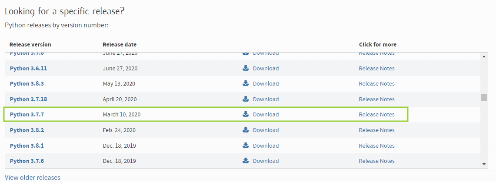
alt-text: Captura de tela da página de download do Python, contendo diversas versões, com destaque para a versão 3.7.7. A página informa o número da versão, a data de lançamento, o botão de download e as notas de lançamento.

Agora, navegue até o tópico Files, escolhendo o sistema operacional e a versão que você tem na máquina, como na imagem abaixo. No nosso exemplo, usamos o instalador web para Windows x86 e x64:
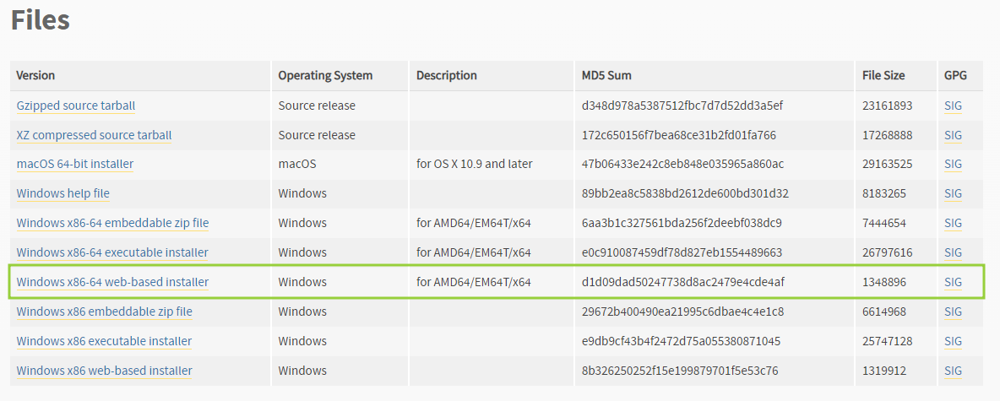
alt-text: Captura de tela da página de download do Python no tópico “Files”, contendo as opções de sistema operacional. A página mostra uma tabela contendo, da esquerda para a direita: as versões, o nome do sistema operacional, descrição, MD5 Sum, o tamanho do arquivo e o GPG. Destacado por um retângulo na cor verde, temos a versão “Windows x86-64 web-based installer”.

Após o download, vamos instalar o Python. Primeiro adicionamos ele como PATH, pois isso garante que, ao utilizar o Prompt de Comando, consigamos executá-lo. Em seguida, clicamos em Install Now, como mostrado na imagem abaixo:
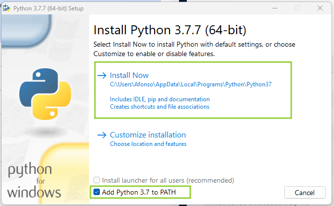
alt-text: Captura de tela da janela de instalação do Python na versão 3.7.7 (64-bit). Nela temos o botão de instalação denominado “Install Now” destacado por um retângulo verde. Abaixo, temos a opção “Customize installation”. Na parte inferior temos dois checkboxes. O primeiro tem o texto “Install launcher for all users (recommended)” e encontra-se desmarcado. O segundo tem o texto “Add Python 3.7 to PATH”, está selecionado e aparece destacado por um retângulo verde.

Basta seguir todo processo de instalação e estaremos prontos para executar as próximas etapas.

Power BI Desktop
Caso não tenha o Power BI instalado, é importante realizar a instalação, pois começaremos a utilizá-lo nesta aula. Assim, basta acessar a [página de download](https://www.microsoft.com/pt-br/power-platform/products/power-bi/downloads) do Power BI, procurar pela opção Microsoft Power BI Desktop e clicar em Fazer download. Após isso, é só seguir todas as instruções de instalação e estaremos preparados(as) para dar sequência às atividades do curso.

Atenção: antes de seguir para o próximo vídeo, é importante baixar os arquivos [requirements.txt](https://cdn3.gnarususercontent.com.br/3059-python-power-bi/aula2/requirements.txt) que contém as bibliotecas e todas as suas versões que utilizaremos neste projeto e o relatório do Power BI no qual vamos criar o dashboard.

Te espero no próximo vídeo!

### Faça como eu fiz: integração Python e Power BI
Nesta aula aprendemos bastante sobre como criar um ambiente virtual para o desenvolvimento do nosso projeto integrando o Python com Power BI. Essa aula é muito importante para preparar o nosso ambiente do Power BI para os diversos usos do Python dentro da ferramenta. Além disso, obtivemos os dados extraídos pelo Python, passando para o Power BI antes de começar a explorá-los.

Portanto, sugerimos que você continue firme nos seus estudos. Siga os passos da pessoa instrutora para prosseguir no curso e, principalmente, pratique bastante os conteúdos trabalhados até aqui!

### Opinião do instrutor  
Compartilhar os conhecimentos e as práticas que vem desenvolvendo nesse ponto é importante para o seu crescimento dentro da carreira de Ciência de Dados. Portanto, busque realizar os exercícios propostos e veja como isso pode te ajudar a progredir em suas habilidades de análise de dados com Python e Power BI.

Se tiver alguma dúvida, você pode usar o fórum ou o Discord da Alura.  

## Aula 3
### Desafio: extraindo e transformando dados no Power BI  
Vamos continuar de onde paramos no Desafio - Extraindo dados, já com os dados de cotações e indicadores prontos para extração por meio de um Script Python no Power BI.

Você vai precisar copiar os códigos gerados no desafio da aula 1 para esse novo desafio, trazendo-os para o Power BI e realizando as transformações necessárias. Dividiremos esse processo em 2 desafios, sendo eles:

Desafio 1

Extrair os dados de cotações e dos indicadores que você gerou separadamente para este Relatório do Power BI.

Atenção: Certifique-se de que o ambiente virtual está configurado corretamente antes de extrair os dados.

Desafio 2

Realizar a transformação dos dados de cotações e indicadores, atentando-se ao tipo de dado em cada coluna. Tratar a coluna Ativo de cotacoes e gerar as colunas calculadas abaixo na tabela indicadores:

Dívida Líquida/Patrimônio Líquido: indicador de endividamento que é a razão entre a Dívida Líquida e o Patrimônio Líquido dos ativos.
Margem Líquida: indicador de eficiência que mostra a razão entre o Lucro Líquido e a Receita Líquida dos últimos 12 meses.
ROE: indicador de rentabilidade como a razão entre o Lucro por Ação pelo Valor Patrimonial por Ação.
Dica 1: utilize o código Python no Power Query para gerar os 3 indicadores juntos.

Atenção: ao final das transformações e aplicação das alterações, lembre de navegar na Exibição do Modelo e relacionar as duas tabelas pela coluna em comum.

Caso precise de ajuda, uma opção de solução da atividade está disponível na seção “Opinião da pessoa instrutora”.  

### Opinião do Instrutor  
Podem existir diversas formas de solucionar os desafios. Apresentamos abaixo uma sugestão de solução para cada problema.

Desafio 1

Para o primeiro desafio, vamos utilizar os códigos do Desafio da Aula 01 e extrair os dados de cotações e indicadores na aba Obter Dados → Outro → Script do Python. Lembrando de extrair uma tabela por vez.

No final, a aba Dados do Power BI deve aparecer da seguinte forma:
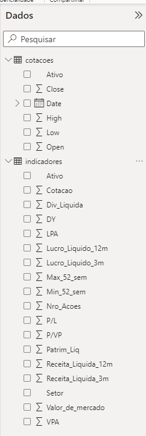
alt-text: Captura de tela da aba de dados do Power BI, contendo as tabelas de cotações e indicadores disponíveis e seus respectivos campos.

Desafio 2

Para o segundo desafio, vamos realizar a transformação dos dados. Primeiro, geramos as colunas calculadas na tabela indicadores e posteriormente tratamos cada um dos dados de acordo com seu tipo. Por fim, faremos o tratamento também da tabela cotacoes.

Código de geração das colunas calculadas dos indicadores
import pandas as pd

dataset["Dívida Líquida/Patrimônio Líquido"] = (dataset["Div_Liquida"] / dataset["Patrim_Liq"])
dataset["Margem Líquida"] = (dataset["Lucro_Liquido_12m"] / dataset["Receita_Liquida_12m"])
dataset["ROE"] = (dataset["LPA"] / dataset["VPA"])
Copiar código
Após a transformação dos dados, a tabela indicadores pode aparecer da seguinte forma no Power Query:
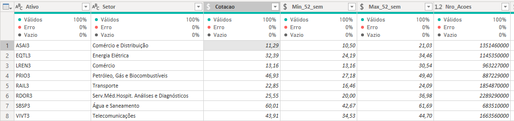
alt-text: Captura de tela da tabela “indicadores” no Power Query. Da esquerda para a direita temos as colunas: “Ativo”, “Setor”, “Cotacao”, “Min_52_sem”, “Max_52_sem” e “Nro_Acoes”.

Código de limpeza da coluna Ativo das cotações
import pandas as pd

# Retirando o .SA dos ativos
dataset["Ativo"] = dataset["Ativo"].apply(lambda x: x[:-3])
Copiar código
Depois da transformação dos dados, a tabela cotacoes pode aparecer da seguinte forma no Power Query:
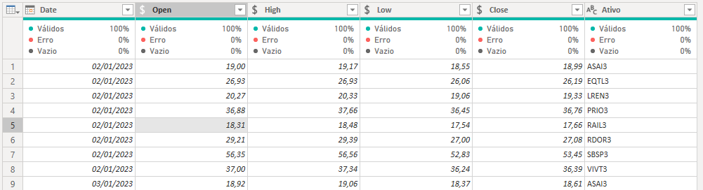
alt-text: Captura de tela da tabela “cotacoes” no Power Query. Da esquerda para a direita temos as colunas: Date, Open, High, Low, Close e Ativo.

Você pode ter acesso ao projeto após o processo de ETL.

Compartilhar os conhecimentos e as práticas que vem desenvolvendo nesse ponto é importante para o seu crescimento dentro da carreira de Ciência de Dados. Portanto, busque realizar os exercícios propostos e veja como isso pode te ajudar a progredir em suas habilidades de análise de dados com Python e Power BI.

Se tiver alguma dúvida, você pode usar o fórum ou o Discord da Alura.

## Aula 4
## Desafio: personalize um gráfico  
Nesse desafio, te convidamos a abrir uma nova aba no seu projeto para personalizar o gráfico de barras do Patrimônio Líquido por Ativo (Patrim_Liq e Ativo). Para isso, explore as funcionalidades aba “Formatar o visual”.
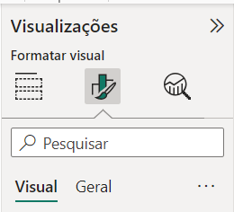
alt-text: Print de tela do menu “Visualizações” do Power BI. A seção “Formatar o visual” está selecionada.

Ao terminar, você pode criar um tópico aqui no fórum e nos mostrar o resultado! Não esqueça de explicar quais foram as personalizações que você realizou no gráfico.

### Opinião do Instrutor  
Antes
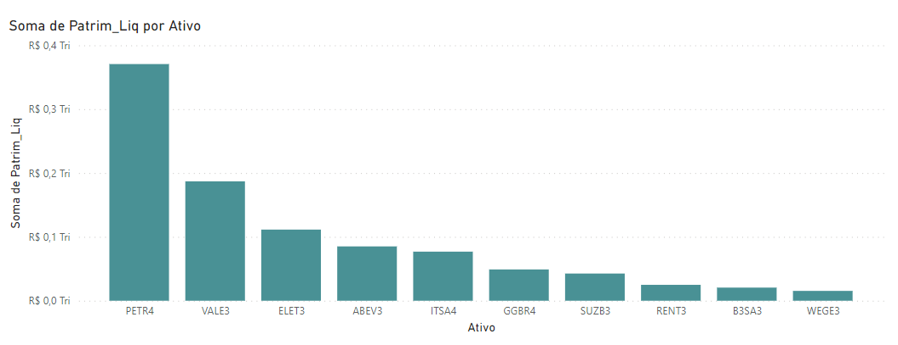
alt-text: Gráfico de barras do patrimônio líquido para diferentes ativos contendo 10 barras verticais de tamanhos diferentes e na cor verde-azulado. No eixo x temos os valores dos Ativos e no eixo y temos a soma do patrimônio líquido. Não há rótulos acima das barra.

Depois
Para esse desafio, personalizamos o gráfico de colunas que mostra o patrimônio líquido por ativo, como indicado abaixo:
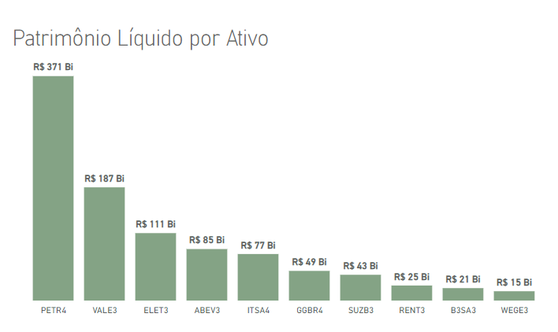
alt-text: Gráfico do patrimônio líquido por ativo para diferentes ativos contendo 10 barras verticais de tamanho diferentes e na cor verde. Os rótulos aparecem acima de cada barra, no título do gráfico se lê “Patrimônio Líquido por Ativo”

Para personalizar, fizemos:

Eixo Y: desativado
Eixo X: DIN 10
Rótulo de dados: ativado, DIN, 11, negrito
Colunas: cor # 84a385
Título: “Patrimônio Líquido por Ativo”, DIN Light, 26  

## Aula 5
### Preparando o ambiente: plano de fundo  
No próximo vídeo, iremos explorar a estilização de um dashboard. Para isso, vamos configurar um plano de fundo do nosso relatório. Para acompanhar o passo a passo da construção do dashboard, baixe o plano de fundo que utilizaremos em nosso projeto.
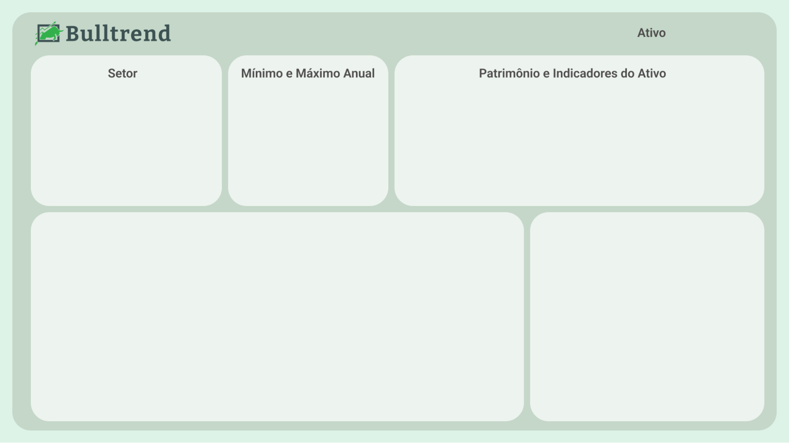
alt-text: Captura de tela do plano de fundo para o dashboard em diferentes tons da cor verde. No canto superior esquerdo temos o logotipo da Bulltrend. Abaixo dele temos um retângulo com o título “Setor”, um quadrado com título “Mínimo e máximo anual” e um outro retângulo com o título “Patrimônio e indicadores do Ativo”. Logo abaixo temos mais um retângulo e um quadrado, ambos sem títulos.

### Faça como eu fiz: adicionando texto informativo
Nosso projeto está completo e, para trazer ainda mais detalhes, podemos contar a Dica de Ferramenta. Esse recurso permite adicionar informação ao passarmos o mouse em um visual configurado. Acompanhe abaixo o passo-a-passo para adicioná-la ao projeto:

1 - Perceba que no projeto já temos algumas abas com texto informativo. Para cada aba iremos configurar uma dica de ferramenta em diferentes cartões.
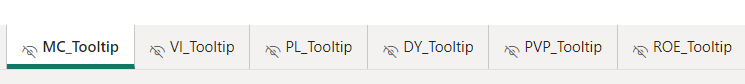
alt-text: Captura de tela das 6 abas do projeto localizada no menu inferior do power bi.

2 - Na aba “Análise de Carteira”, podemos clicar no cartão “valor de mercado” e em formatar visual no menu “visualizações”. Logo em seguida, habilitamos o recurso ”Dica de Ferramenta”.
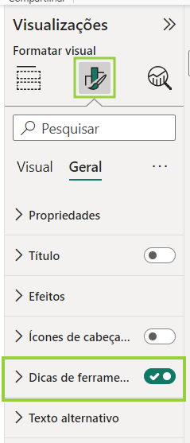
alt-text: Captura de tela do menu “visualizações” localizado à direita do power bi desktop. A opção formatar visual está selecionada e o recurso “dica de ferramenta” está habilitado. Ambos estão destacados por um retângulo verde.

3 - Ao expandir a opção Dica de Ferramenta, podemos escolher o tipo “Página de relatório” e atribuir a página que a dica de ferramenta fará menção. Nesse caso, o cartão “valor de mercado” faz referência à aba de nome “MC_tooltip”.
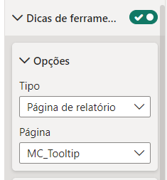
alt-text: Captura de tela do recurso dica de ferramenta que aparece habilitado e expandido. Nele temos a opção “página de relatório” como o tipo selecionado e a página de nome “MC_tooltip”.

4 - Pronto! Agora é só passar o mouse sobre o cartão para ter acesso a informação detalhada.
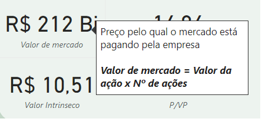
alt-text: Captura de tela da dica de ferramenta em caixa de texto que aparece ao passar o mouse em cima do cartão “valor de mercado”. Nela temos os textos: “Preço pelo qual o mercado está pagando pela empresa” e “Valor de mercado é igual Valor da ação vezes número de ações”.

5 - Podemos fazer o mesmo processo para os cartões P/L, DY, Valor intrínseco, P/VP e ROE para as demais abas do relatório.

P/L → PL_Tooltip
DY → DY_Tooltip
Valor intrÍnseco → VI_Tooltip
P/VP → PVP_Tooltip
ROE → ROE_Tooltip

### Opinião do Instrutor  
A Dica de Ferramenta é um excelente recurso para melhorar a comunicação de informações importantes dos nossos dashboards. Agora podemos ter cartões com descrições detalhadas das métricas utilizadas para analisar os ativos.

Caso queira, você pode baixar o projeto com todas as dicas de ferramentas configuradas.

### Desafio: construindo o dashboard
Após concluir o carregamento que realizamos no Desafio - Extraindo e transformando dados no Power BI, vamos partir para a construção do dashboard completo da carteira de ativos desse(a) novo(a) cliente.

Vamos precisar utilizar o relatório criado no Desafio da Aula 03 para começar a gerar as visualizações e construir o dashboard de Análise de Carteira com os dados de cotações e indicadores fundamentalistas.

Para isso, dividiremos esse processo em 3 desafios, sendo eles:

Desafio 1

Construir os visuais com os dados gerais e fundamentalistas dos ativos. Os dados necessários para serem apresentados no Dashboard são:

1 - Filtro de segmentação de dados com o Ativo (Ticker)

2 - Cartões representando:

Setor
Cotação atual, mínima e máxima no ano
Valor de Mercado
Patrimônio Líquido
P/L
P/VP
DY
Dívida Líquida/Patrimônio Líquido
Margem Líquida
ROE
3 - Gráficos representando:

Receita e Lucros Líquidos nos últimos 12 meses
Receita e Lucros Líquidos nos últimos 3 meses
Desafio 2

Gerar um visual de Candlestick para representar os movimentos dos ativos durante o período, com apenas o filtro por ativo (nesse caso, as datas são fixas no período dos dados). Esse candlestick deve conter os seguintes elementos visuais adicionais:

Médias móveis de 7 e 21 períodos
Linhas representando os valores máximos e mínimos do período
Desafio 3

Construir um dashboard com todos os visuais pedidos no Desafio 1 e 2 desta aula. Você pode usar este plano de fundo gerado no Figma ou criar o seu próprio para construir o dashboard para o time de consultoria.

Caso precise de ajuda, uma opção de solução da atividade está disponível na seção “Opinião da pessoa instrutora”.

### Opinião do instrutor
Podem existir diversas formas de solucionar os desafios. Apresentamos abaixo uma sugestão de solução para cada problema.

Desafio 1

Para o primeiro desafio, vamos gerar cada uma das visualizações pedidas no enunciado. Neste momento não é necessário deixar todas formatadas como ficarão no dashboard, mas sim dispor seus dados e pensar como organizá-los em um só visual.

No final, a aba com esses visuais no Power BI pode ser similar a figura a seguir:
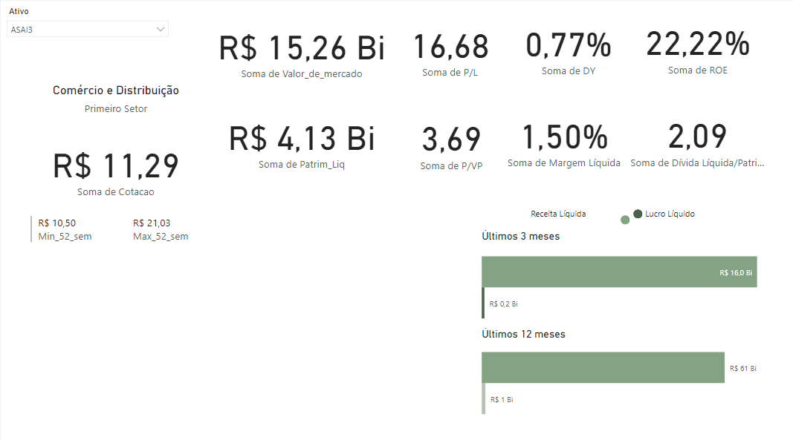
alt-text: Captura de tela do relatório do Power BI contendo nove visuais de cartão na parte superior e em duas linhas. Além deles há um gráfico de barra no canto inferior esquerdo.

Desafio 2

Para o segundo desafio, vamos criar o código para gerar o Candlestick com as demandas levantadas de inserção das médias móveis e linhas de máximo e mínimo. Lembre-se que o código e gráfico abaixo são apenas uma sugestão de resolução do problema.

Código de geração do Candlestick
# O código a seguir para criar um dataframe e remover as linhas duplicadas sempre é executado e age como um preâmbulo para o script:

# dataset = pandas.DataFrame(Date, Open, High, Low, Close)
# dataset = dataset.drop_duplicates()

import pandas as pd
import numpy as np
import matplotlib.pyplot as plt
import matplotlib.ticker as mticker
import seaborn as sns

# Configurações iniciais de fonte
plt.rcParams['font.family'] = 'sans-serif'
plt.rcParams["font.sans-serif"] = 'Verdana'

def candlestick(date, open, high, low, close):
    fig, ax = plt.subplots(figsize=(30,11), dpi=72, facecolor='#edf3ee')
    ax.set_facecolor("#edf3ee")

    # Definindo as cores de cada candle
    cores = ["#5B855C" if close > open else "#DA1E37" for close, open in zip(close, open)]

    # Candlestick corpo + pavio
    sns.barplot(x=date, y=np.abs(open-close), bottom=np.min((open,close), axis=0), width=0.8, palette=cores, ax = ax)
    sns.barplot(x=date, y=high-low, bottom=low, width=0.1, palette=cores, ax = ax)

    # Média móvel de 7 e 30 períodos
    mav_7 = close.rolling(7).mean()
    mav_21 = close.rolling(21).mean()
    sns.lineplot(x=ax.get_xticks(), y=mav_7, label = "MAV 7", color = "#E76F51", linewidth = 4, ax = ax)
    sns.lineplot(x=ax.get_xticks(), y=mav_21, label = "MAV 21", color = "#023E8A", linewidth = 4, ax = ax)

    # Linhas de Min e Max
    for i in range(0, len(date)):
      if low[i] == np.min(low):
        ax.axhline(y = low[i], color = "grey", linestyle='--')
      if high[i] == np.max(high):
        ax.axhline(y = high[i], color = "grey", linestyle='--')

    ## Personalizando o gráfico
    # Ajustando os ticks dos eixos x e y
    plt.setp(ax, xticks = ax.get_xticks(), yticks = ax.get_yticks(),
             xticklabels = [date[i].strftime('%b %Y') for i in ax.get_xticks()],
             yticklabels= [f'R$ {valor:.2f}' for valor in ax.get_yticks()])

    # Ajustando tamanhos dos labels, retirando títulos e bordas
    ax.set_xlabel('')
    ax.set_ylabel('')
    ax.tick_params(axis='both', labelsize=32)
    ax.xaxis.set_major_locator(mticker.MaxNLocator(4))
    sns.despine()
    plt.legend(fontsize=28, facecolor="#EDF3EE", edgecolor="#EDF3EE")
    plt.grid(alpha=0.2)

    # Ajustando o limite de y para um respiro
    plt.ylim(ax.get_ylim()[0]-0.5, ax.get_ylim()[1]+0.5)

dataset["Date"] = pd.to_datetime(dataset["Date"], format="%Y-%m-%dT%H:%M:%S")

candlestick( dataset["Date"], dataset["Open"], dataset["High"], dataset["Low"], dataset["Close"])

plt.subplots_adjust(left=0.07, bottom=0.05, right=0.95, top=0.95)
plt.show()
Copiar código
Saída:
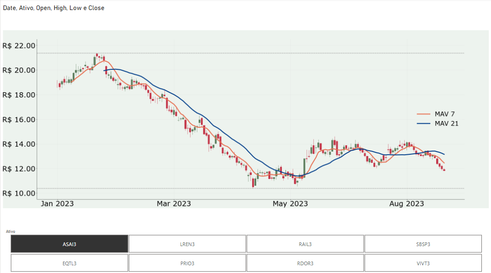
alt-text: Captura de tela do gráfico de Candlestick com as cores verde, vermelho e amarelo. No eixo X, temos as datas em mês e ano, de janeiro, março, maio e agosto de 2023. No eixo Y temos os valores que vão de 10 a 22 reais, variando de dois em dois. Na parte de baixo, temos um gráfico de seleção contendo os ativos.

Desafio 3

Para o último desafio, vamos compilar todos os visuais criados, transformando-os em um só dashboard com todas as informações demandadas pelo time de consultoria. Abaixo temos uma sugestão de estilização do dashboard.
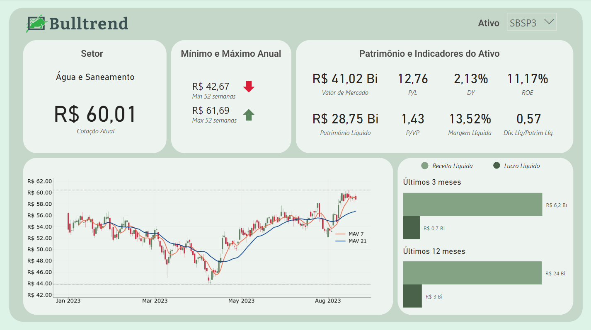
alt-text: Captura de tela do dashboard da Bulltrend em diferentes tons da cor verde. No canto superior esquerdo temos o logotipo da Bulltrend. Abaixo dele temos um retângulo com o título “Setor”, um quadrado com título “Mínimo e máximo anual” e um outro retângulo com o título “Patrimônio e indicadores do Ativo”, cada um com seus respectivos visuais. Logo abaixo, à esquerda, temos mais um retângulo contendo o gráfico de Candlestick. À direita dele há um quadrado contendo um gráfico de barras da Receita e Lucro Líquidos.

Você pode ter acesso ao projeto, que contém os desafios completos.

Compartilhar os conhecimentos e as práticas que vem desenvolvendo nesse ponto é importante para o seu crescimento dentro da carreira de Ciência de Dados. Portanto, busque realizar os exercícios propostos e veja como isso pode te ajudar a progredir em suas habilidades de análise de dados com Python e Power BI.

Se tiver alguma dúvida, você pode usar o fórum ou o Discord da Alura.