# Para Saber Mais

## Aula 1

### Para saber mais: Yahoo Finance e Fundamentus  
Já existe uma série de ferramentas para auxiliar um(a) profissional de análise de dados a analisar informações a respeito do mercado das bolsas de valores, utilizando as bibliotecas do Python. Tudo isso aproveitando o potencial do Python em trazer valor ao trabalhar com os dados gerando insights, visualizações e até auxiliando na construção de modelos de aprendizagem de máquina.

Em nosso curso, vamos focar em duas bibliotecas que nos auxiliarão a extrair os dados das ações tanto das cotações diárias (yfinance) quanto dos dados fundamentalistas (fundamentus).

Yahoo Finance
A biblioteca yfinance é uma API não-oficial que permite acessar dados do [Yahoo Finance](https://br.financas.yahoo.com/quote/%5EBVSP/?p=%5EBVSP&guce_referrer=aHR0cHM6Ly9jdXJzb3MuYWx1cmEuY29tLmJyLw&guce_referrer_sig=AQAAAKa8FoWl3sIw3Ph30PAcqvi8T0yEeS3i_QgcJuMDmsg7PShNHCfW39_NxBzx0TFdloELkHyCNg7n9j8R5-Oq68rDSPPLoXgw3tdcBdcWhA_8tVHIM0CmSwYVE2SaLBOyNq9A8fl5Hh-cciTFl5FR0NwNqTRF0YUsrTAgDDuUTvSS) por meio da linguagem Python. Você pode utilizá-la para baixar dados históricos, informações sobre ações e estatísticas financeiras ou para automatizar a coleta de dados incorporando essas informações em análises técnicas (ou gráficas).

Falando sobre o site, o Yahoo Finance é amplamente utilizado para acompanhar informações financeiras, notícias e análises de mercado. Ele oferece diversos recursos relacionados a ações, moedas, índices e outros instrumentos financeiros. Além disso, ele disponibiliza gráficos interativos e ferramentas de análise que podem ser valiosas para investidores(as) que desejam realizar análises técnicas de ações.
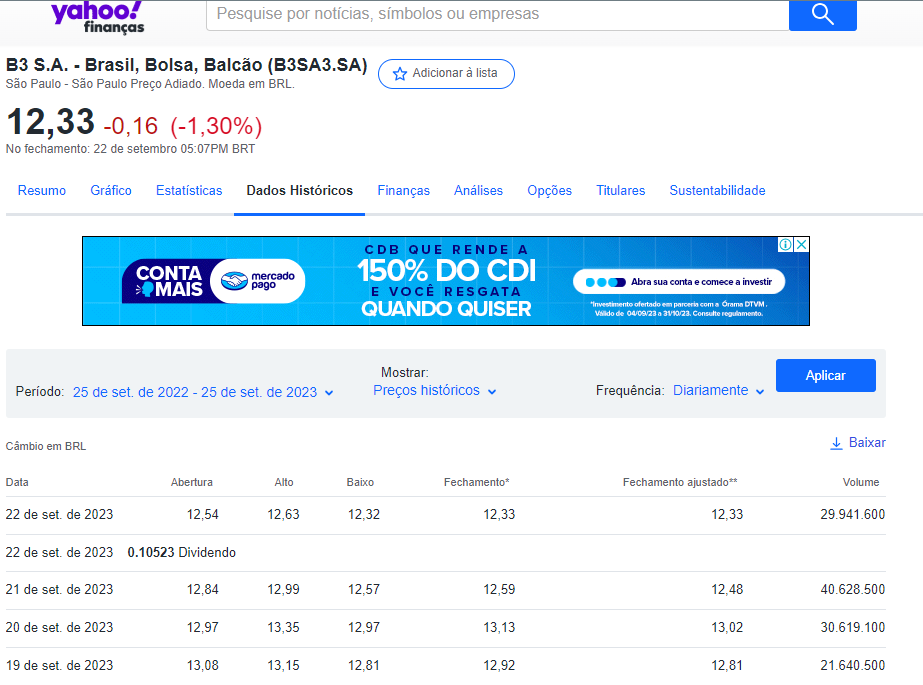
alt-text: Captura de tela do site do Yahoo Finanças contendo informações gerais sobre finanças. De cima para baixo temos: o nome da ação da “B3 S.A.” em destaque e o valor da ação de “12,33 -0,16 (-1,30%)”. Abaixo dessa informação temos uma barra com as opções, da esquerda para a direita: Resumo, Gráfico, Estatísticas, Dados Históricos, Finanças, Análises, Opções, Titulares, Sustentabilidade. A opção de “Dados Históricos” está selecionada e mostra uma tabeça com dados de câmbio em BRL de 19 a 22 de setembro de 2023.

O Yahoo Finance fornece diversas funcionalidades que podem ser úteis para realizar análises de ações, como:

Gráficos interativos que permitem às pessoas usuárias visualizar o histórico de preços das ações, adicionar indicadores técnicos (como médias móveis) e desenhar linhas de tendência para identificar padrões.
Dados históricos de preços e volumes das ações disponíveis para download, o que é essencial para realizar análises técnicas avançadas, como a construção de modelos quantitativos.
Notícias e eventos fornecendo informações sobre eventos corporativos, notícias e anúncios que podem influenciar os preços das ações.
Indicadores técnicos padrão que podem ser aplicados aos gráficos para ajudar na identificação de tendências e sinais de compra/venda.

Fundamentus
A biblioteca fundamentus também é uma API não-oficial que permite acessar dados do site [Fundamentus](https://www.fundamentus.com.br/index.php) por meio da linguagem Python. Com ela, podemos baixar dados financeiros, indicadores fundamentalistas e outras informações relevantes das empresas listadas na [B3 (Brasil, Bolsa, Balcão)](https://www.b3.com.br/pt_br/institucional).

O Fundamentus é um site brasileiro amplamente utilizado para realizar análises fundamentalistas de ações listadas na Bolsa de Valores do Brasil. Ele se concentra na disponibilização de informações financeiras e fundamentais das empresas, permitindo que investidores(as) avaliem a saúde financeira e o desempenho de uma empresa antes de tomar decisões de investimento.
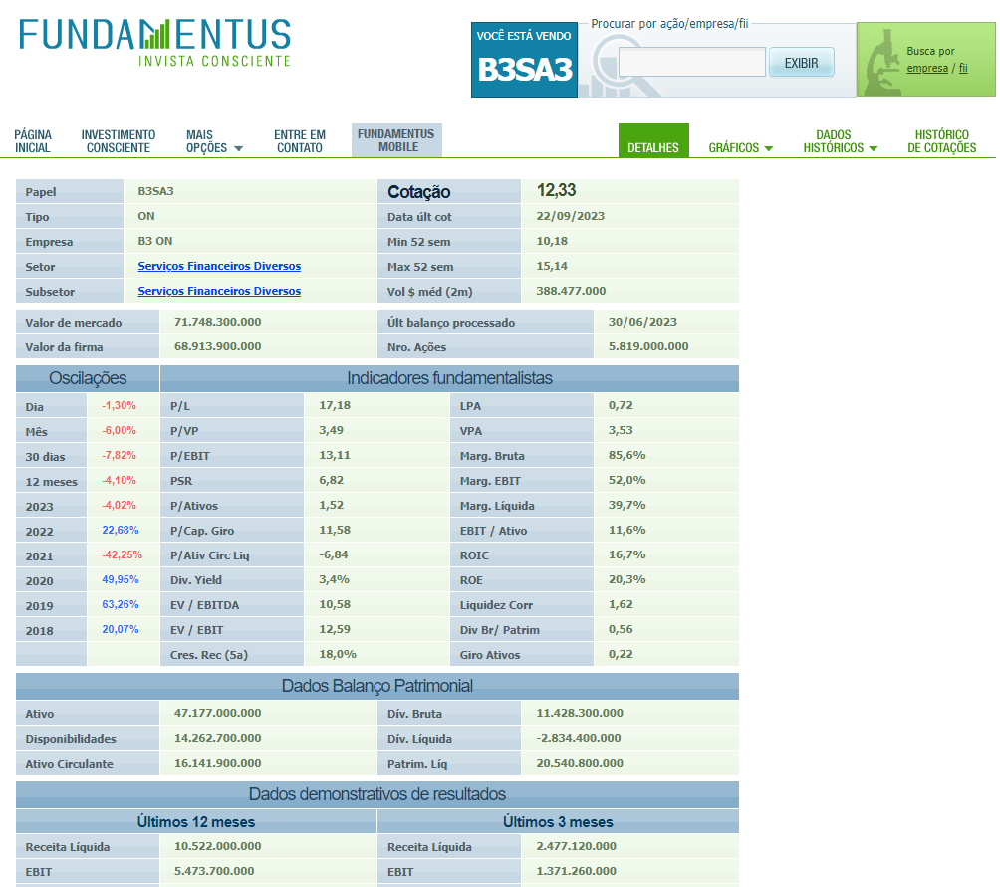
alt-text: Captura de tela do site Fundamentus utilizado para ações da bolsa de valores do Brasil. Nela temos uma tabela com as informações gerais da “B3SA3”, além da cotação, oscilações e indicadores fundamentalistas.

Essa ferramenta é bem útil para investidores(as) que desejam realizar análises fundamentalistas detalhadas das ações brasileiras com informações financeiras atualizadas, permitindo a tomada de decisões de investimento.

O Fundamentus pode ser usado para análise fundamentalista de ações através de:

Dados financeiros e indicadores fundamentalistas por meio das informações financeiras, como balanços patrimoniais, demonstrações de resultados, demonstrações de fluxo de caixa e indicadores fundamentais, como: P/L (Preço/Lucro), P/VP (Preço/Valor Patrimonial), ROE (Retorno sobre o Patrimônio Líquido) e muito mais.
Histórico de resultados dos principais indicadores financeiros de uma empresa ao longo do tempo, o que é útil para identificar tendências e padrões de desempenho.
Comparação entre empresas do mesmo setor com base em seus indicadores, ajudando na escolha de ações que melhor se encaixem em sua estratégia de investimento.
Divulgação dos dividendos e proventos distribuídos pelas empresas, o que é importante para investidores que buscam renda passiva.
Lembrando que os dados financeiros de empresas listadas na bolsa são abertos e normalmente divulgados por trimestre por meio do Relações com o Investidor (RI), uma espécie de relatório com os resultados da empresa divulgados às pessoas investidoras ou potenciais pessoas investidoras.

### Para saber mais: Análise fundamentalista x Análise gráfica  
A análise financeira é um campo muito importante no mundo dos negócios e dos investimentos. Qualquer pessoa que queira investir em ações, títulos ou outros ativos financeiros deve primeiro fazer uma análise cuidadosa. Mas o que é exatamente a análise financeira?

Basicamente, ela é o processo de avaliar empresas, projetos, orçamentos e outras entidades financeiras para determinar a sua performance e adequação. Ao realizar a análise financeira, podemos tomar decisões informadas sobre onde colocar o dinheiro.

Existem duas principais formas de fazer isso. Uma delas é através da análise fundamentalista e outra da análise gráfica.

Análise fundamentalista
A análise fundamentalista é o estudo dos indicadores que demonstram a situação financeira de uma empresa e as suas perspectivas, visando identificar o potencial de crescimento e lucro desta empresa no futuro.

Para definir se as ações de uma dada empresa são um bom investimento, um(a) profissional nesta área recorre à análise macroeconômica (fatores como PIB, inflação, câmbio, entre outros), análise setorial (segmento da empresa e suas características) e a análise da empresa em si, por meio dos seus dados financeiros.

Indicadores fundamentalistas
Existe uma série de indicadores para avaliar a situação financeira de uma empresa que são importantes na busca do valor ótimo de uma ação. Na análise fundamentalista, é importante levar em conta o balanço patrimonial da empresa (bens, direitos e obrigações) e a representação do fluxo financeiro (Demonstração do Resultado do Exercício ou DRE - receitas x despesas), por exemplo.

Podemos destacar os seguintes indicadores como os principais para auxiliar na análise fundamentalista de ações:

Valor de mercado (Market Cap) - preço que o mercado está pagando pela empresa. Produto entre o valor da ação pelo número de ações.
P/L (Preço/Lucro) - quanto o mercado está disposto a pagar pelos lucros da empresa. Razão do valor da ação pelo Lucro por Ação (LPA).
DY (Dividend Yield) - relação entre os dividendos pagos pela empresa (participação dos lucros do investidor) e o preço da ação. Razão dos dividendos pelo valor da ação (em %).
P/VP (Preço/Valor Patrimonial) - avalia o preço de uma ação entre o seu valor de mercado e o valor que ela tem em patrimônio. Quanto maior for o número, mais valorizada a ação está. Razão entre o valor da ação pelo Valor Patrimonial por Ação (VPA).
ROE (Retorno sobre capital) - mede a eficiência de uma empresa na geração de lucro a partir de seus recursos (em %). Razão entre o lucro líquido e o patrimônio líquido, ou LPA/VPA.
Análise gráfica
A análise gráfica (ou técnica) é uma outra alternativa para as pessoas investidoras utilizarem na escolha das ações que desejam comprar. Ela toma como base os dados históricos de cotações das empresas levando em conta os movimentos passados dos preços de um ativo e o volume de negociações para prever o comportamento futuro das cotações.

Tida como análise de curto prazo, é utilizada como forma de identificar tendências e optar pela compra e/ou venda dos ativos de acordo com as oscilações no preço dos ativos e comportamentos que se repetem. Enquanto a análise fundamentalista está centrada na escolha dos melhores papéis, a técnica pode ser utilizada como ferramenta para decidir o melhor momento de comprar ou vender uma ação.

O gráfico mais utilizado na análise técnica é o Gráfico de Candlestick (gráfico de velas), em que as suas barras representam os movimentos de um ativo em determinado período, como podemos notar na imagem abaixo.
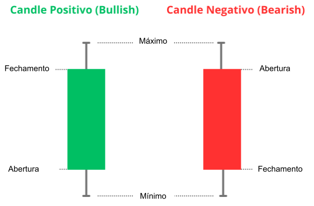
alt-text: Representação de dois gráficos de Candlestick. Cada gráfico é composto por um pavio e uma barra ou caixa sobreposta ao pavio, na vertical. Da esquerda para a direita temos o “candle positivo (bullish)”, na cor verde; e o “candle negativo (bearish)”, na cor vermelha. Os gráficos estão com legendas indicando: o Mínimo e o Máximo localizados, respectivamente, na parte inferior e superior dos pavios. No gráfico positivo, temos a Abertura na base da caixa e o Fechamento no topo. Já no gráfico negativo, temos o inverso: a Abertura está no topo da caixa e o Fechamento na base.

Se considerarmos os dados diários, os elementos de um candle (vela) são:

1 - O corpo (parte espessa do candle): mostra o quanto a ação subiu ou caiu da abertura até o fechamento do mercado naquele período. Existem 2 tipos de candles:

Candle positivo (bullish): usualmente representado na cor verde, aponta que naquele período o preço da ação subiu do momento da abertura até o fechamento.
Candle negativo (bearish): usualmente representado na cor vermelha, aponta que naquele período o preço da ação caiu do momento da abertura até o fechamento.
2 - O pavio (parte fina do candle): demonstra os valores mínimos e máximos que aquela ação atingiu durante o período entre a abertura e fechamento.

Ambos, análise fundamentalista e análise gráfica, têm seus méritos e podem ser úteis dependendo da sua estratégia de investimento. A análise fundamentalista é melhor para avaliar o valor real de um ativo e pode ser útil para investidores(as) de longo prazo. A análise gráfica, por outro lado, é melhor para identificar tendências de curto prazo e pode ser útil para pessoas investidoras que estão atentas às flutuações do mercado.

O ideal é combinar ambos os métodos para obter uma visão completa e fazer a melhor decisão de investimento possível. Independentemente do método que escolher, é crucial fazer sua própria pesquisa e entender completamente o que você está investindo antes de tomar qualquer decisão.

É importante pontuar que, neste curso, não vamos destrinchar os tipos de movimento da análise gráfica, mas apenas apresentar como construir uma visualização que englobe as duas análises: fundamentalista e gráfica no mesmo relatório. O nosso foco é oferecer, a quem estuda com a gente, um repertório suficiente para construir o seu próprio dashboard de acordo com o uso do Python junto ao Power BI.

### Para saber mais: sintetizando o conteúdo  
Neste curso, vamos aprender a utilizar o Python junto ao Power BI a fim de gerar um dashboard que auxilia na análise de carteira de investimentos de clientes na bolsa brasileira, combinando a análise fundamentalista e a análise gráfica de ativos.

O nosso objetivo é compilar os dados extraídos por meio das APIs yfinance e fundamentus com a linguagem Python a fim de carregar os dados no Power BI e gerar um dashboard que inclua dados de cotações e indicadores fundamentalistas para cada ativo de uma carteira hipotética.

Para isso, nós, como analistas de dados da Bulltrend, geramos duas tabelas com os dados de cotações e indicadores, separadamente. Esses dados serão de extrema importância para todo o projeto. Para que possamos trabalhar com os dados, precisamos compreender as informações que temos acesso. Sendo assim, vamos verificar os dados que possuímos em cada coluna das nossas tabelas cotacoese indicadores:

Cotações dos ativos
A tabela cotacoes dispõe dos seguintes dados:

Date: data, no formato ano-mês-dia, das cotações dos ativos. Por exemplo: 2022-01-08.
Open: cotação de abertura, em reais, dos ativos no período.
High: cotação máxima, em reais, dos ativos no período.
Low: cotação mínima, em reais, dos ativos no período.
Close: cotação de fechamento, em reais, dos ativos no período.
Ativo: ticker da empresa, ou seja, o nome utilizado para encontrar o ativo na bolsa de valores da B3 (Brasil, Bolsa, Balcão). Na bolsa brasileira, um ticker possui 4 caracteres que identificam a empresa, seguido de 1 ou 2 dígitos que identificam o tipo de ativo que a empresa oferta.
Logo abaixo, temos o código completo que geramos para extração das cotações de nosso projeto:

# Código completo da obtenção dos dados históricos das cotações da carteira de 01/08/2022 à 01/08/2023
# Importando a biblioteca
import yfinance as yf

# Definindo a carteira de ações
carteira_yf = ['ABEV3.SA', 'B3SA3.SA', 'ELET3.SA', 'GGBR4.SA', 'ITSA4.SA',
               'PETR4.SA', 'RENT3.SA', 'SUZB3.SA', 'VALE3.SA', 'WEGE3.SA']

# Carregando os dados da carteira
df = yf.download(carteira_yf, start="2022-08-01", end="2023-08-01")

# Passando os ativos para o multindex do df
cotacoes = df.stack(level=1)

# Resetando os índices e renomenado a coluna dos ativos
cotacoes = cotacoes.reset_index().rename(columns={"Ticker": "Ativo"})

# Organizando o df
cotacoes = cotacoes[["Date", "Open", "High", "Low", "Close", "Ativo"]]

del carteira_yf, df
Copiar código
Dados gerais e indicadores dos ativos
A tabela indicadores dispõe dos seguintes dados:

Ativo: ticker da empresa.
Setor: setor que atua a empresa listada.
Cotacao: cotação de fechamento no último dia.
Min_52_sem: menor cotação do ativo nos últimos 12 meses (52 semanas).
Max_52_sem: maior cotação do ativo nos últimos 12 meses (52 semanas).
Valor_de_mercado: preço pelo qual o mercado está pagando pela empresa.
Receita_Liquida_12m: receita líquida dos últimos 12 meses.
Nro_Acoes: número total de ações.
Patrim_Liq: patrimônio líquido, a diferença entre os ativos e passivos da empresa.
Receita_Liquida_3m: receita líquida dos últimos 3 meses.
Lucro_Liquido_12m: lucro líquido dos últimos 12 meses.
Lucro_Liquido_3m: lucro líquido dos últimos 3 meses.
P/L: preço sobre o lucro; quanto o mercado está disposto a pagar pelos lucros da empresa.
DY: relação entre os dividendos pagos pela empresa (participação dos lucros do investidor) e o preço da ação.
P/VP: preço sobre valor patrimonial; avalia o preço de uma ação entre o seu valor de mercado e o valor que ela tem em patrimônio.
ROE: retorno sobre patrimônio; mede a eficiência de uma empresa na geração de lucro a partir de seus recursos (em %).
LPA: lucro por ação.
VPA: valor patrimonial por ação.
A seguir, temos o código completo que geramos para extração dos indicadores de nosso projeto:

# Importando as bibliotecas
import fundamentus
import pandas as pd

# Definindo a carteira de ações
carteira_fund = ["ABEV3", "B3SA3", "ELET3", "GGBR4", "ITSA4",
                 "PETR4", "RENT3", "SUZB3", "VALE3", "WEGE3"]

# Criando um df com algumas infos da carteira
ind = pd.concat([fundamentus.get_papel(papel)[['Setor', 'Cotacao', 'Min_52_sem', 'Max_52_sem', 'Valor_de_mercado',
                                            'Nro_Acoes', 'Patrim_Liq','Receita_Liquida_12m','Receita_Liquida_3m',
                                            'Lucro_Liquido_12m', 'Lucro_Liquido_3m']] for papel in carteira_fund])

# Passando o ticker para uma coluna
ind = ind.reset_index()
ind.rename(columns = {'index':'Ativo'}, inplace=True)

# Alterando colunas object para numeric
colunas = ['Cotacao', 'Min_52_sem', 'Max_52_sem', 'Valor_de_mercado', 'Nro_Acoes', 'Patrim_Liq',
           'Receita_Liquida_12m', 'Receita_Liquida_3m', 'Lucro_Liquido_12m', 'Lucro_Liquido_3m']
ind[colunas] = ind[colunas].apply(pd.to_numeric, errors='coerce', axis=1)

# Criando um novo df com alguns indicadores da carteira
ind_2 = fundamentus.get_resultado_raw().reset_index()
ind_2 = ind_2.query("papel in @carteira_fund")
ind_2 = ind_2[['papel','P/L', 'Div.Yield','P/VP','ROE']].reset_index(drop=True)
ind_2.rename(columns={'papel': 'Ativo','Div.Yield':'DY'}, inplace= True)

# Concatenando os dfs em um só com as infos e indicadores
indicadores = pd.merge(ind, ind_2, on="Ativo")

# Criando uma coluna para LPA (Lucro por Ação) e VPA (Valor Patrimonial por ação)
# para calcular a fórmula de Graham  Valor intrínseco de uma ação (VI = √22,5 x LPA x VPA)
indicadores["LPA"] = (indicadores["Lucro_Liquido_12m"] / indicadores ["Nro_Acoes"]).round(2)
indicadores["VPA"] = (indicadores["Patrim_Liq"] / indicadores ["Nro_Acoes"]).round(2)

del ind, ind_2, carteira_fund, colunas
Copiar código
Conseguimos extrair as duas tabelas com os dados de cotações e indicadores da carteira a partir da linguagem Python. Agora, vamos preparar o nosso ambiente para que possamos habilitar o Python no Power BI e extrair esses dados lá dentro da ferramenta?

## Aula 2
## Para saber mais: habilitação de Scripts no Python
O Power BI permite criar modelos de dados e, com base neles, é possível elaborar relatórios e publicá-los em seu serviço. Podemos criar modelos a partir de diversas fontes de dados e uma delas é o Python. Ele é capaz de gerar conjuntos de dados a partir da execução dos seus scripts no ambiente do Power BI. Com esse conjunto de dados em mãos, podemos utilizar o Power BI para seguir com as demais etapas.

Como apontamos no Preparando o ambiente: Instalando o Python para que seja possível a execução do Python no Power BI, precisamos realizar algumas etapas antes e vamos explicar o porquê de algumas delas:

1 - Primeiramente, precisamos instalar o Python no nosso computador, como fizemos no início dessa aula. Isso acontece porque precisamos de um interpretador Python para executar os códigos descritos na aba de Scripts do Python.

2 - A criação de uma pasta do projeto e do [ambiente virtual](https://www.alura.com.br/artigos/ambientes-virtuais-em-python) são opcionais, mas constituem de uma boa prática visando a separação de diferentes tipos de projeto e facilitando a instalação e manutenção das bibliotecas necessárias para o projeto.

3 - Após a criação do projeto, instalamos as bibliotecas necessárias. Dentro da [documentação do Power BI](https://learn.microsoft.com/pt-br/power-bi/connect-data/service-python-packages-support#python-packages-that-are-supported-in-power-bi) podemos notar algumas das bibliotecas que possuem suporte. No projeto que estamos realizando, utilizamos as seguintes:

a. pandas: principal biblioteca de manipulação e análise de dados.
b. numpy: utilizada para trabalhar com arrays e matrizes multidimensionais, oferece funções matemáticas adequadas para manipulação dos dados.
c. matplotlib: principal biblioteca de visualização de dados.
d. seaborn: biblioteca de visualização construída sobre o matplotlib que fornece uma interface de alto nível para gráficos mais atraentes e informativos.
e. fundamentus: API em Python que fornece dados financeiros dos ativos da bolsa brasileira.
f. yfinance: API em Python que fornece dados financeiros dos ativos da bolsa brasileira e internacional.
4 - Após a realização dos processos anteriores, partimos para habilitação do Python no Power BI, passando, nas suas opções e configurações, o diretório base onde o Python foi instalado.

Obs: caso não possua um ambiente virtual, você pode passar o caminho do Python que foi instalado.

5 - Por fim, podemos começar a extrair os dados por meio da aba Obter Dados do Power BI, escolhendo a opção Scripts do Python.

Pronto! Agora estamos com o ambiente preparado para utilizar o Python. Entretanto, é importante tomar alguns cuidados antes de podermos executar algum script. Devemos ter atenção a alguns detalhes, como:

Estrutura de dados: verifique se os dados importados estão na estrutura apropriada para o pandas. A estrutura deve seguir o formato tabular, como podemos conferir no exemplo abaixo:
Nome	Idade
Maria	25
Lucas	33
Pedro	27
Tempo de execução: os scripts Python não podem passar de 30 minutos em execução. Caso atinja esse limite, a execução será interrompida.

Interação do usuário:os scripts que exigem a interação da pessoa usuário(a) têm sua execução interrompida. Por exemplo, caso essa pessoa precise inserir um valor para que o script continue sua execução, ele será interrompido.

Caminhos dos arquivos: são utilizados nos scripts precisam ser completos e não relativos. A seguir, podemos verificar um exemplo da importação de um arquivo csv:

import pandas as pd

df_completo = pd.read_csv(“C:\Users\Documents\Project\meus_dados.csv”) # permitido
df_relativo = pd.read_csv(“Project\meus_dados.csv”) # não permitido
Copiar código
Tabelas aninhadas: para que seja possível utilizar o Python no Power BI, elas não são permitidas.
Com tudo alinhado e entendendo mais sobre as escolhas e os processos, vamos prosseguir para a obtenção dos dados das cotações, dados gerais e indicadores fundamentalistas. Até o próximo vídeo!  

## Aula 3
### Para saber mais: privacidade dos dados  
Na aula anterior, aprendemos a executar scripts do Python no Power BI. Como sabemos, o Python é uma ferramenta poderosa para tratamento, análise e modelagem de dados, utilizada em diversas áreas por diversos profissionais.

No Power BI, é possível realizar o processamento e tratamento dos dados no Editor do Power Query. Pensando na união dessas duas ferramentas, podemos utilizar o poder do Python para preparar os dados através do Editor do Power Query.

Preparando os dados
No Editor do Power Query, localize a aba Transformar e selecione a opção Executar script Python, no canto superior direito, como exibido na imagem:
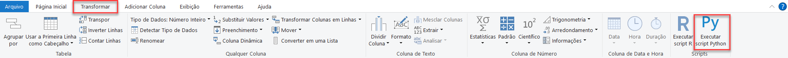
alt-text: Captura de tela da barra de opções do Editor do Power Query, com destaque para a opção “Executar script Python” na aba “Transformar”, ambas destacadas por um retângulo vermelho.

Após selecionar essa opção, vai aparecer uma janela com um campo de texto. Nesse campo, vamos inserir nosso script Python e clicar em OK:
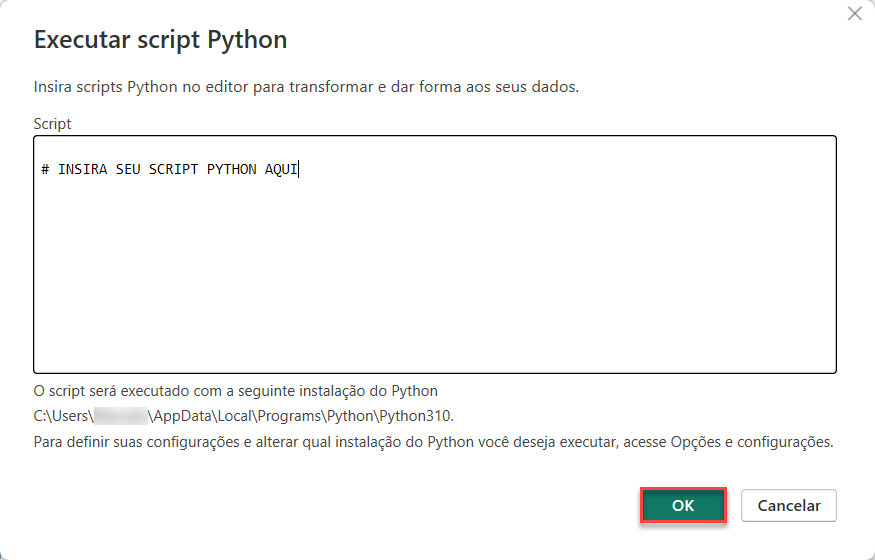
alt-text: Captura de tela da janela “Executar script Python”, com o campo para inserir o código. No canto inferior direito temos dois botões: o botão “OK” que aparece destacado em vermelho; e o botão “Cancelar”.

Atenção: para que possamos executar scripts no Power BI, todas as fontes de dados devem ser públicas. Por isso, iremos receber um aviso sobre a privacidade dos dados, como aparece na imagem abaixo:
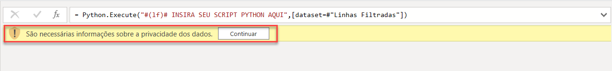
alt-text: Captura de tela do aviso de privacidade dos dados do Editor do Power Query que aparece destacado por um retângulo vermelho.

Para resolver isso, podemos clicar no botão de Continuar que aparece no aviso. Ao fazer isso, vai abrir uma janela para configurar o nível de privacidade do Python. Nesta janela, vamos selecionar o nível Público, clicando no botão do canto inferior direito e, em seguida, iremos clicar em Salvar, conforme mostrado nas imagens abaixo:
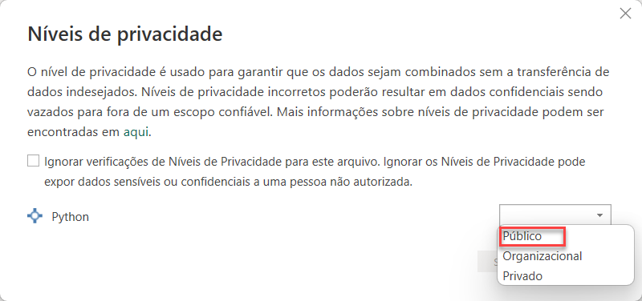
alt-text: Captura de tela da janela de Níveis de privacidade. No canto inferior direito temos um menu de seleção aberto e mostrando, de baixo para cima, três opções: “público”, “organizacional” e “privado”. A opção “público” encontra-se destacada por um retângulo vermelho.
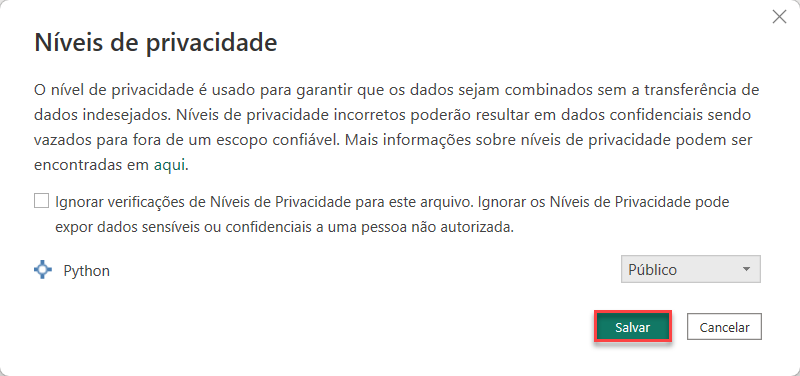
alt-text: Captura de tela da janela de Níveis de privacidade. No canto inferior direito, a opção “Público” é exibida no menu de seleção. Abaixo dele temos dois botões, da esquerda para a direita: o botão “Salvar” que aparece destacado por um retângulo vermelho; e o botão “Cancelar”.

Além da configuração de privacidade do Python, é importante que todas as fontes de dados sejam definidas como Públicas. Para isso, podemos acessar a [documentação](https://learn.microsoft.com/pt-br/power-bi/connect-data/desktop-python-in-query-editor#considerations-and-limitations) para identificar como podemos resolver esse processo. Dessa forma, a troca de informações entre as fontes de dados é permitida, fazendo com que o desempenho e a funcionalidade não sejam afetados.

Caso queira aprofundar seus conhecimentos sobre os níveis de privacidade no Power BI, confira o artigo [Níveis de privacidade do Power BI Desktop](https://learn.microsoft.com/pt-br/power-bi/enterprise/desktop-privacy-levels) disponibilizado pela Microsoft.

Outros dois pontos que valem citação são:

Para habilitar a atualização agendada de conjuntos de dados e elementos visuais do Python, precisamos habilitar essa função e possuir um Gateway instalado na máquina.
Assim como scripts do Python no Power BI, não há suporte para tabelas aninhadas no Power Query até o momento da gravação deste curso.

### Para saber mais: cálculo do valor intrínseco  
A análise fundamentalista é uma ferramenta muito importante para pessoas investidoras que baseiam as suas tomadas de decisão financeiras por meio de análises matemáticas. Dentre uma série de indicadores e cálculos, a busca por encontrar um preço justo a se pagar por um ativo é bastante demandada.

Neste ponto, um indicador se destaca: o valor intrínseco. Ele é interpretado como preço justo a ser pago por uma ação e pode ser calculado de diversas formas. Em nosso curso, nos concentramos em trazer uma das formas mais utilizadas que é baseada numa fórmula apresentada no livro [Investidor Inteligente](https://www.google.com.br/books/edition/O_investidor_inteligente/NYarDwAAQBAJ?hl=pt-BR&gbpv=0) de autoria de Benjamin Graham, economista e best-seller de livros com a temática de análise fundamentalista.

Segundo Graham, o valor intrínseco pode ser calculado da seguinte forma:

VI = √(22,5 x LPA x VPA)
Copiar código
Mas o que esses valores significam?

O valor de 22,5, também conhecido como índice de Graham, provém do cálculo em que se define como aceitável quando uma pessoa investidora paga no máximo 15 vezes pelo lucro de uma empresa (P/L =15) e 1,5 vezes pelo patrimônio líquido da mesma (P/VP = 1.5), ou seja, 15 x 1,5 = 22,5. Além disso, temos 2 termos na raiz do produto, sendo eles: o LPA (Lucro por Ação) e o VPA (Valor Patrimonial por Ação).

É importante pontuar que além dessa não ser a única forma de calculá-la, também não é o único indicador a ser levado em consideração na análise fundamentalista. Portanto, o valor intrínseco é uma parte da análise fundamentalista importante para avaliar o preço justo e realizar o valuation de uma empresa, mas sempre é importante adicionar outros indicadores à análise.  

### Para saber mais: relacionamento das tabelas e cardinalidade
No vídeo anterior, percebemos uma das funcionalidades presentes na modelagem de dados que é a relação entre tabelas. Não vamos aprofundar essa temática, mas deixamos o curso [Power BI: modelagem de dados](https://cursos.alura.com.br/course/power-bi-modelagem-dados) como indicação de estudo sobre esse assunto dentro do contexto do Power BI.

Esse conteúdo explica com detalhes o que é a modelagem de dados, apresenta os relacionamentos entre as tabelas, traz exemplos dos tipos de cardinalidade existentes e ainda explica os conceitos de tabela fato e dimensão. Tudo isso por meio de um projeto prático que auxilia estudantes e profissionais de análise de dados e BI a construir relatórios mais robustos relacionando todos os dados pertinentes à análise.

## Aula 4
### Para saber mais: sugestão de leitura e sites  
O mundo de dados é vasto e engloba diversas áreas, como educação, marketing e vendas. Neste curso, estamos explorando a área de finanças e abordando diversos conceitos e formas de analisar os dados. Existe uma série de fontes de materiais como sites e livros que ajudam a explorar os conteúdos.

A seguir, temos alguns materiais para você acessar e aprofundar nos estudos do mercado financeiro.

Para acompanhar os indicadores abordados no curso, ações do mercado em tempo real, temos o [Status Invest](https://statusinvest.com.br/) e o [Investidor10](https://investidor10.com.br/), que exibem graficamente os valores de cada ativo junto aos indicadores que permitem avaliar empresas e definir estratégias de investimento.

Para aprofundar os conhecimentos sobre o mercado de ações, confira o [Info Money](https://www.infomoney.com.br/guias/mercado-de-acoes/) que explica como o mercado funciona.

Além dos sites disponíveis, você pode conferir materiais educativos. Um deles é o livro [O Investidor Inteligente](https://www.google.com.br/books/edition/O_investidor_inteligente/NYarDwAAQBAJ?hl=pt-BR&gbpv=0), que fornece estratégias sobre como usar com sucesso o investimento em valor no mercado de ações.

Caso esteja interessado em explorar mais ainda o Python e Power BI nessa área, recomendamos o livro [Python Aplicado: Bolsa de Valores - Um guia para construção de análises e indicadores](https://www.google.com.br/books/edition/Python_Aplicado/Px-fxAEACAAJ?hl=pt-BR). Nele são apresentadas algumas análises estatísticas, criação de diversos indicadores, além da elaboração de um sistema para testar os indicadores e estratégias.

Agora que tem diversas opções para aprofundar seus conhecimentos na área de finanças, sinta-se à vontade para explorar e aplicar o que aprenderá adiante. Quem sabe você descobre algo interessante e compartilha conosco no LinkedIn? Aguardamos para ver suas descobertas!

## Aula 5
### Para saber mais: criar visuais Python no Power BI  
O Python oferece diversas funcionalidades para processamento e análise de dados. Parte do processo de análise é a visualização dos dados para que possamos gerar insights sobre as informações apresentadas.

Durante o curso, aprendemos a importar, tratar e criar indicadores dos dados utilizando os scripts Python, restando apenas visualizar essas informações. Para atender a essa necessidade, o Power BI permite a criação de visuais usando o Python.

A visualização dos dados só é possível após concluirmos alguns pré-requisitos já realizados no curso. São eles:

Instalar o Python no computador.
Habilitar os scripts Python no Power BI.
Instalar as bibliotecas de manipulação e visualização de dados.
Como exemplo, vamos utilizar as colunas Ativo e Valor_de_mercado do nosso projeto. Com as nossas colunas escolhidas, vamos selecioná-las para nosso visual do Python. Para isso, temos que arrastá-las para a seção de Valores na aba de Visualizações, pois o Power BI só poderá usar os campos que estão nessa seção.

Além disso, o Power BI atualiza o visual automaticamente após qualquer alteração feita no script ou nos campos selecionados. Abaixo, podemos verificar as colunas no campo de Valores do visual:
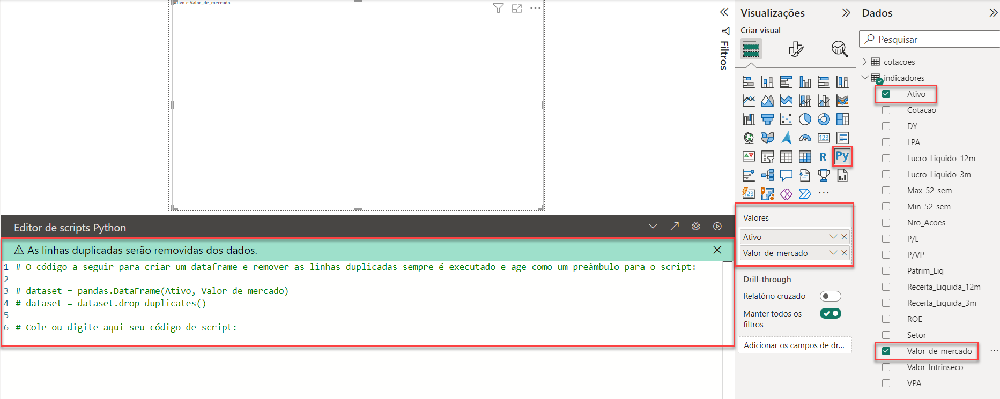
alt-text: Captura de tela da área de criação de scripts Python do Power BI. Na parte inferior esquerda temos a área para inserir o código. À direita temos a aba chamada “Visualizações”, contendo os campos utilizados e o tipo de visual e a aba “Dados” contendo a tabela e seus campos utilizados.

Após selecionarmos os campos, podemos perceber que nossas colunas foram importadas automaticamente para um DataFrame chamado dataset. Agora, vamos elaborar nosso script para visualizar os dados. Nesse caso, podemos utilizar um gráfico de barras e conferir o código abaixo:

import matplotlib.pyplot as plt

dataset_ordenado = dataset.sort_values(by='Valor_de_mercado', ascending=False)

plt.bar(dataset_ordenado['Ativo'],dataset_ordenado['Valor_de_mercado'], color='#97cf3b') 

plt.show()
Copiar código
Com a nossa visualização criada, podemos rodar nosso script:
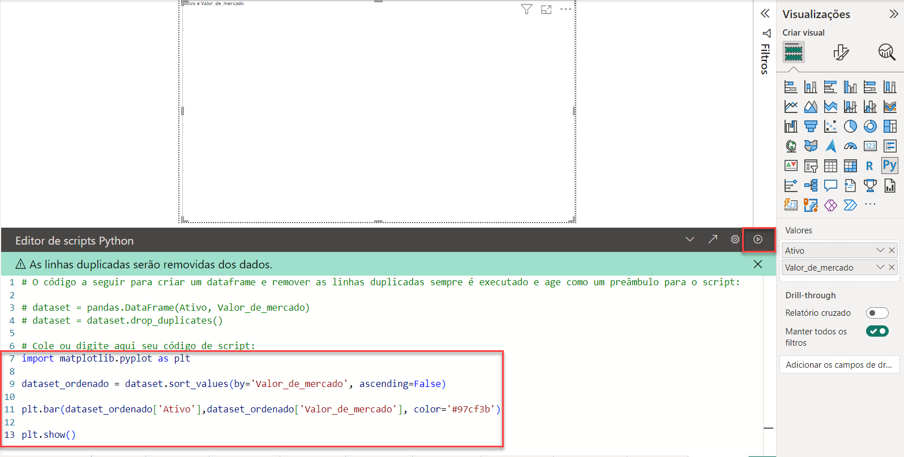
alt-text: Captura de tela da área de criação de scripts Python do Power BI. Na parte inferior, no Editor de scripts Python, temos o código para criar o gráfico de barras destacado por um retângulo vermelho. À direita, temos a aba chamada Visualizações.

A seguir, podemos conferir o visual criado:
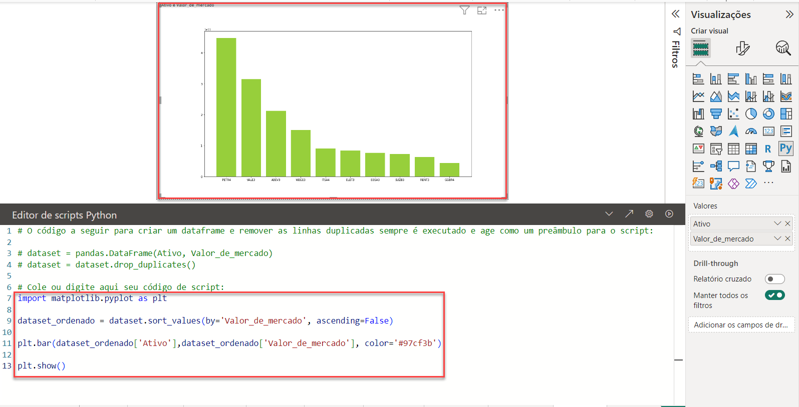
alt-text: Captura de tela da área de criação de scripts Python do Power BI. Na parte central temos o visual gerado pelo script. Abaixo dele temos a área para inserir o código. Ambos destacados com um retângulo vermelho. À direita temos a aba Visualizações.

Deixando o gráfico em evidência, notamos abaixo o Visual Python por meio do Power BI.
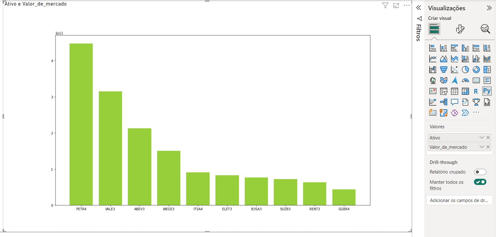
alt-text: Captura de tela do gráfico de barras gerado pelo script Python com 10 barras verticais de diferentes tamanhos e na cor verde. À direita temos a aba Visualizações.

Limitações
Apesar de muito poderosos, os visuais do Python no Power BI possuem algumas limitações, como podemos conferir abaixo:

O Python limita os dados para o máximo de 150.000 linhas e para o tamanho de armazenamento de 250 MB.
O Python irá truncar valores com cadeia de caracteres maiores que 32.766 caracteres.
Visuais que demorarem mais de cinco minutos para serem executados resultarão em um erro, sendo assim interrompidos.
Caso os campos de dados que não possuem relacionamento entre si sejam selecionados, resultará em erro.
Os visuais do Python não são interativos, mas são atualizados automaticamente após qualquer alteração.
As colunas utilizadas para elaborar os visuais devem manter seus nomes originais.
Os visuais do Python são uma poderosa ferramenta, fornecendo possibilidades de visualizações além das que já estão disponíveis no próprio Power BI. Caso queira explorar mais, recomendamos o artigo [Criar visuais do Power BI usando Python](https://learn.microsoft.com/pt-br/power-bi/connect-data/desktop-python-visuals) da Microsoft.
