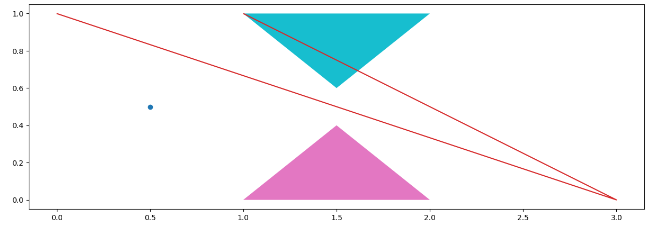
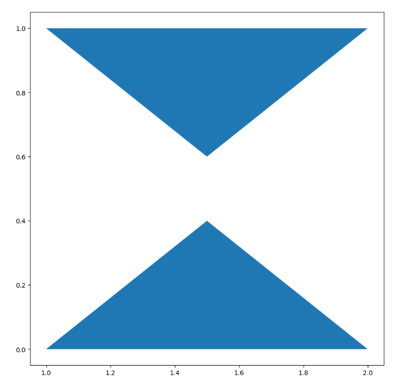
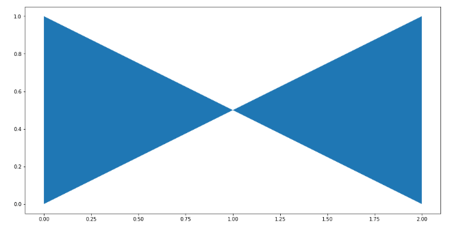
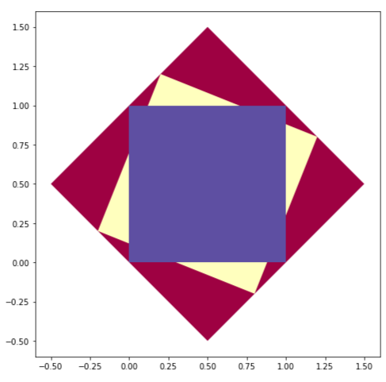
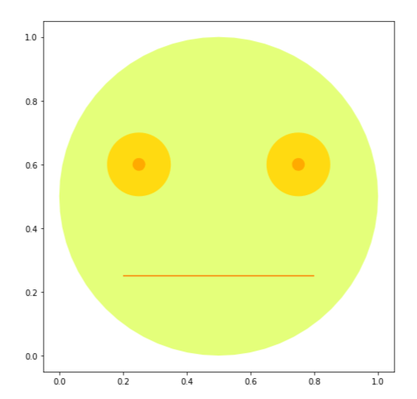

**Faça Como Eu Fiz** = **Mão na Massa**

## Aula 1
### Preparando o ambiente  
Neste curso, vamos trabalhar no ambiente do [Google Colaboratory](https://colab.research.google.com/). As bases de dados utilizadas no curso podem ser acessadas neste [repositório](https://github.com/alura-cursos/curso_geopandas/tree/main/dados). E o dataset apresentado na última aula pode ser acessado aqui.

Instalação do GeoPandas
Atenção!
Para trabalhar com dados georreferenciados, será utilizada a biblioteca GeoPandas, em sua versão mais recente: 0.13.2. O GeoPandas já vem instalado no Colab, mas se quiser acompanhar o curso na mesma versão, é necessário instalar a GeoPandasexecutando o código abaixo em uma célula do seu notebook de aula:

!pip install geopandas==0.13.2 
Copiar código
 Discutir no Fórum

### Desafio: carregando dados  
Uma empresa de turismo quer mapear as opções de atividades culturais em São Paulo, de acordo com a proximidade do metrô. Sua tarefa como cientista de dados vai ser mapear os locais culturais mais próximos das estações de metrô, especificamente da linha vermelha. Esse desafio será desenvolvido em quatro etapas ao longo das aulas desse curso

Nessa primeira etapa do desafio, você deve carregar o mapa do Estado de São Paulo e utilizar um filtro para gerar um GeoDataFrame que contenha apenas o mapa do município de São Paulo.

### Opinião do instrutor
[Neste notebook](https://github.com/alura-cursos/curso_geopandas/blob/main/Desafio_sampa_Aula1.ipynb) você encontra uma possível solução para o desafio proposto.

## Aula 2
### Desafio: alterando o CRS  
No desafio da aula anterior você carregou o mapa do município de São Paulo. Continuando com o Desafio você deve carregar outros dois conjuntos de dados. Um dataset com as estações do metrô e outro com a localização dos centros culturais.

Você deve adicionar um CRS adequado para o município de São Paulo. Para o mapa de São Paulo, você pode fazer isso com o método to_crse, para os demais dados, deve usar o método set_crs. O funcionamento é idêntico. A única diferença é que usamos o to_crs quando o dado já possui um crs pré-definido.
### Opinião do instrutor  
[Neste notebook](https://github.com/alura-cursos/curso_geopandas/blob/main/Desafio_sampa_Aula2.ipynb) você encontra uma possível solução para o desafio proposto.

## Aula 3
### Desafio: visualizando os dados
No desafio da aula anterior carregamos todos os datasets necessários e alteramos o seu CRS. Agora queremos ter uma ideia do visual da localização dos centros culturais em relação às estações do metrô. Agora que todas as informações possuem o mesmo CRS, gere um mapa que mostre todas as informações em conjunto. Separe a localização das estações de metrô em um GeoDataFrame e mostre esses dados em vermelho no mapa. 

### Opinião do instrutor  
[Neste notebook](https://github.com/alura-cursos/curso_geopandas/blob/main/Desafio_sampa_Aula3.ipynb) você encontra uma possível solução para o desafio proposto.

## Aula 4  
### Correção da correlação  
Desde que o curso foi lançado, a biblioteca Pandas e a GeoPandas foram atualizadas. Isso fez com que surgisse um erro quando tentamos calcular a correlação em DataFrames que contém colunas do tipo String.

Para evitar o erro, nos momentos em que o instrutor calcula a correlação você deve importar a biblioteca Numpy e criar um novo DataFrame apenas com as colunas numéricas. Exemplo:

import numpy as np
geo_dados_num = geo_dados.select_dtypes(include=[np.number])
correlacao = geo_dados_num.corr()
Copiar código
Se você tiver alguma dificuldade você conferir o código completo do curso que foi atualizado com essas correções.

### Desafio: calculando a distância
No desafio da aula anterior construímos um mapa para ter uma ideia visual do problema. Agora a ideia é saber quais são os 10 centros culturais mais próximos das estações de metrô. Faça esse cálculo e mostre os 10 centros em conjunto com seus endereços disponíveis no GeoDataFrame de centros culturais.  
### Opinião do Instrutor  
[Neste notebook](https://github.com/alura-cursos/curso_geopandas/blob/main/Desafio_sampa.ipynb) você encontra uma possível solução para o desafio proposto.

## Desafio: Polygon, Point, LineString e MultiPolygon  
Durante as aulas, vimos que uma das colunas, a geometry, continha elementos como o MULTYPOLYGON e POLYGON para definir as formas apresentadas no mapa. O POLYGON é um polígono e o MULTIPOLYGON é a combinação de dois ou mais polígonos. Mas também podemos definir outras formas como pontos e linhas.

Para definir formas desse tipo podemos usar a [biblioteca shapely](https://pypi.org/project/shapely/). Por exemplo, se quisermos definir formas como um ponto, uma linha, e polígonos, podemos fazer da seguinte forma:

from shapely.geometry import MultiPolygon, Polygon, Point, LineString

#Ponto 
p1 = Point(0.5,0.5)

#Linha
p2 = LineString([(0,1),(3,0),(1,1)])

##Polígonos
p3 = Polygon([(1,0),(1.5,0.4),(2,0)])

p4 = Polygon([(1,1),(1.5,0.6),(2,1)])
Copiar código
A função Point também possui o método .buffer() atrelado. Isso permite adicionar um valor para definir o raio do círculo.

Para visualizar os polígonos criados, podemos adicioná-los a uma GeoSeries e usar o método plot:

import geopandas as gpd
g = gpd.GeoSeries([p1,p2,p3,p4])
g.plot(cmap='tab10',figsize=(15,10))
Copiar código
Resultado:

Um triângulo azul claro de cabeça para baixo, no topo central da imagem, e um triângulo rosa, na parte inferior central da imagem. A figura também apresenta duas retas e um ponto.

Um MultiPolygon é a combinação de dois polígonos. Para criar um, podemos combinar os polígonos p3 e p4:

p8 = MultiPolygon([p3,p4])
g = gpd.GeoSeries([p8])
g.plot(cmap='tab10',figsize=(15,10))
Copiar código
Resultado:

Imagem com dois triângulos azuis, um na parte superior, de cabeça para baixo, e outro na posição correta, na parte inferior da imagem.

Agora é a sua vez
Tente gerar cada uma dessas figuras:

Figura 1:

Imagem com dois triângulos azuis de lado, um apontando para o outro.

Figura 2:

Imagem com três quadrados de tamanhos diferentes. Cada quadrado está dentro de um quadrado maior e rotacionado em relação ao anterior

Figura 3:

Imagem de um rosto construído com formas geométricas de círculos
### Opinião do Instrutor  
Aqui, segue o código para a geração de cada figura individualmente. Lembre-se de importar as funções da biblioteca shapely e a geopandas através dos comandos:

from shapely import Point, Polygon, MultiPolygon, LineString
import geopandas as gpd
Copiar código
Figura 1:

Para a primeira figura, precisamos gerar dois triângulos. Para isso, podemos passar quatro vértices. Repare que a ordem em que passamos os vértices importa. Caso tivéssemos passado os vértices em uma ordem diferente, poderíamos ter gerado um quadrado.

p1 = Polygon([(0, 0), (2, 1), (2, 0), (0, 1)])

g = gpd.GeoSeries([p1])
g.plot(cmap='tab10', figsize=(15,8))
Copiar código
Figura 2:

Para a figura 2, a técnica utilizada foi criar um quadrado e, através do laço for, gerar quadrados maiores e rotacionados:

figuras = []
for i in [0.5, 0.2, 0]:
    figuras.append(Polygon([(0 - i, 0 + i),
                            (1 - i, 0 - i),
                            (1 + i, 1 - i),
                            (0 + i, 1 + i)]))

g = gpd.GeoSeries(figuras)
g.plot(cmap='Spectral', figsize=(15,8))
Copiar código
Figura 3:

Nessa figura estamos o Point com o método buffer para definir círculos com seus respectivos raios.

p1 = Point(0.5, 0.5).buffer(0.5)
p2 = MultiPolygon([Point(0.25, 0.6).buffer(0.1), 
                    Point(0.75, 0.6).buffer(0.1)])
p3 = MultiPolygon([Point(0.25, 0.6).buffer(0.02),
                    Point(0.75, 0.6).buffer(0.02)])
p4 = LineString([(0.2, 0.25), (0.8, 0.25)])

g = gpd.GeoSeries([p1, p2, p3, p4])
g.plot(cmap='Wistia', figsize=(15,8))
Copiar código

