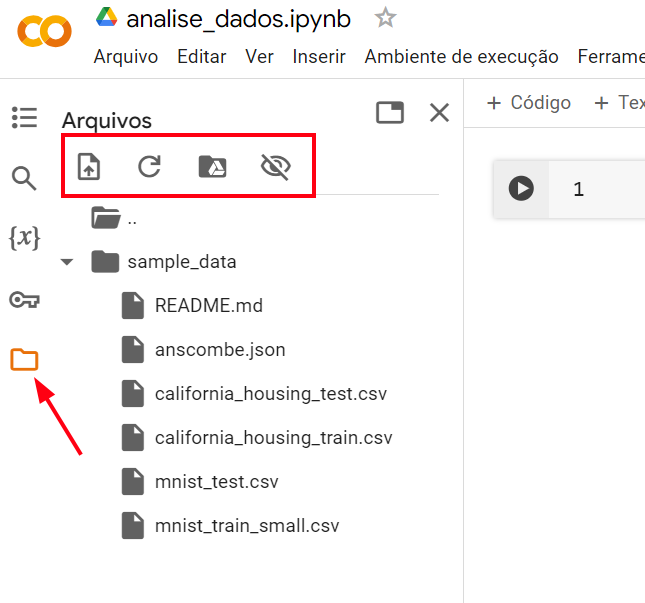
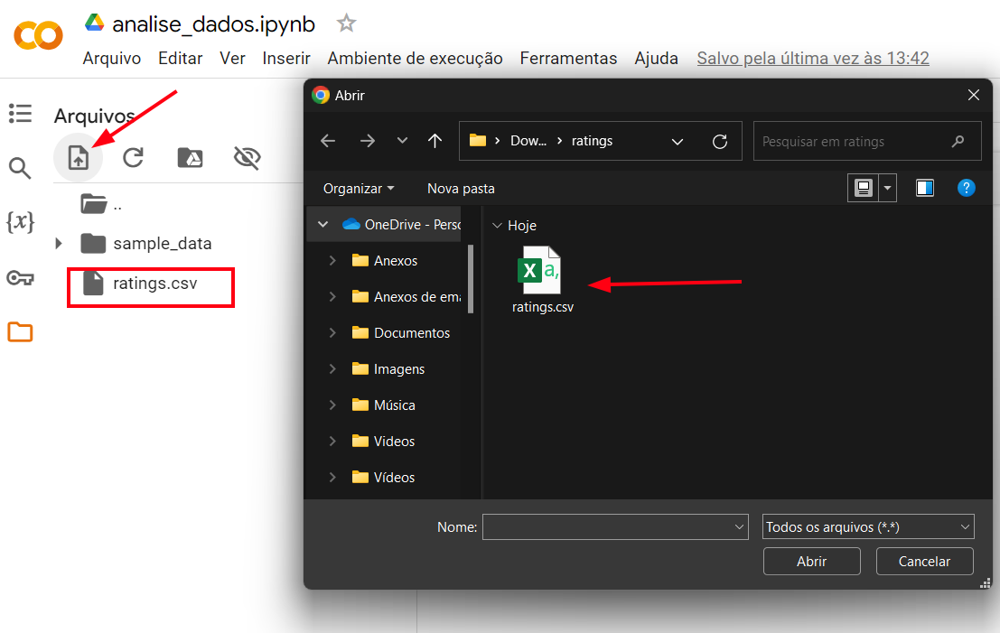
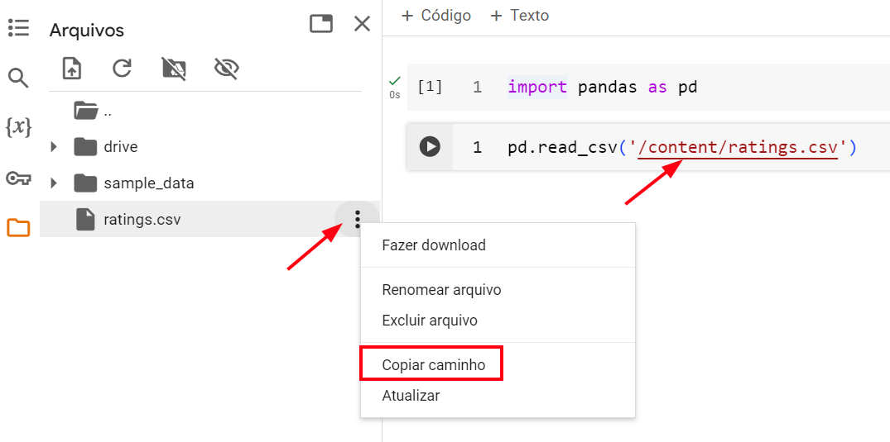

# Para Saber Mais

## Aula 1

### Para saber mais: fazendo upload de arquivos no Colab  
O Google Collaboratory é uma ferramenta completa para análise de dados, fornecendo recursos em nuvem de forma gratuita com suporte a linguagem Python e várias bibliotecas instaladas. Naturalmente, para fazer a análise de dados, é preciso utilizar uma base de dados, e o Colab oferece um sistema de armazenamento de arquivos que permite carregar os dados para dentro do ambiente de desenvolvimento.

O sistema de arquivos pode ser acessado na 5ª opção do menu lateral esquerdo, a partir de um ícone de pasta. A partir da seleção, surgirá um explorador de arquivos, com uma pasta sample_data contendo arquivos de dados para praticar e um novo menu de 4 ícones. O primeiro destes ícones é o de fazer upload de arquivos, o segundo atualiza o sistema de arquivos, o terceiro permite conectar o sistema de arquivos ao Google Drive a partir da conta do gmail e por fim, o quarto ícone habilita a visualização de arquivos ocultos.

alt text: Sistema de arquivos do Google Colab. Há uma seta vermelha indicando um ícone de pasta na quinta opção do menu lateral esquerdo do Google Colab e um retângulo vermelho destacando os 4 ícones de opções do menu de arquivos: Fazer uploads, atualizar, montar drive e mostrar arquivos ocultos.

A partir daí, temos duas opções para fazer a leitura de arquivos, seja fazendo o upload diretamente do computador ou a partir de um arquivo que esteja no Google Drive. A primeira opção é bem direta, vamos selecionar o ícone de upload do arquivo e o explorador de arquivos do sistema operacional irá se abrir, podemos selecionar o arquivo da nossa escolha e enviar para dentro do ambiente do Colab. O arquivo surgirá dentro do explorador de arquivos do Colab. Caso não apareça, podemos selecionar no botão de atualizar.

alt text: Sistema de arquivos do Google Colab com a opção de fazer o upload de arquivos em destaque. O explorador do windows está aberto com um arquivo nomeado ratings.csv em destaque. O menu de arquivos do Colab também apresenta o mesmo arquivo destacado com nome ratings.csv

Se for o desejo acessar o arquivo pelo Google Drive, podemos fazer o upload do arquivo para dentro do Google Drive, da forma usual e depois selecionamos a 3ª opção do menu de arquivos do Colab, chamada "Montar Drive", que permite fazer um acesso direto aos arquivos da conta de gmail que está acessando o Colab. Ao acessar essa opção, o Google solicitará uma permissão e caso seja permitido, o explorador de arquivos apresentará uma nova pasta, chamada "drive", contendo todos os arquivos do Google Drive.

Depois de fazer o upload do arquivo em formato csv, precisamos fazer a leitura com a biblioteca pandas. Para isso, podemos usar o método read_csv(), informando o local do arquivo dentro do sistema de arquivos do Colab. Podemos navegar pelo sistema de pastas de arquivos, seja no arquivo de upload ou na pasta do Drive, e ao lado direito do arquivo selecionar o ícone de mais opções, escolhendo a opção "Copiar caminho". Feito isso, basta colar o caminho do arquivo entre os parênteses da função read_csv().

alt text: Explorador de arquivos do Google Colab aberto com destaque para o menu suspenso do arquivo ratings.csv. No menu suspenso, a quarta opção de copiar caminho está em destaque. Há duas células de código no notebook, uma com o código import pandas as pd e o outro com o código pd.read_csv('/content/ratings.csv'), no qual o caminho /content/ratings.csv está em destaque.

### Para saber mais: Pandas Series e DataFrame  
Series e DataFrame são estruturas de dados fundamentais no ecossistema do Pandas. Nós cientistas de dados nos debruçamos diariamente com essas estruturas e, por isso, é importante aprender sobre o que representam e como manipulá-las.

DataFrame
Um DataFrame é uma estrutura tabular bidimensional, similar a uma planilha ou tabela de banco de dados, onde os dados são organizados em linhas e colunas. Vamos criar um simples DataFrame e verificar sua estrutura:

import pandas as pd

# Criando um DataFrame simples
dados = { 'Nome': ['Mirla', 'Ana', 'Daniel'],
   'Idade': [25, 30, 35],
              'Salario': [5000, 6000, 8000]}
df = pd.DataFrame(dados)
df
Copiar código
Saída:

Nome	Idade	Salario
0	Mirla	25	5000
1	Ana	30	6000
2	Daniel	35	8000
Explorando brevemente a sua estrutura, no lado esquerdo temos o índice (de 0 a 2) indicando a quantidade de registros (observações) que possuímos no DataFrame, em negrito no topo as colunas, que identificam a natureza dos dados e os valores que são a combinação entre o tipo do dado e a observação que ele representa, por exemplo, Mirla é um nome no índice de número 0.

Em um DataFrame, podemos aplicar funções para explorar, tratar e manipular os dados tanto em toda a sua estrutura como em uma ou mais colunas (Series). Podemos observar, logo abaixo, dois exemplos de como explorar um DataFrame por inteiro e por apenas uma coluna:

df.info()
Copiar código
Saída:

<class 'pandas.core.frame.DataFrame'>
RangeIndex: 3 entries, 0 to 2
Data columns (total 3 columns):
 #   Column   Non-Null Count  Dtype 
---  ------   --------------  ----- 
 0   Nome     3 non-null      object
 1   Idade    3 non-null      int64 
 2   Salário  3 non-null      int64 
dtypes: int64(2), object(1)
memory usage: 200.0+ bytes
Copiar código
Aqui, é possível notar algumas observações sobre o DataFrame, como quantidade de registros e colunas, o tipo das variáveis da coluna (object e int64), se possuem dados nulos e o uso de memória daqueles dados.

df['Salario'].mean()
# ou df.Salario.mean() 
Copiar código
Saída:

6333.333333333333

No código acima, calculamos apenas a média de uma coluna do df trazendo a média salarial das pessoas cadastradas.

Series
Um Series por sua vez é uma estrutura unidimensional que armazena uma sequência de valores indexados. Podemos dizer que um DataFrame nada mais é que uma sequência de vários Series nomeados organizados coluna por coluna e ordenados pelos índices.

import pandas as pd

# Criando um Series simples
idades = pd.Series([45, 30, 45, 40, 25])
idades
Copiar código
Saída:

0    45
1    30
2    45
3    40
4    25
dtype: int64
Copiar código
Explorando brevemente a sua estrutura, no lado esquerdo temos o índice (de 0 a 4) indicando a quantidade de registros (observações) que possuímos no Series e no lado direito os registros dos dados. Na última linha, podemos observar o tipo do dado (int64). A diferença entre este Series e o Series extraído de uma coluna do DataFrame é que o que vem do DataFrame também apresenta na última linha o nome (Name) do Series.

Num Series, podemos aplicar funções para explorar, tratar e manipular seus dados, como podemos observar, logo abaixo, em dois exemplos:

idades.index
Copiar código
Saída:

RangeIndex(start=0, stop=5, step=1)

No código acima lemos os índices do Series. Como estão numerados de 0 até 4, o código representa que o índice é gerado pelo RangeIndex()partindo de 0 até 5 de um a um.

idades.sort_values()
Copiar código
Saída:

4    25
1    30
3    40
0    45
2    45
dtype: int64
Copiar código
No código acima, ordenamos apenas os valores de idades em ordem crescente, sem alterar os índices.

Observamos nestes exemplos, como podemos trabalhar com conjuntos de dados estruturados, seja em formato de DataFrame ou Series, compreendendo suas diferenças e como utilizá-las no contexto de ciência de dados.

## Aula 2
### Para saber mais: método query  
O método query() do Pandas permite filtrar dados de um DataFrame utilizando uma expressão de consulta semelhante à linguagem SQL. Ele permite que você selecione linhas com base em condições específicas definidas na expressão de consulta, facilitando a filtragem dos dados. Isso é bastante útil ao lidar com grandes conjuntos de dados e condições de filtragem simples e complexas.

Ele aceita um texto (string) contendo a expressão de consulta e retorna um DataFrame contendo apenas as linhas que atendem às condições especificadas. A expressão de consulta pode incluir operadores lógicos como and, or e not, bem como operadores de comparação como ==, <, >, <= e >=.

Vamos ver alguns exemplos?

Query para filtrar dados em uma coluna
Vamos utilizar aqui, em nossos exemplos, a base de dados da Serenatto, que você pode baixar por meio deste link. Primeiro, vamos trazer o método query() aplicado a filtragem de apenas uma coluna:

import pandas as pd
vendas = pd.read_csv("serenatto_2sem_2023.csv")
vendas.query('produto == "Tiramisù" ').head()
Copiar código
Neste exemplo, estamos filtrando o DataFrame para selecionar apenas as linhas em que o produto seja “Tiramisù”. Para efeito de visualização colocamos o head() para aparecer apenas os 5 primeiros valores.

Query para filtrar dados de duas ou mais colunas
Este método também pode ser utilizado para filtrar dados em duas ou mais colunas, combinando as condições com operadores lógicos.

vendas.query('valor > 10 and metodo_pagamento != "Dinheiro" ')
Copiar código
Neste outro exemplo, estamos filtrando o DataFrame para selecionar apenas as linhas em que o valor do produto é maior que 10 e o método de pagamento é qualquer um, exceto “Dinheiro”.

Query com o operador @
Além disso, o método query() permite referenciar variáveis externas dentro da expressão de consulta usando o operador @. Sendo bastante útil para criar consultas dinâmicas com base em variáveis definidas previamente.

# Definindo uma variável externa
produtos = ['Café au lait', 'Espresso', 'Cappuccino']

vendas.query('produto in @produtos and metodo_pagamento == "PIX" ')
Copiar código
Neste exemplo, estamos filtrando o DataFrame para selecionar apenas as linhas em que tenham os produtos passados pela lista produtos e que o método de pagamento seja em PIX.

Para que você aprenda bastante sobre o método query() é importante recorrer também a sua [documentação](https://pandas.pydata.org/docs/reference/api/pandas.DataFrame.query.html).

### Para saber mais: utilizando notebooks localmente com Jupyter  
O ambiente do Google Colab não é a única opção para trabalharmos com análise de dados e com notebooks interativos. Se quisermos um ambiente mais personalizado e criar códigos localmente em nosso computador, podemos recorrer ao Jupyter Notebook, uma ferramenta poderosa e versátil para trabalhar com dados.

O primeiro passo para a utilização do Jupyter é ter o Python instalado no computador. Para isso, precisamos ir no site oficial da linguagem Python e fazer o download da versão mais atualizada para o sistema operacional de preferência, seja Windows, MacOS ou ambientes Linux. Você pode acessar o site oficial a partir do link abaixo:

[Página de downloads do Python](https://www.python.org/downloads/)
alt text: Website da linguagem Python, na seção de downloads. No centro da página há um botão em amarelo para realizar o download do python na versão mais recente para Windows. Caso seja outro sistema operacional, logo abaixo do botão há links de acesso para os downloads para MacOS e Linux.

Depois de realizar o download do arquivo, basta prosseguir com a instalação. No Windows e MacOS, basta executar o programa e seguir os passos avançando as etapas. No Linux, basta executar o comando sudo apt-get install python3 no terminal.

A instalação do Python no computador vai habilitar um gerenciador de pacotes diretamente a partir do terminal ou prompt do computador. O nome desse gerenciador de pacotes é pip. A partir dele, será possível instalar o Jupyter Notebook, bem como as bibliotecas de análise de dados do Python.

Para usar o pip é muito simples, basta abrir o terminal ou prompt do computador e iniciar o comando com a palavra pip. Na [documentação do Jupyter Notebook](https://jupyter.org/install), podemos checar a maneira de instalá-lo, a partir do comando:

pip install notebook
Copiar código
Ao término do comando, o Jupyter Notebook será instalado no computador e para acessá-lo também é muito simples, basta usar novamente o terminal ou prompt do computador, digitar o comando abaixo e pressionar enter:

jupyter notebook
Copiar código
A partir disso, o Jupyter Notebook já poderá ser usado. A interface deste ambiente se assemelha muito ao ambiente do Google Colab. Porém, diferentemente do Colab, o Jupyter Notebook não vem com as bibliotecas de análise de dados instaladas. Para instalar, podemos utilizar o gerenciador de pacotes pip. Podemos utilizar diretamente do terminal ou prompt do computador ou em um Jupyter Notebook já criado. Assim como no Colab, é necessário utilizar um sinal de exclamação ( ! ) antes do código. Porém, no terminal não é necessário utilizar este sinal.

Para instalar o pandas no terminal ou prompt:

pip install pandas==1.5.3
Copiar código
Para instalar o pandas no Jupyter Notebook:

!pip install pandas==1.5.3
Copiar código
Para instalar o seaborn no terminal ou prompt:

pip install seaborn==0.13.1
Copiar código
Para instalar o seaborn no Jupyter Notebook:

!pip install seaborn==0.13.1
Copiar código
alt text: Ambiente do Jupyter Notebook com duas células de código. A primeira célula apresenta o comando !pip install pandas==1.5.3. A segunda célula apresenta o comando !pip install seaborn==0.13.1

## Aula 3
### Para saber mais: The Movie Database   
Neste curso, estamos utilizando uma base de dados bem conhecida no Kaggle: [o TMDB 5000 Movie Dataset](https://www.kaggle.com/datasets/tmdb/tmdb-movie-metadata). É um conjunto de dados com informações gerais sobre filmes para as pessoas que querem praticar a ciência de dados em um outro contexto no ambiente do Kaggle. Este conjunto de dados contém detalhes de quase 5.000 filmes, incluindo informações como título, gênero, elenco, equipe, receita bruta, orçamento e muito mais.

Cientistas, analistas de dados e entusiastas de cinema podem explorar esses dados para descobrir insights interessantes sobre tendências de filmes, preferências de público, desempenho financeiro de filmes e muito mais. Com a variedade de informações disponíveis, os usuários podem realizar a análise exploratória dos dados, identificar padrões dos gêneros mais populares, analisar a influência de atores e diretores no desempenho de filmes, criar modelos de recomendação de filmes e muito mais.

Além disso, o conjunto de dados também é uma ótima ferramenta de aprendizado permitindo a prática de habilidades de manipulação de dados, visualização e análise exploratória de dados em um contexto real.  

### Para saber mais: classificando as variáveis  
Variáveis são características, atributos ou quantidades de uma amostra ou população que podem ser mensuradas, contadas ou categorizadas. Elas são fundamentais para descrever e entender os fenômenos em estudo. As variáveis podem ser classificadas basicamente em dois tipos: qualitativas (ou categóricas) e quantitativas (ou numéricas).

Na imagem abaixo, podemos observar os diferentes tipos de variáveis, seja por sua natureza, quanto pelas suas derivações:

alt-text: Árvore dividindo as variáveis em dois grandes grupos: qualitativas (categóricas) e quantitativas (numéricas). Abaixo de qualitativas temos duas subdivisões: nominais e ordinais; e abaixo de quantitativas temos outras duas subdivisões: discretas e contínuas

Variáveis Qualitativas
Também conhecidas como categóricas, representam características que não podem ser medidas numericamente, mas podem ser categorizadas, ou seja, representam uma classificação. Estas variáveis podem ser nominais ou ordinais.

Observação: a depender dos tipos dos dados, é possível que uma variável qualitativa possa ser representada por números. Por exemplo, uma coluna que representa uma característica em que 0 simboliza “Não” e 1 simboliza “Sim”. Os números aqui servem para resumir a representação dos dados e não devem ser utilizados para cálculo, por exemplo, de média.

Nominal
Uma variável qualitativa nominal é aquela que classifica os elementos em classes ou categorias em relação ao tipo do dado representado. Ela não possui uma relação de grandeza ou ordem dos dados

Exemplos: Nome de produtos, departamentos, métodos de pagamento ou variáveis geográficas, como, cidade, estado e região.

Ordinal
Uma variável qualitativa ordinal também é aquela que classifica os elementos em classes ou categorias, porém existe uma ordem natural ou hierárquica entre as categorias.

Exemplos: grau de escolaridade (ensino infantil, ensino fundamental, ensino médio), nível de satisfação do cliente (insatisfeito, neutro e satisfeito) e nível socioeconômico.

Variáveis Quantitativas
Representam medidas numéricas ou quantidades observáveis que podem ser expressas em números. Elas são resultantes de contagens (conjunto finito de valores) ou mensurações (conjunto infinito de valores). Estas variáveis podem ser discretas ou contínuas.

Discreta
Uma variável quantitativa discreta é aquela que apresenta valores que podem ser contados e geralmente inteiros. Exemplos: quantidade de produto vendido, número de cômodos em uma casa e idade.

Contínua
Uma variável quantitativa contínua é aquela que apresenta valores que podem assumir qualquer valor dentro de um intervalo específico e geralmente são expressos como números reais.

Exemplos: peso de um produto, altura de uma pessoa, tempo e temperatura de um experimento.

Compreender as variáveis e onde elas se posicionam dentro dessas classificações facilita bastante na escolha das técnicas, visuais e análises para cada tipo de dado. Por isso, quando estiver mexendo com conjuntos de dados em seus projetos, analise o que cada coluna pode representar e como poderá te auxiliar na investigação por meio da ciência de dados.  

## Aula 4
### Para saber mais: quando saber que um gráfico de pizza é eficaz?    
Muitos(as) especialistas debatem sobre a praticidade dos gráficos de setores, como o gráfico de pizza e rosca, como ferramenta de visualização de dados.

Existem estudiosos(as) que se opõem a sua utilização, como Edward Tufte, um renomado teórico considerado pioneiro de visualização de dados e autor de vários trabalhos sobre o assunto; e Cole Nussbaumer Knaflic, escritora do "Storytelling com dados", uma das obras mais destacadas na área.

Apesar disso, esses gráficos são incorporados em nosso cotidiano devido à sua capacidade direta de apresentar informações e à sua facilidade de criação em diversas ferramentas de análise de dados.

É importante destacar que muitas pessoas também apontam aplicações práticas dos gráficos de pizza e rosca para situações específicas. O artigo, When Pie Charts Are Okay (Seriously): Guidelines for Using Pie and Donut Charts, escrito por Ann K. Emery, destaca alguns cenários nos quais os gráficos de pizza e rosca podem ser utilizados:

Dados de categorias de gêneros homem/mulher/etc;
Quantidade ou porcentagem de respostas de pesquisas de sim/não;
Estudantes que concluíram o ensino médio a tempo ou não;
Outros dados binários/dicotômicos.
É evidente que a adequação de um gráfico de pizza depende muito do tipo de dado ou da maneira como desejamos comunicar nossas análises ao público. Assim, apresentaremos três pontos de atenção para evitar que nossa visualização de dados cause confusão na interpretação pelo público-alvo.

Nunca utilize gráficos 3D e explosão de fatias
Quanto mais simples e direta for a nossa visualização, menor será o esforço cognitivo exigido de nosso público para compreender os dados apresentados.

Os gráficos de pizza já possuem certa complexidade ao relacionar partes com o todo por meio de áreas de setores circulares. A inserção de elementos 3D adiciona uma camada de complexidade ao representar dados em volumes, que não são nada triviais para nossa análise. Além disso, a explosão de fatias desloca as fatias do centro, tornando ainda mais desafiadora a comparação entre elas, como ilustrado nos gráficos a seguir.

alt text: Gráfico de pizza com o título “Pesquisa de satisfação do arroz da Marca Arroz Soltinho''. O gráfico está desenhado em 3D com a fatia correspondente a Insatisfeito explodida (extraída do gráfico). O rótulo dos dados são: 21% (Indiferente), 22% (Insatisfeito) e 57% (Satisfeito)

alt-text: Gráfico de pizza com o título “Pesquisa de satisfação do arroz da Marca Arroz Soltinho''. O gráfico está desenhado de maneira simples (sem 3D e explosões). O rótulo dos dados são: 21% (Indiferente), 22% (Insatisfeito) e 57% (Satisfeito)

Quanto menos fatias, melhor
Não há um número ideal de fatias para uma pizza. No entanto, para garantir a máxima clareza, é suficiente utilizar entre duas ou três fatias para comunicar certos pontos ao nosso público.

À medida que o número de fatias aumenta, a visualização dos dados se torna mais complexa, levantando questionamentos sobre a adequação do uso de gráficos de setores. Frequentemente, a resposta é negativa, exigindo que consideremos outras formas de visualização, como gráficos de barras, colunas, linhas ou outras representações. Os exemplos abaixo demonstram os mesmos dados dispostos de maneiras distintas.

alt text: Gráfico de pizza de título “% estimada da população brasileira por regiões (em 2020)” possuindo 5 fatias, cada uma com uma legenda de dados, em ordem de porcentagem da seguinte forma: Centro-Oeste (7,8%), Norte (8,8%), Sul (14,3%), Nordeste (27,1%) e Sudeste (42,0%). As cores apresentadas são, respectivamente: roxo, vermelho, verde, laranja e azul.

alt-text:Gráfico de pizza de título “% estimada da população da Região Nordeste do Brasil (em 2020)”, contendo apenas duas fatias: uma fatia cinza escrita Outros (72,9%) e uma azul-claro indicando os dados Nordeste (27,1%).

Fonte: IBGE. Diretoria de Pesquisas - DPE - Coordenação de População e Indicadores Sociais - COPIS (apenas os dados).

Posicionamento dos rótulos
É ideal posicionar os rótulos próximos aos dados, evitando distrações que prejudiquem a leitura e interpretação dos dados. Um exemplo disso é o posicionamento da legenda, cuja distância pode afetar diretamente a interpretação da visualização. Quanto mais distante a legenda estiver do gráfico, mais difícil será a compreensão do visual, pois exigirá uma divisão da atenção entre a legenda e o gráfico, como mostrado nos exemplos abaixo:

alt text: Gráfico de pizza que tem como título “Preferência do público de 4 marcas de sabão”. O gráficos possui 4 fatias com as porcentagens das marcas dentro de cada uma delas(10%, 15%, 25% e 50%) e uma legenda no lado direito com as marcas que cada fatia representa, respectivamente, Mais limpo, Limpeza Já, BacFree e Limpux. As cores apresentadas respectivamente são: azul, laranja, azul claro e verde.

alt-text: Gráfico de pizza que tem como título “Preferência do público de 4 marcas de sabão” com o nome das marcas juntas as suas respectivas porcentagens dentro de cada fatia, sendo elas: Mais Limpo (10%), Limpeza Já (15%), BacFree (25%) e Limpux (50%). As cores apresentadas respectivamente são: azul, laranja, azul claro e verde.

Para concluir, os gráficos de setores tendem a ser mais compreensíveis quando utilizamos frações comuns, como um quarto e três quartos (25% vs. 75%) ou um terço e dois terços (33% vs 67%).  

## Aula 5
### Para saber mais: Biblioteca Seaborn  
Como estamos vendo ao longo deste curso, Seaborn é uma biblioteca de visualização de dados em Python que é baseada no Matplotlib. Ela fornece uma interface de alto nível para criar gráficos mais atrativos e com menor necessidade de ajustar os parâmetros de visualização. Seu principal objetivo é tornar a visualização de dados mais simples e esteticamente agradável, oferecendo uma ampla variedade de gráficos pré-construídos e personalizáveis.

Com apenas algumas linhas de código, é possível criar gráficos complexos, como histogramas e boxplots, como aprendemos ao longo deste curso, e também gráficos de dispersão, gráficos de linhas, mapas de calor e muito mais. Além disso, a biblioteca Seaborn integra-se perfeitamente com Pandas, outra biblioteca essencial em ciência de dados, facilitando a visualização de conjuntos de dados.

Vamos trazer um exemplo de código explorando algumas de suas possibilidades. Logo abaixo, utilizamos a base do TMDB, que exploramos durante a aula, e filtramos os filmes nas línguas francesa, espanhola e alemã com valores válidos de receita (revenue) e orçamento (budget). Em sequência, criamos 3 gráficos de dispersão com retas de regressão linear (lmplot()) para cada língua:

import pandas as pd
import seaborn as sns

# Importando a base de dados
tmdb = pd.read_csv("https://raw.githubusercontent.com/alura-cursos/data-science-analise-exploratoria/main/Aula_0/tmdb_5000_movies.csv")

# Filtrando os dados para as colunas desejadas
dados = tmdb[["title", "original_language", "budget", "revenue"]]
linguas = ["fr", "es", "de"]

# Mantendo dados com valores de receita e orçamento válidos e nas línguas desejadas (fr, es, de)
fr_es_de_com_revenue_e_budget = dados.query("revenue > 0 and budget > 0 and original_language == @linguas")

# Construindo o gráfico de dispersão mais a reta de regressão linear para cada caso
sns.lmplot(data=fr_es_de_com_revenue_e_budget, x="budget", y="revenue", col="original_language", 
           hue="original_language", ci=None, height=4, scatter_kws={"s": 30, "alpha": 0.5})
Copiar código
O gráfico gerado é o seguinte:

alt-text: Gráficos de dispersão com reta de regressão linear para os casos de orçamento versus receita para filmes de língua francesa, espanhola e alemã, respectivamente. Temos três gráficos com os pontos e retas na cor azul, laranja e verde. No topo de cada gráfico notamos a língua do filme de onde os dados foram representados

Podemos notar diferenças entre as produções em cada uma das línguas, mostrando as tendências da relação entre o orçamento utilizado e a receita gerada pelos filmes. Seria necessário um número maior de filmes para cada uma delas para gerarmos melhores interpretações com os dados.

Sinta-se livre para observar e testar mais exemplos disponíveis na [documentação do Seaborn](https://seaborn.pydata.org/examples/index.html), e não deixe de continuar os estudos dentro deste curso e nos próximos para aprender mais sobre o potencial da visualização de dados em nossas análises.

## Aula 5  
### Para saber mais: histograma e boxplot  
Falamos bastante sobre histograma e boxplot durante as nossas aulas e construímos estes visuais utilizando as bibliotecas do Python. Mas afinal o que são essas representações visuais?

Histograma
Um histograma é uma representação visual que mostra a distribuição dos dados em um dado intervalo por meio de colunas. Os dados são divididos em intervalos, chamados de “bins”, que apresentam quantas observações estão presentes naquela faixa de dados. Ele é amplamente utilizado para visualizar a distribuição de frequências ou contagens em um conjunto de dados.

Este tipo de gráfico é eficaz para mostrar a distribuição de variáveis discretas ou categorias em que a altura de cada barra indica a contagem ou proporção de observações naquela categoria. Isso facilita a identificação de tendências, como a concentração de observações em determinados intervalos, e ajuda a compreender também a distribuição geral dos dados.

Como vimos na aula, é importante termos atenção no equilíbrio entre o número apropriado de “bins” e/ou a largura dos “bins” para representação dos dados, pois bins estreitos podem gerar ruídos por poucas observações em determinados intervalos e bins largos podem descaracterizar a curva e reduzir a sensibilidade na variação das faixas.

Boxplot
O Boxplot, também conhecido como “diagrama de caixa”, é uma representação visual que apresenta a distribuição de um conjunto de dados por meio de uma série de estatísticas descritivas: quartis, mediana, mínimo e máximo.

Este tipo de gráfico auxilia na visualização da dispersão e centralidade dos dados, identificando assimetrias, outliers e variações nos dados.

Você pode aprender um pouco mais sobre estas visualizações de dados no curso Estatística com Python: frequências e medidas.

## Aula 6  
### Para saber mais: desvio padrão  
O desvio padrão é uma medida estatística que indica a dispersão ou variabilidade dos dados em relação à média. Ele representa o quão distantes os valores individuais estão da média do conjunto de dados. Quanto maior o desvio padrão, maior é a dispersão dos dados em torno da média; e quanto menor, menor é a dispersão.

O desvio padrão auxilia na compreensão da variabilidade de um conjunto de dados e avalia o quão representativa é a média. Ele nos fornece uma medida da consistência ou inconsistência dos dados em relação à média e é comumente utilizado para medir a confiança e a margem de erro em cálculos estatísticos, que você aprenderá um pouco mais nos próximos cursos da formação.

Vamos para um exemplo?
Podemos notar o comportamento do desvio padrão observando o código abaixo que cria um DataFrame que contém a quantidade de visitas em um website por dia da semana em duas semanas:

import pandas as pd
import numpy as np

# Criando DataFrame de exemplo

dados = np.array([[100, 120, 90, 110, 130], [80, 150, 70, 140, 60]])

df = pd.DataFrame(dados, index = ["Semana 1", "Semana 2"],
                  columns= ["Segunda", "Terça", "Quarta", "Quinta", "Sexta"])

# Calculando o desvio padrão das visitas por semana
desvio_padrao_semana1 = df.loc["Semana 1"].std()
desvio_padrao_semana2 = df.loc["Semana 2"].std()

print(df)
print("\nDesvio Padrão da Semana 1:", desvio_padrao_semana1.round(2))
print("Desvio Padrão da Semana 2:", desvio_padrao_semana2.round(2))
Copiar código
Observe abaixo a saída desse código:

                  Segunda  	Terça  		Quarta  	Quinta  	Sexta
Semana 1      	100    		120      	90     		110    		130
Semana 2       	80    		150      	70     		140     		60

Desvio Padrão da Semana 1: 15.81
Desvio Padrão da Semana 2: 41.83
Copiar código
Lendo a resposta gerada pelo código, percebemos que o desvio padrão da Semana 2 foi maior que o da Semana 1. Por quê? Sabendo que estamos trabalhando com dados de uma mesma natureza (quantidade de visitas), isso indica que possuímos uma maior dispersão dos dados de visitas na Semana 2 em relação à média semanal (100 visitas), enquanto que na Semana 1 possuímos uma menor dispersão da quantidade de visitas de acordo com a mesma semana (110 visitas).

Trazendo para ciência de dados, podemos interpretar que houve maior instabilidade ou flutuação no número de visitas em diferentes dias da semana na Semana 2, o que pode aumentar o interesse em analisar o que pode ter ocorrido e como planejar um maior engajamento para a semana inteira.  

### Para saber mais: Kaggle  
Uma das ferramentas que podemos utilizar para explorar os dados em diversos contextos da ciência de dados é o [Kaggle](https://www.kaggle.com/). Ele é uma plataforma online que conecta entusiastas de ciência de dados e aprendizado de máquina, oferecendo um vasto repositório de competições, conjuntos de dados, notebooks, e uma comunidade ativa para troca de conhecimento e experiências. Este ambiente permite que as pessoas explorem e participem de desafios propostos por empresas e organizações, os quais vão desde previsão de vendas até diagnósticos médicos avançados, oferecendo prêmios para as melhores soluções.

Para estudantes e profissionais da área de ciência de dados, o Kaggle atua como uma ferramenta de aprendizado de mão na massa, permitindo aplicar conceitos aprendidos na área por meio de problemas reais. Podemos acessar uma série de notebooks disponíveis na plataforma compartilhados pela comunidade partindo da análise exploratória com o storytelling dos dados aos modelos de machine learning documentados passo a passo.

Além disso, os desafios do Kaggle possibilitam às pessoas estudantes testar e aplicar o que vem aprendendo em cenários competitivos, com feedback sobre a performance de seus modelos através dos rankings. Essa interação direta com problemas do mundo real e a possibilidade de ver como outros participantes abordaram o mesmo problema são inestimáveis para o desenvolvimento de habilidades práticas em ciência de dados.

